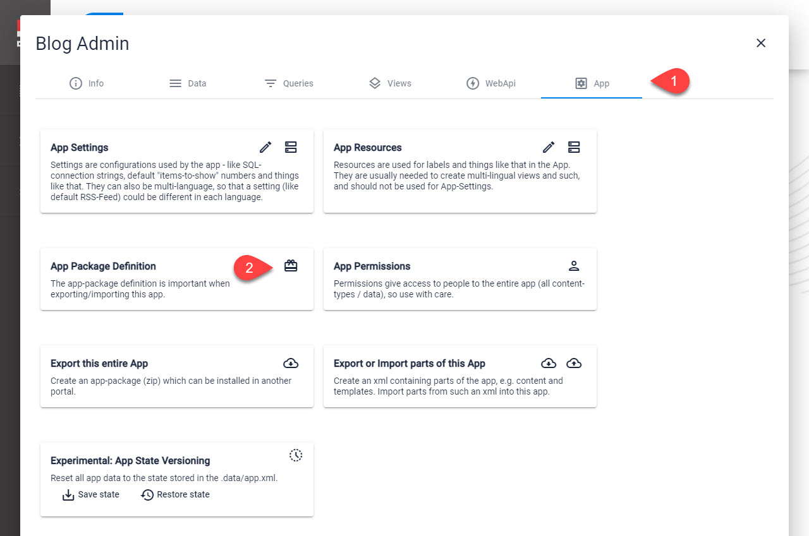

# App Configuration

[!include]

Every App has a **Configuration** Entity which describes things like

1. App Name
1. App Version
1. Folder (within the 2sxc-folder)
1. Minimum version of DNN needed for the App to work
1. Minimum version of 2sxc needed for the App to work
1. etc.

## Edit App Configuration

This is where you can find the App Configuration

On **2** you can configure the permissions you need:

## Difference App Configuration / App Settings

The  is a system Entity and 2sxc needs it for the App to work properly. 

The  can contain any information you configure it to have, and the values are only used in the App itself. 

## Use in C# Code (Razor / WebAPI)

Most of this information is available on the `App` object, like `App.Path`. Read about the [C# API here](xref:NetCode.DynamicCode.Objects.App.Index). 