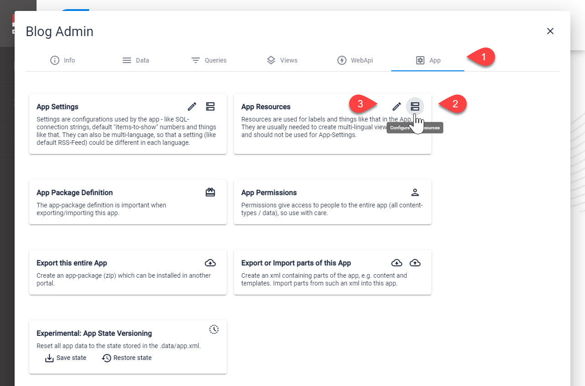
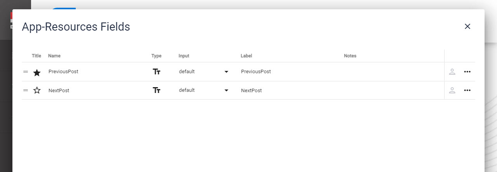
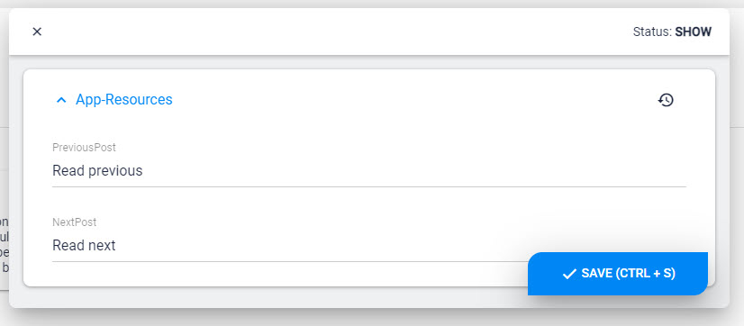

# App Resources

Every App has a **Resources** Entity. The fields available can be anything your App needs, so there is no pre-defined set of fields. 

## Edit/Configure App Resources

This is where you can find the App Resources

On **2** you can configure the fields you need, just like any other Entity:

On **3** you can set the values you need

## Why would you use this?

Many templates may have special labels, intro-texts or buttons which would benefit from simple editing and from multi-language capabilities. This is what the **App Resources** are for. 

## Use in C# Code (Razor / WebAPI)

In code you can access it on the `App.Resources` [Dynamic Entity](xref:NetCode.DynamicData.DynamicEntity), like `App.Resources.Introduction`. Check out the [App API docs](xref:NetCode.DynamicCode.Objects.App.Index)

## Use in Tokens Templates

Tokens templates are much more limited, but you can access these values using `[App:Resources:...]` - for example `[App:Resources:Introduction]`

## Don't use in Visual Query

You _could_ also access these properties in [VisualQuery](xref:Basics.Query.VisualQuery.Index), using tokens like `[App:Resources:Introduction]` - but this is not recommended, as you should _not_ use **Resources** for this. Use  instead.

## Don't Use Resources for Settings

Resources should only be used for labels, logos, introduction-texts and similar. For **Settings** always use .