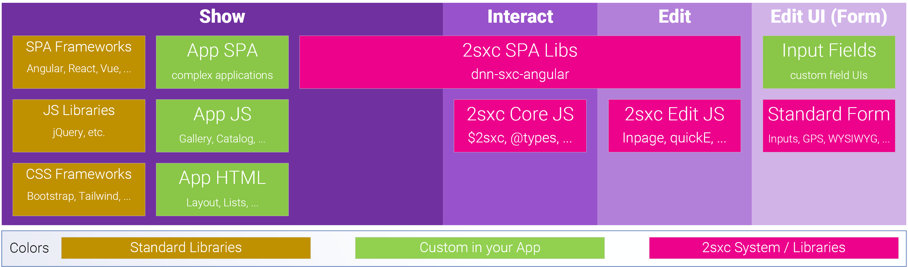

# What Happens in the Browser...

In 2sxc most things _just work_. These docs give you a deep understanding of how they work so you can figure out really cool stuff. But don't be intimidated - by default things just magically work. 

[!include["App stack browser"](../stack/_shared-browser.md)]

This is what web-systems do from a bird's-eyes perspective. On the top you see what happens in the browser (the purple boxes).

1. **Show**: Output using HTML and a little CSS + JS. This is the simplest way to work with 2sxc.
1. **Interact**: Content or SPAs where the UI does some hard work like reorganizing data and getting data from JSON endpoints. This requires additional skills.
1. **Edit**: Editing is built into everything by default and you can customized it as much as you need, up to creating custom WebAPIs, forms and input fields.

This document will go into more detail what happens at that level. To understand the server level go to .

## Deeper Dive into the Client (Show, Interact, Edit)

Everything that's green in the image can be customized.

## Standard CSS and JS Libraries and Frameworks

A key goal of 2sxc is to stay out of the way and let you do things using your favorite CSS and JS Frameworks. So the frameworks-section is simply here for you to see that you can use any standard framework or library you want. 

[!include["App browser frameworks"](../../shared/app/app-browser-frameworks.md)]

Basically you can simply add these frameworks to your Razor-template files as `<script>` or `<link>` tags, and everything will just work. You may want to learn more about

1. [Bundling / Optimizing assets](xref:HowTo.Output.Assets)
1. Using Koi to detect if the Skin/Theme already has some frameworks (like Bootstrap) to not load them

## Custom App HTML is created by the Server-Templates

The HTML you need is 100% customizable and comes from the server using your templates. 
Usually you'll use Razor templates to generate this. 

[!include["App browser html"](../../shared/app/app-browser-html.md)]

Since it's just standard HTML there's not much to say about it here. You may want to learn more about:

1. Learn Razor with placeholder to show your data
1. Automatically resize images to your needs
1. Create different output based on the CSS Framework of the page
1. [Use Polymorphism](xref:Specs.Cms.Polymorphism) to stage changes for review while still running the original live edition
1. SEO Optimize your HTML (google this topic)

## Custom CSS and JS Assets

JS and CSS files are stored in your app folder and included in your output. 

[!include["App browser js"](../../shared/app/app-browser-js.md)]

You may want to learn more about

1. [Bundling / Optimizing assets](xref:HowTo.Output.Assets)
1. Using Webpack to prepare / optimize your assets (google it 😉)
1. Pointing your JS to target the HTML DOM you created in your templates
1. Creating dynamic JavaScript or Styles based on values in the data
1. Passing CMS data (content-items) to scripts
    1. using inline JSON
    1. using HTML attributes
    1. using REST APIs to get data / content-items
    1. the JSON format of data in the APIs

## Create Awesome SPAs (Single-Page-Applications)

2sxc is great and bundling SPA JS Applications built using Angular, React, Vue or whatever. 

[!include["App browser js"](../../shared/app/app-browser-spa.md)]

You may want to learn more about:

1. [Bundling / Optimizing assets](xref:HowTo.Output.Assets)
1. Using Webpack to prepare / optimize your assets (google it 😉)
1. Pointing your JS to target the HTML DOM you created in your templates
1. Best practices for integrating Angular in DNN
1. Develop locally and still see the results live in DNN
1. Using dnn-sxc-angular to 
    1. access data & content from 2sxc
    1. ensure that HTTP requests have the right security headers
    1. access 2sxc data / content and queries using simple JS APIs
    1. Edit data / content directly from the Angular App
    1. Customize the toolbar for an item
    1. Intercepting refreshes to reload the data instead of reloading the page after edit

## Automatic In-Page Editing Experience

By default 2sxc creates hover toolbars to add modules and on most items which only a _Content Editor_ can see. These let them edit the content or data. It's made possible thanks to the server helper [@Edit.TagToolbar](xref:NetCode.Razor.Edit.Toolbar) in your templates.

[!include["App browser js"](../../shared/app/app-browser-edit-auto.md)]

## Custom In-Page Editing Experience

The edit experience can be customized to a very large extent:

[!include["App browser js"](../../shared/app/app-browser-edit-custom.md)]

You may want to learn more about:

1. [quickE / quick Edit](xref:Specs.Cms.QuickE) to customize the toolbar which adds / deletes modules
1. Specifying different buttons / commands on a toolbar in Razor
1. Specifying different buttons / commands on a toolbar in JavaScript
1. Adding completely custom buttons to the toolbar which will run your own JavaScript
1. Reconfiguring buttons to show filter data to list of items belonging to the current module
1. Modify the `new` button to include a prefill for new items

## Edit Form

The edit form is generated automatically from the Content-Type information (Schema) and the template configuration. 

[!include["Edit form"](../../shared/app/app-browser-edit-form.md)]

You may want to learn more about:

1. Configuring Content-Types
1. Data-Types in 2sxc
1. Input Fields in 2sxc
1. Advanced fields like GPS-picker
1. Rules like Enable, Can-be-Translated, Default-values
1. Create custom Input Fields (like a custom color-picker)
