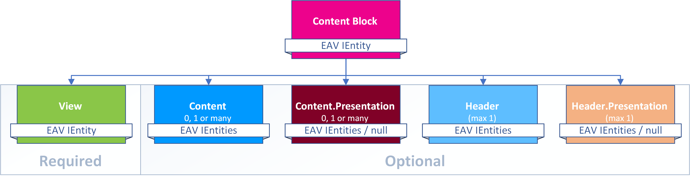

# Content Blocks

Content items wouldn't do much - they must be shown to the user in the intended layout. The configuration of such a _show these things using this template_ is handled in a **ContentBlock**. The data model for these _Content Blocks_ looks like this:

So each _Content Block_ has:

1. One reference to a View configuration
1. Zero, one or many references to content items
1. The same amount of Content-Presentation items 
1. Zero or one references to Header items
1. The same amount of Header-Presentation items

> [!TIP]
> Content Blocks contain a reference to the _View_ and optionally a bunch of _Content Items_ that will be used/shown in that _View_. But there are actually 4 possible scenarios deciding what is actually shown:
>
> 1. The _View_ can show the content-items provided by the _Content Block_
> 1. The _View_ can be configured to use a _Query_ and show data from that
> 1. The _Template_ code could also get data from the _App_ directly and show that
> 1. Combinations of the three options above are possible

> [!IMPORTANT]
> Since the _View_ can also be configured to get data from other sources, it may show items that are not in the list of the _Content Block_. 

## Content Blocks in a CMS like DNN

When you see 2sxc data in DNN, that's because a module was added to the page pointing to a _Content Block_. If you want to know more about that, read .
