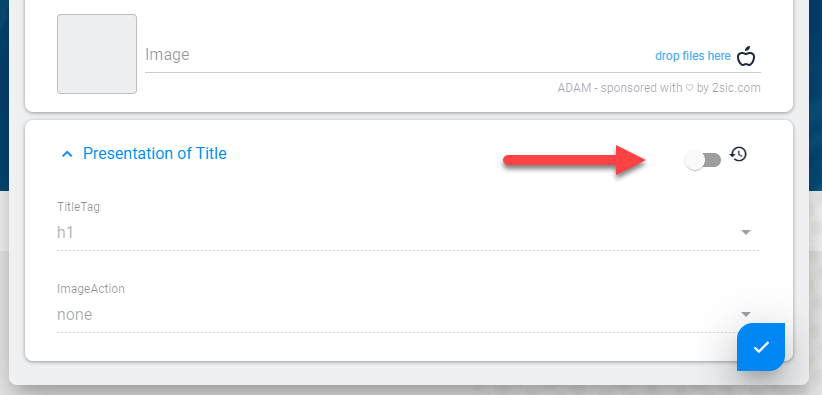
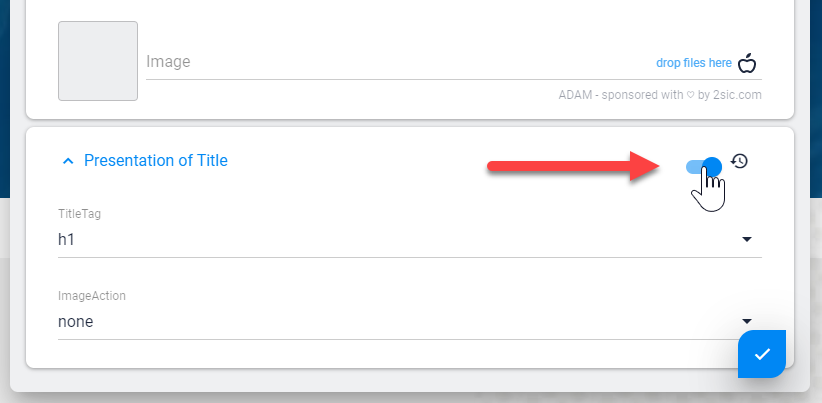

# Content Presentation Settings

[!include]

When [Data](xref:Basics.Data.Index) is used as [Content](xref:Basics.Content.Index) it can also have **Presentation** settings. 

## Example

This is important because the _same piece_ of content (like an Address) may need to be visualized different ways depending on how it's used. Let's say we have an Address of 2sic in Switzerland as Data, and we're using it in a few places:

1. In the footer of the website we're just showing it, the template says how it's shown
1. In the _We make Websites Page_ we have a CTA (Call to Action) with two addresses, and the 2sic address is configured to be highlighted using the **Presentation**
1. We have a _Contact Page_ where it's shown in a Google-Maps - there we configured the **Presentation** to use a pink pin

## Edit Behavior

Since the **Presentation** is directly connected to the Item it's showing, the Edit-UI will open both items for editing together:

## Demo / Defaults Behavior

Very often the **Presentation** contains default settings which are often left untouched. In these cases the Presentation-item is not stored, but the Demo-data is provided automatically. This allows you to update the defaults an any time and it will be reflected on all items which have unmodified Presentation settings.

Here's what Presentation looks like when inheriting defaults:

This is what Presentation looks like when you set it on the current item:

## Available on each Content-Item and on Header

**Presentation** is available on _each_ Content item and also in the Header (if a View is configured to have a [List](xref:Basics.Content.Lists)). Each Content item will have it's own presentation settings.

The [View](xref:Basics.App.Views) configuration determines if there is a **Presentation** setting on Content (or Header) and what Content-Type is to be used. 

## Use in Code

In C# you will usually do things like `@Content.Presentation.Color` or similar. Check the [C# API Docs for this](xref:NetCode.DynamicCode.Content).

In Tokens you will usually do things like `[Content:Presentation:Color]`. Check the [Tokens docs](xref:Basics.Server.Render.Tokens.Index).

## History

1. Introduced in 2sxc v2.0