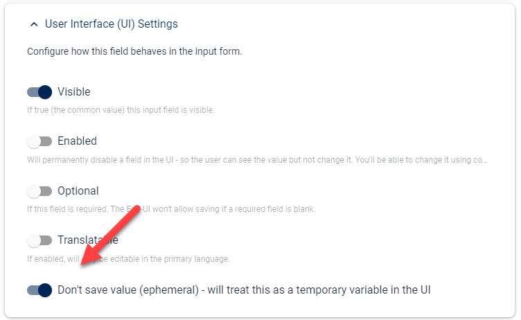

# Temporary Variable Fields (Emphemeral Fields)

[!include["Data"](~/basics/data/_shared-content-types.md)]

This explains **Ephemeral aka Temporary Variable Fields**. For an overview check out .

---

Sometimes you need fields which controle the Form UI without being real data. Some examples:

1. Toggles which show/hide other fields or field groups
1. Hidden calculations which will consolidate other field values to determine if something else is required

We don't want to save these fields as the data is not relevant, and often the value should be calculated upon opening the form - so it's important that they are reset. 

> These kinds of fields are _ephemeral_ = temporary

To configure a field to _not save_ and be temporary / ephemeral, use this setting:

## History

1. Introduced in 2sxc 12.01