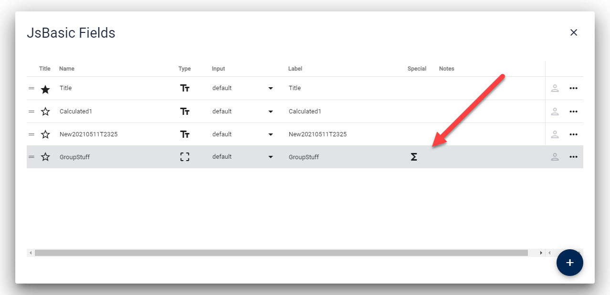

# Formulas (Logic) in the Edit Form

[!include]

2sxc provides _Formulas_ which let you dynamically change all kind of things in the edit UI. With it you can dynamically change 

1. the **value** of the field
1. General field settings like
    1. `Visibility` to show/hide a field
    1. `Disabled` to enable/disable a field
    1. `Required` to change required or not
    1. `Name` to change the label
    1. `Notes` to change the description / help-text (v14)
1. Field-specific settings like
  1. `Collapsed` on a field-group to change if it's open/closed

## Demo

## How To Create & Develop Formulas

Formulas are stored as normal data as part of the Content-Type. As shown in this image, all fields having formulas are easy to discern:

You can create or edit Formulas them in the general field settings:

👉 To develop Formulas we suggest you try the [Interactive Formula Designer](xref:Basics.Edit.Formulas.Designer)

## Specs and JavaScript Documentation

👉 Check out the [JS Formula Documentation](xref:JsCode.EditForm.Formulas.Index) - also the [data](xref:JsCode.EditForm.Formulas.Data) and [context](xref:JsCode.EditForm.Formulas.Context) objects

👉 Also read about the [Formula Specs](xref:Basics.Edit.Formulas.Specs)

👉 Also read about the new [empty-end Field to close a Field-Group](xref:Basics.Data.Fields.Empty-End)

## More

You should also check [Ephemeral / Temporary Fields](xref:Basics.Data.Fields.Ephemeral) as they are very useful together with Formulas.

---

## History

* Introduced in 2sxc 12.01
* Extended with `Required` ca. v13.00
* Extended with `Notes` ca. v13.10

Shortlink to here: https://r.2sxc.org/formulas