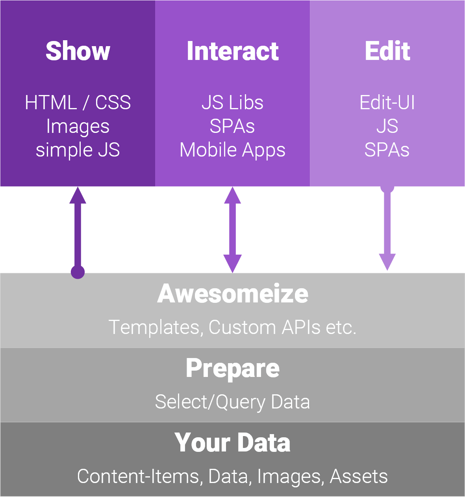

> [!WARNING]
> # Work-In-Progress
> 
> _We're reorganizing our introduction / basics Docs - they will be moved to here. This is still WIP._

# Basics

In 2sxc most things _just work_. These docs give you a deep understanding of how they work so you can figure out really cool stuff. But don't be intimidated - by default things just magically work. 

## How Systems and User Interact

This is what web-systems do at the top-level. On the top you see what happens in the browser:

1. **Show**: Output using HTML and a little CSS + JS. This is the simplest way to work with 2sxc.
1. **Interact**: Content or SPAs where the UI does some hard work like reorganizing data and getting data from JSON endpoints. This requires additional skills.
1. **Edit**: Editing is built into everything by default and you can customized it as much as you need, up to creating custom WebAPIs, forms and input fields.

The bottom shows what happens on the server:

1. **Your Data** is the original material - probably created by an editor using the CMS UI or in advanced cases it's data coming from SQL, CSV or elsewhere. This data could also be combined from multiple sources.  
    _By default this just magically works, you don't have to do anything!_
1. **Prepare** is a layer of data processing where the desired data is selected to be shown, filtered, sorted etc.  
    _By default this happens automatically, you don't have to do anything! But you can customize it anyhow you want._
1. **Awesomize** - this is where you tell the system how the output should look, what image sizen you want, how the HTML should be built etc. 

## Deeper Dive into the Client (Show, Interact, Edit)

[!include["App browser"](../shared/app/app-browser-raw.md)]

## Deeper Dive into the Server (Data, Prepare, Awesomeize)

Here's a diagram of what an App can have, and which parts you control:

[!include["App diagram"](../shared/app/app-server-raw.md)]

## What's Where

This documentation contains the following sections

TODO

