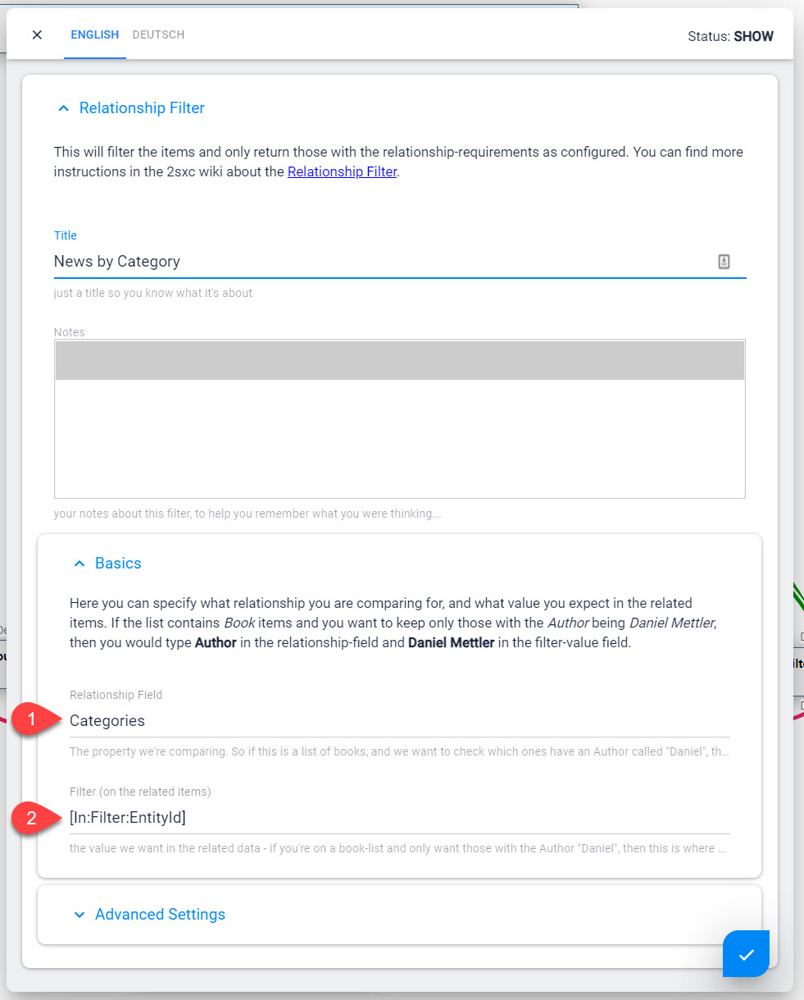

# DataSource Parameters from Other DataSources

[!include]

DataSources are _parts_ of a query, and each performs certain functions. To do this, it needs parameters which it can get from many sources

1. The Configuration-UI of this specific Data
1. The general [Query-Parameters](xref:Basics.Query.Parameters.Index)
1. Various [Look-Up Sources (Tokens)](xref:Basics.LookUp.Index)
1. Other DataSources which give the configuration value on an In-Stream

## Configuration UI of earch Part #todoc

todoc

## Query Parameters #todoc

todoc

## LookUp Sources #todoc

## Settings from Another DataSource

Often some stored data will be used to change what a DataSource does. Here's an example which will retrieve a **Category** either pre-defined or from the URL, then use that category to apply a filter:

Here's how the settings of that are configured:

Read more about the [In LookUp](xref:Basics.LookUp.In).

## Settings from the Current Module (CmsBlock)

Another common use case is when a normal Module-Content provides more settings. This uses the [CmsBlock DataSource](xref:ToSic.Sxc.DataSources.CmsBlock):

Read more about 

---

#todoc 

In some cases a DataSource in your Query needs a parameter that depends on other Data in the system. 

Quick Examples

1. A DataSource retrieves a Setting
1. ...and another DataSource uses this Setting to filter something

This is a very internal spec - don't use it :). 

System Queries are stored as json in `DesktopModules\ToSIC_SexyContent\.data\queries`.

List of queries as of 2sxc 9.x through 10.x

1. Eav.Queries.Global.Apps - retrieve all apps
1. Eav.Queries.Global.Attributes - retrieve all the attributes of a content-type
1. Eav.Queries.Global.ContentTypes - retrieve all content-types
1. Eav.Queries.Global.Queries - retrieve all queries
1. Eav.Queries.Global.QueryInfo - retrieve all streams and fields of a query
1. Eav.Queries.Global.Zones - retrieve all zones

## History

1. Introduced in 2sxc 07.00
1. In added in 2sxc 07.00
1. Params added in 2sxc 10.22

