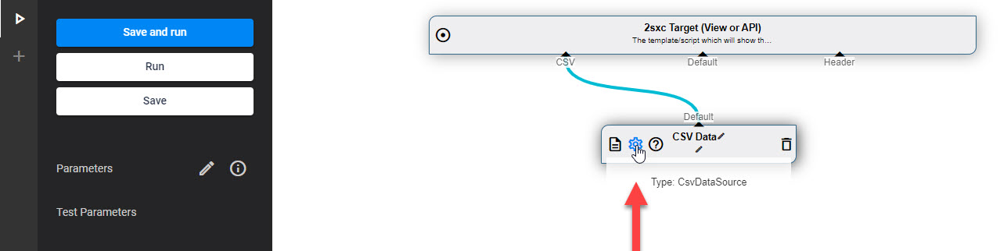
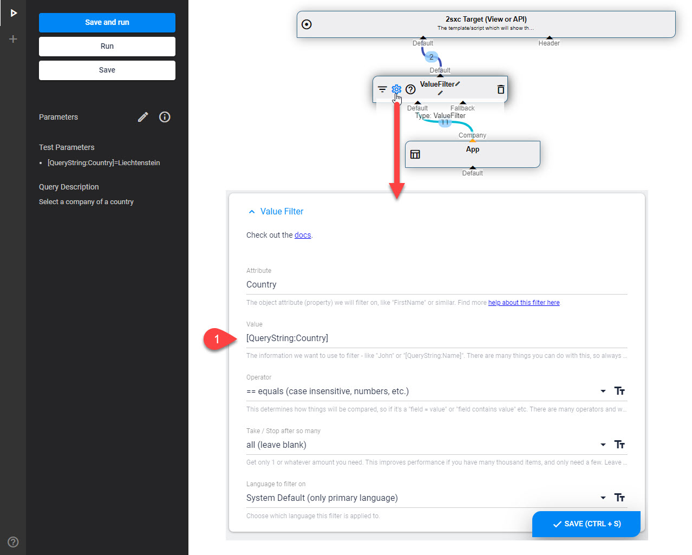
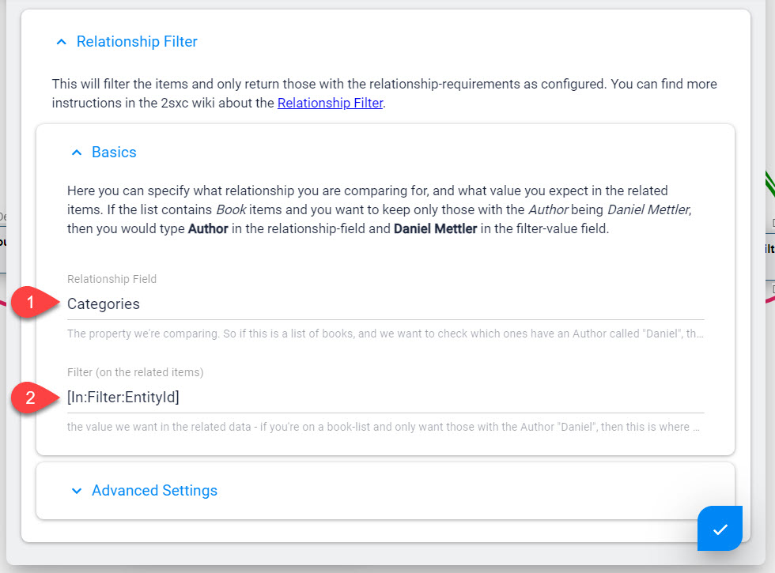

# DataSource Parameters

[!include]

DataSources are _parts_ of a query, and each performs certain functions. To do this, it needs parameters which it can get from many sources

1. The Configuration-UI of this specific Data
1. The general [Query-Parameters](xref:Basics.Query.Parameters.Index)
1. Various [Look-Up Sources (Tokens)](xref:Basics.LookUp.Index)
1. Other DataSources which give the configuration value on an In-Stream

## Configuration UI of a Part = Settings

Each _part_ is a DataSource. If it's configurable you'll see a button appear when you mouse over it like this:

The dialog which appears will be different for each type of DataSource. In the C# code of the DataSource, these parameters are available as [Settings](xref:Basics.LookUp.Settings).

## Configuration can be Values or Tokens

Almost all configuration values are strings, even if the DataSource expects a number. This allows you to write either `27` or `[QueryString:Id]` dependending on your needs. Here's an example:

Read more about [LookUp Tokens here](xref:Basics.LookUp.Index). 

Aside from the normal LookUps like `QueryString`, `User` etc. there are two special LookUps which you should know about: **Params** and **In**.

## Global Query Parameters with Params-Token

Each Query can have a list of Parameters which all parts can access through the [Params LookUp](xref:Basics.LookUp.Params). This has some great benefits:

1. A developer can always see what parameters affect the Query
1. If you use the same parameter in various places, you can be sure that it's always the same value.
1. These Parameters can also be set from another query calling it 

This is what it looks like in VisualQuery:

You will find a full explanation of this here: .

> [!TIP]
> You _can_ write the tokens you need like `[QueryString:Id]` directly into any DataSource configuration. 
>
> But we _highly recommend_ that you create a param for it and use that instead. 
> It just makes it easier for people looking at your query to see what will affect its results. 

## Get Configuration from Another DataSource

Often some stored data will be used to change what a DataSource does. Here's an example which will retrieve a **Category** either pre-defined or from the URL, then use that category to apply a filter:

Here's how the settings of that are configured:

Read more about the [In LookUp](xref:Basics.LookUp.In).

## Settings from the Current Module (CmsBlock)

Another common use case is when a normal Module-Content provides more settings. This uses the [CmsBlock DataSource](xref:ToSic.Sxc.DataSources.CmsBlock):

This shows how the In will look in the `Mod` stream to find the `PortalId`. Read more about this

* [In LookUp](xref:Basics.LookUp.In)
* 

---

## History

1. Introduced in 2sxc 07.00
1. In added in 2sxc 07.00
1. Params added in 2sxc 10.22
