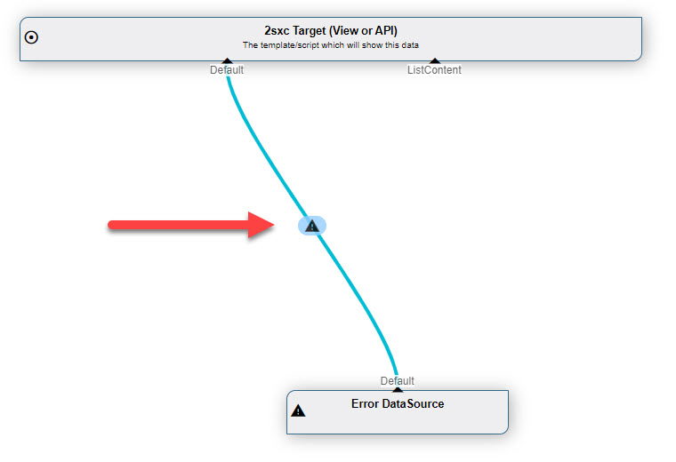
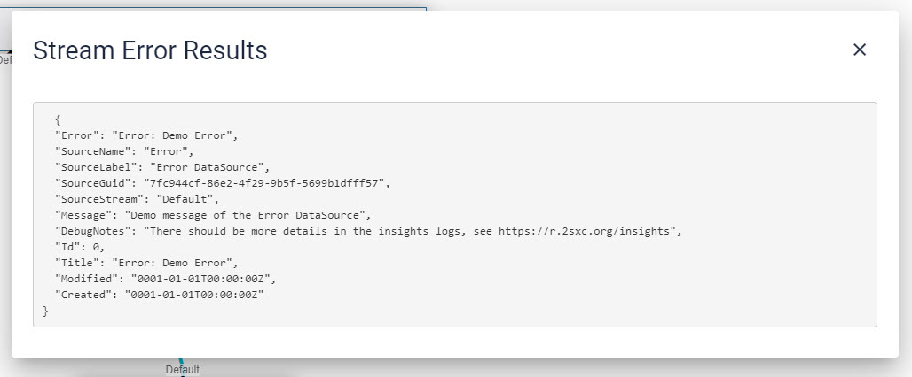

# VisualQuery

[!include]

In 2sxc 11.13 we're introducing two new feature to help you create VisualQueries

1. **Stream Debugging**
1. **Non-Breaking Errors**

## Stream Debugging

todo: #todoc

## Non-Breaking Errors

Previously if there was an error in a Query, the entire query would fail and you would get a error message which was very difficult to debug. 

Now the system is much simpler. If any Stream has an error it will actually still provide a single Entity containing the error information. This looks like this:

If you then click on the ⚠ you'll see the full message like this:

## Security Considerations

1. All the error information is also logged into Insights, so super-users can check that for more details.
1. If the query blows on a normal user, the data will not contain any important information - so no paths, no internal values, etc.
1. If the query blows on the Super-User we'll sometimes include more information - like the Path to the CSV file

## History

1. Introduced in 2sxc 11.13

