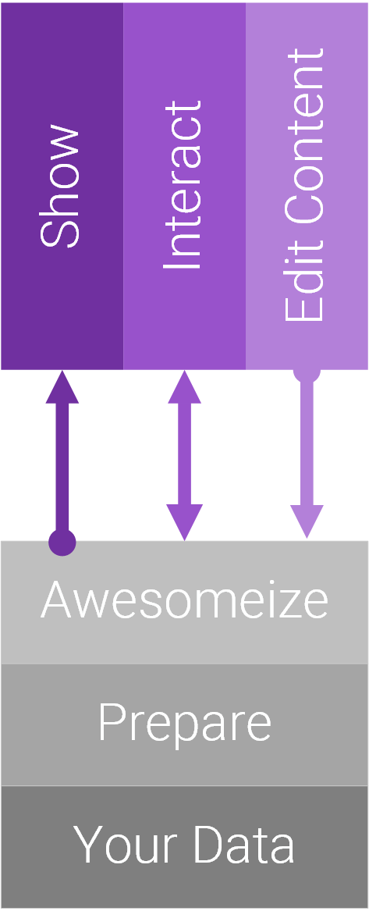

# What Happens on the Server...

You should get an idea of how the system works and all the things you can customize. This overview lets you see the essential parts of any **App** including the main **Content**. 

  

  

This is what web-systems do from a bird's-eyes perspective. On the top you see what happens in the browser (the purple boxes). It's documented in .

The bottom shows what happens on the server:

1. **Awesomeize** - this is where you tell the system how the output should look, what image sizes you want, how the HTML should be built etc. 
1. **Prepare** is a layer of data processing where the desired data is selected to be shown, filtered, sorted etc.  
    _By default this happens automatically, you don't have to do anything! But you can customize it anyhow you want._
1. **Your Data** is the original material - probably created by an editor using the CMS UI or in advanced cases it's data coming from SQL, CSV or elsewhere. This data could also be combined from multiple sources.  
    _By default this just magically works, you don't have to do anything!_

## Deeper Dive into the Server (Data, Prepare, Awesomeize)

## Understanding Data

This is where **Data** comes in:

[!include["App browser js"](../../shared/app/app-server-data.md)]

Data has it's own chapter in the docs 

## Preparing Data

Something must determine what data should be shown or worked on, which is what happens in the **Prepare** step. 

[!include["App browser js"](../../shared/app/app-server-prepare.md)]

There are a few standard use cases:

1. When working with basic content, the editor has added content to a specific module, so the **Prepare** step will retrieve this data and give it to the template. 
1. If a template is configured to use a [Query](xref:todo) then 2sxc will prepare the query and give that to the template to work with. 
1. The template / WebAPI can also always access all the data in the App using [App.Data](xref:todo)
1. If you need the data in JavaScript then the headless APIs provide access to both the items, lists and queries of the app.

You may want to learn more about:

1. ?
1. Create queries using Visual Query
1. Preparing data in code
1. Preparing data for the full-text search index of the platform
1. DataSources
    1. List of all DataSources and their APIs
    1. Creating Custom DataSource

---
