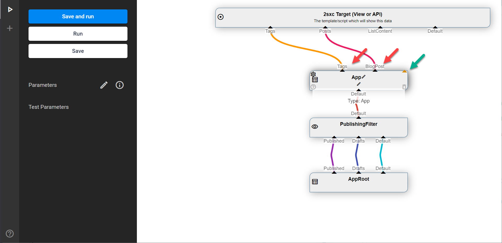

# DataSource API: Out Streams

[!include[](~/basics/stack/_shared-float-summary.md)]
<style> .context-box-summary .datasource-custom { visibility: visible; } </style>

All DataSources must have **Out** Streams.

By convention, the primary Out is called `Default` and the VisualQuery Designer assumes that it exists by default. 

But there are two important things you can change

1. You can determine one or more predefined Out streams
1. You can tell the UI that your Stream can have many, dynamically named Out-Streams just like the [App DataSource](xref:ToSic.Eav.DataSources.App)

## Out Streams in VisualQuery

These are predefined `Out` Streams where each DataSource declares what it can offer:


Some Sources can have _Dynamic Out_ where you can create as many Out streams as you want. Usually the name you give each stream will affect what is in it:




## Explicitly Naming Out-Streams

For an example, we'll use the [Paging DataSource](xref:ToSic.Eav.DataSources.Paging). It's job is to take a list of items and only forward a chunk on the `Default`, like "Page 3 containing items 61-90". In addition it should also provide information as to what page we're on and how many pages exist. 

This is defined in the constructor, where the DataSource determines what it Provides #todoc.

```c#
public Paging()
{
  Provide(GetList);
  Provide("Paging", GetPaging);
  ConfigMask(PageSizeKey, "[Settings:" + PageSizeKey + "||" + DefPageSize + "]");
  ConfigMask(PageNumberKey, "[Settings:" + PageNumberKey + "||" + DefPageNum + "]");
}
```

The two lines of `Provide` are the important bits:

1. `Provide(GetList)` will provide data on the `Default` Out-Stream
1. `Provide("Paging", GetPaging)` will provide data on the `Paging` Out-Stream


## Dynamic Out Streams

Some DataSources like the [App DataSource](xref:ToSic.Eav.DataSources.App) can have many Out-streams which are not known till Runtime. To allow the UI to provide these, we must specify this in the [VisualQuery attribute](xref:NetCode.DataSources.Custom.VisualQueryAttribute). Here's an example of the App DataSource:

```c#
[VisualQuery(GlobalName = "...",
  Type = DataSourceType.Source, 
  Icon = "app",
  DynamicOut = true,
  NiceName = "App",
  UiHint = "...",
  ExpectsDataOfType = "...",
  HelpLink = "...")]
```

The important part here is the `DynamicOut = true`. 

## History

1. Introduced ca. in 2sxc 6
1. Extended with Dynamic Out ca. 2sxc 8