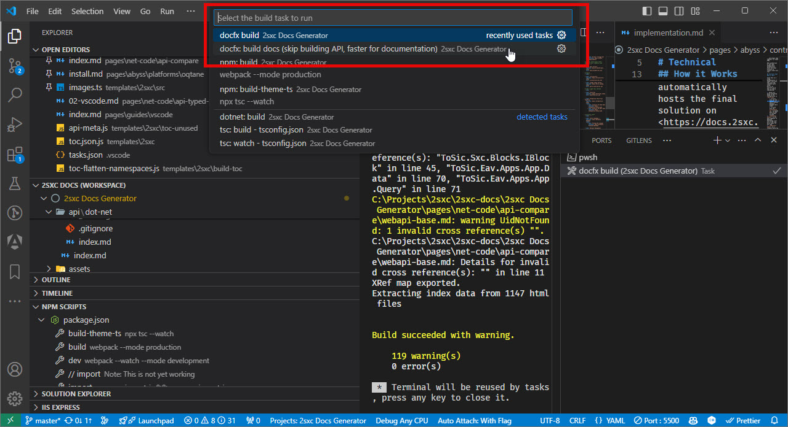

# Building the Documentation

> [!TIP]
> These instructions should get you started right away.
> But there are many things which make your work better and easier,
> so do take the time to read about hove everything works
> before making larger changes.
>
> Even simple things like images have great tricks you want to know about.


Before beginning with the documentation process,
ensure that you have set up the complete 2sxc/EAV development environment.
This environment should be configured and functional for the development of C# and JavaScript code.
For more information on this setup, please refer to the [Code](xref:Abyss.Contribute.Code) documentation.

## Start with Visual Studio Code

➡️ Make sure you already did the steps in [Run Locally using VS-Code](xref:Abyss.Contribute.Docs.Preview.Index).

## Install DocFX

The documentation tool we use is **docfx**, which needs to be installed on your development machine. You can install it using the following command:

```cmd
dotnet tool install -g docfx
```

## Your First Build

We've configured the most important build commands in VS-Code so you can just get started.
They are located in `.vscode/tasks.json`.
Hit `ctrl+shift+b` to see the build-commands.
These two are of interest:

* **docfx: build docs (skip building API, faster for documentation)** will only build the markdown files, which is much faster if you're only working on the docs.  
  _Note that this should work, even if the C# code doesn't compile._

* **docfx build** will compile the real source code, generate the docs from the XML-comments and merge them with this project's markdown files.


<div gallery="vs-code">
  
</div>


## How it Works

The documentation development takes place in this [2sxc-docs](https://github.com/2sic/2sxc-docs) GitHub repository.
The documentation is generated from `*.yml` and `*.md` files and 2sxc/EAV's C# and JavaScript source code.

## Troubleshooting

To verify whether docfx can successfully build the documentation, use the following command in the VS-Code terminal:

```cmd
docfx
```

The successful execution of this command should display the message: `Build succeeded`.

If docfx encounters an error when building a .NET project, you can manually attempt to build the project. This allows you to get more information about the error and address it. You can do this with the following commands:

```cmd
cd c:\[your-path]\2sxc\Src\Dnn\ToSic.Sxc.Dnn
dotnet build
```

Upon successful execution, you should see the message: `Build succeeded`.

