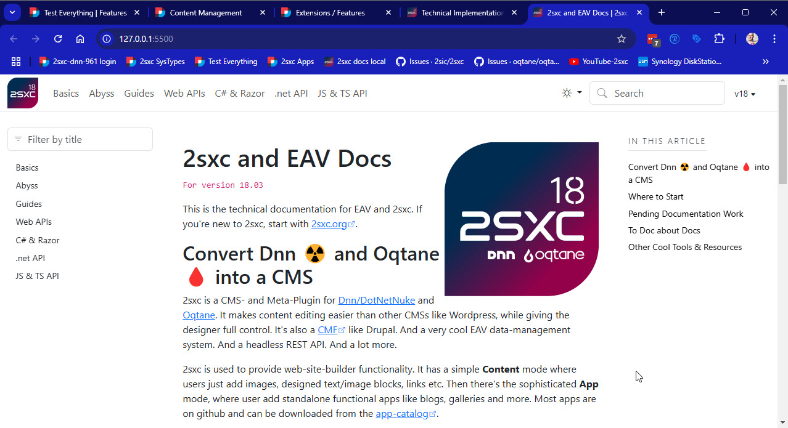

# Run / Preview the Docs Locally using VS-Code

We always use VS Code to work in the docs, which is what we're explaining here.
Note that we won't explain how to install VS-Code or how to do a git pull.

Please open the `2sxc Docs.code-workspace` **Workspace** in VS Code, which will automatically load all the necessary settings and extensions.

> [!TIP]
> Opening the workspace in VS-Code will ask you to install the recommended extensions.
> You should really do this, as it makes life much easier
> and includes a simple web-server to test the docs.

It will ask you to install these extensions:

1. [DavidAnson.vscode-markdownlint](https://marketplace.visualstudio.com/items?itemName=DavidAnson.vscode-markdownlint) a great markdown linting tool
1. [shd101wyy.markdown-preview-enhanced](https://marketplace.visualstudio.com/items?itemName=shd101wyy.markdown-preview-enhanced) a great markdown preview tool, also supports Mermaid diagrams
1. [ritwickdey.LiveServer](https://marketplace.visualstudio.com/items?itemName=ritwickdey.LiveServer) a simple web-server to test the docs

Once you've installed all the plugins, you can see the `Go Live` button in the bottom right corner of VS-Code.
When you click it, a web server will be started hosting the `/docs` folder:

    
    

## Troubleshooting the Preview

If you have trouble with the preview, here some background how it works.

1. The preview is a simple web-server which hosts the `/docs` folder.

1. It runs using the [ritwickdey.LiveServer](https://marketplace.visualstudio.com/items?itemName=ritwickdey.LiveServer).

1. The configuration for this is in the `2sxc Docs.code-workspace` file, in the section `liveServer.settings.mount`.
