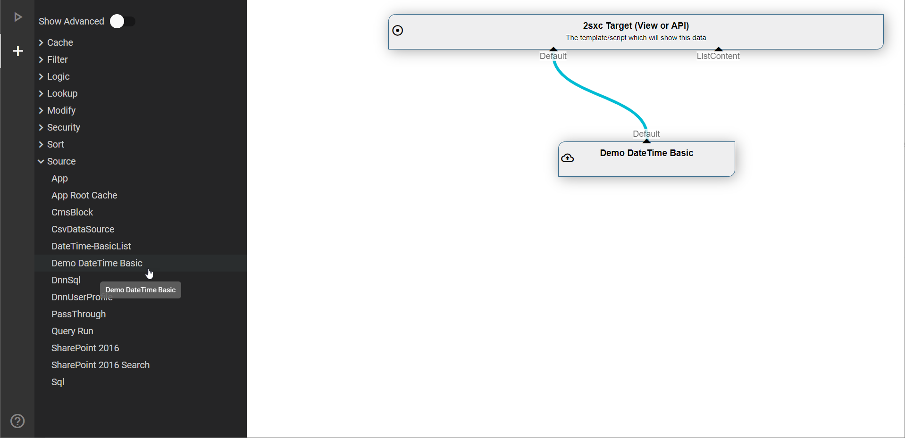

# Create Custom DataSources

[!include[](~/pages/basics/stack/_shared-float-summary.md)]
<style> .context-box-summary .datasource-custom { visibility: visible; } </style>


If you want to create your own DataSource and use it in C# or the VisualQuery designer, this is for you.

* [Docs about the API](xref:NetCode.DataSources.Custom.Api)
* [](xref:NetCode.DataSources.Custom.Configuration) 
* how [LookUps work](xref:Abyss.Parts.LookUp.Index)

## Simple Example

Here's an example of a complete data-source, which just delivers 1 item with the current date:

```cs
using System;
using System.Collections.Generic;
using System.Collections.Immutable;
using ToSic.Eav.Data;
using ToSic.Eav.DataSources;
using ToSic.Eav.DataSources.Queries;

namespace ToSic.Tutorial.DataSource.Basic
{
    // Additional info so the VisualQuery can provide the correct buttons and infos
    [VisualQuery(
        NiceName = "Demo DateTime Basic",
        GlobalName = "7aee541c-7188-429f-a4bb-2663a576b19e"   // random & unique Guid
    )]
    public class DateTimeDataSourceBasic: ExternalData
    {
        public const string DateFieldName = "Date";

        /// <summary>
        /// Constructor to tell the system what out-streams we have
        /// </summary>
        public DateTimeDataSourceBasic()
        {
            Provide(GetList); // "Default" out; when accessed, will deliver GetList
        }

        /// <summary>
        /// Get-List method, which will load/build the items once requested 
        /// Note that the setup is lazy-loading so this code will only execute when used
        /// </summary>
        private ImmutableArray<IEntity> GetList()
        {
            var date = DateTime.Now;
            var values = new Dictionary<string, object>
            {
                {DateFieldName, date},
                {"Weekday", date.DayOfWeek},
                {"DayOfWeek", (int) date.DayOfWeek}
            };
            
            // Construct the IEntity and return as ImmutableArray
            var entity = DataBuilder.Entity(values, titleField: DateFieldName);
            return new [] {entity}.ToImmutableArray();
        }
    }
}
```

This code demonstrates:

1. The [VisualQuery](xref:NetCode.DataSources.Custom.VisualQueryAttribute) attribute, so that this data-source will be shown in VisualQuery
1. The **constructor** `DateTimeDataSourceBasic()`, which tells the source what Out-streams it has using [Provide](xref:NetCode.DataSources.Custom.Provide), in this case it's just the `Default`
1. A **method** `GetList()` which gets the items if ever requested
1. The [`DataBuilder.Entity(...)`](xref:NetCode.DataSources.Custom.DataBuilder) helper to construct IEntity objects from value-dictionaries

## Use in VisualQuery Designer

This is what the DataSource would appear like in VisualQuery



...and this is what the test-run would look like


## Demo App and further links

* [](xref:NetCode.DataSources.Custom.VisualQueryAttribute)
* [](xref:NetCode.DataSources.Custom.Provide)
* [](xref:NetCode.DataSources.Custom.DataBuilder)
* [Basic DataSources for EAV and 2sxc](https://github.com/2sic/2sxc-eav-tutorial-custom-datasource)
* [Blog about this feature](https://2sxc.org/en/blog/post/tutorial-custom-datasources-for-eav-2sxc-9-13-part-1)
* [Blog post about custom DataSources](xref:Blog.CustomDataSource)

## History

1. Introduced in 2sxc ca. 4 but with a difficult API
1. API strongly enhanced and simplifield in 2sxc 09.13 
1. Another API rework ca. 2sxc 10.25 (but we're not exactly sure)
