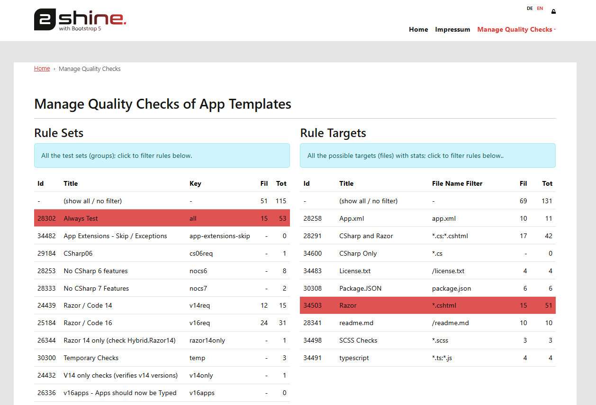
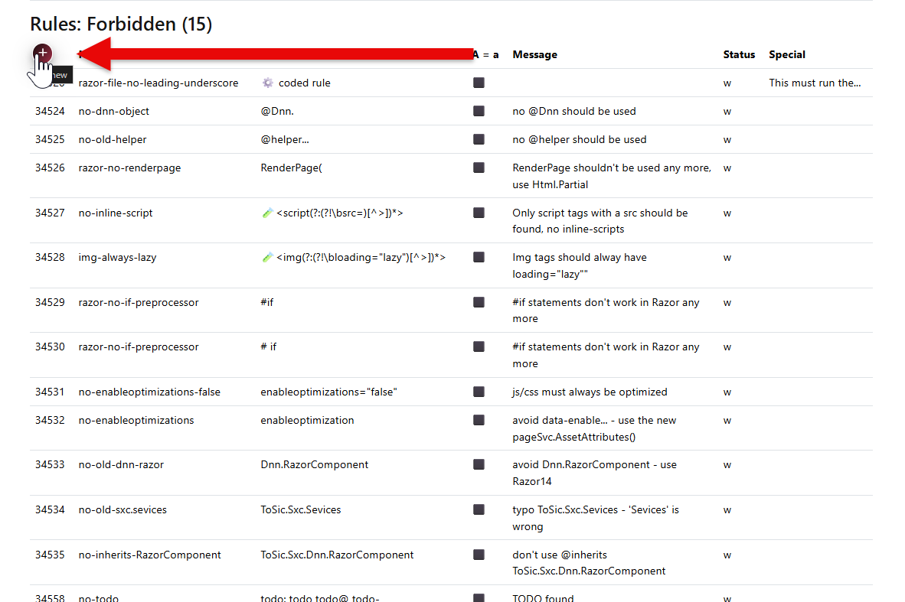
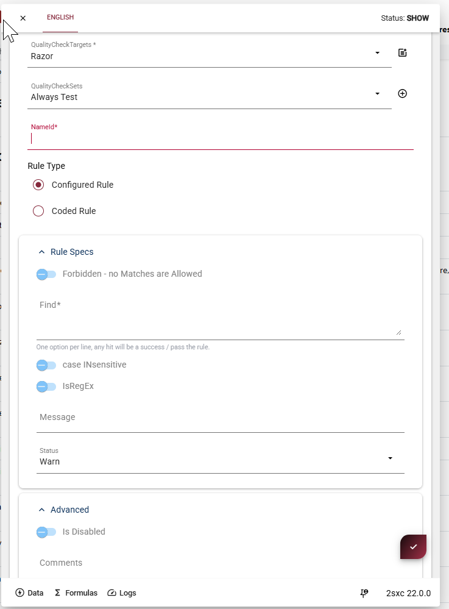
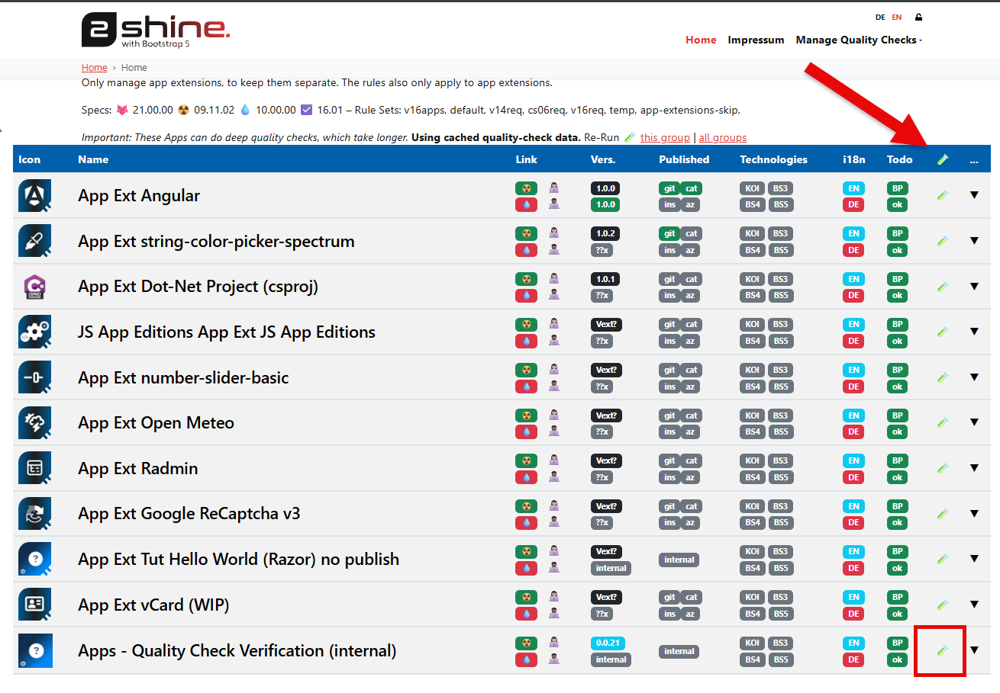
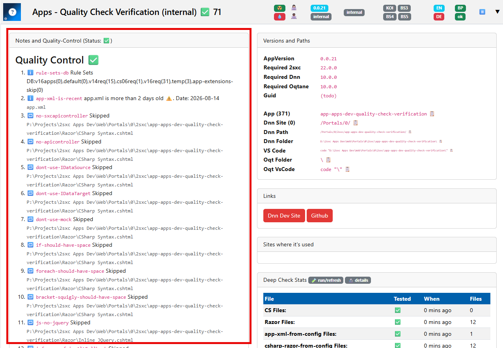

# Quality Management for 2sxc / EAV Standard Apps

[!include[""](../../code/_contributors-only.md)]

When we create Apps for distribution,
they must adhere to very high quality standards,
because others will look at the code and use it as reference.

> [!TIP]
> If you want to create your own Apps, then this may not be important to you.
> But we from 2sxc want to be sure that our Apps are built in a consistent way, and that they are well documented and tested.
> So if you want to contribute an App in our name, please follow these guidelines.

---

## How It Works

The quality system consists of:

1. **Registered Apps** which can be selected for a check.
1. **Check definitions** which describe unwanted or outdated patterns.
1. **Results** grouped by App and check.

Checks can inspect source files for patterns such as:

- inline scripts;
- platform-specific namespaces in hybrid code;
- obsolete APIs or namespaces;
- discouraged data, toolbar, or image patterns.

## How Checks Are Organized

Rules are organized by **group**, **file type**, and **behavior**:



- **Rule Sets** are groups describing when or why checks apply, such as
  **Always Test**, **Razor / Code 16**, or **Temporary Checks**.
- **Rule Targets** define the files to inspect, such as **Razor** (`*.cshtml`),
  **CSharp Only** (`*.cs`), or **typescript** (`*.ts;*.js`).

## How a Rule Is Defined

Rules have a stable **NameId**, belong to a Rule Set and Rule Target,
and are implemented in one of two ways:

- A **Configured Rule** searches file content using values entered in the editor.
- A **Coded Rule** runs custom code. Use this when the check requires logic which
  cannot be expressed reliably as a content search.

To create a rule, filter the list to the intended Rule Set and Rule Target,
then select the **+** action above the rule list:



The editor starts with the selected target and set:



The important fields are:

- **NameId** is the stable ID shown in result
- **Find** accepts one pattern per line. Enable **IsRegEx** to treat them as regular expressions.
- **Forbidden** controls the result, when enabled, a match fails the rule

## Run Checks

Open **Manage Quality Checks** and use the highlighted action for the App you want to check:



Checks can be run for:

- **one App** while developing or fixing it;
- **selected Apps** after changing a shared convention or API;
- **all registered Apps** before a coordinated release or after changing a check definition.

After changing an App, run its checks again. Existing results describe the files at the time of the previous run.

## Handle Results

The App detail page shows the quality-control status and the result of each applicable check:



Review the summary, open the affected App, and inspect each finding.
Use one of these solutions:

1. **Fix the code** using the recommended pattern.
1. **Correct the check definition** if it produces general false positives.
1. **Document an exception** if the pattern is intentional in this file.

A runner error is not a quality finding. It means the App could not be checked reliably—for example because its registration or path is invalid.

## Intentional Exceptions

A specific check can be disabled for a file with:

```text
2sxclint:disable:<check-id>
```

Example:

```cshtml
@{
  // This App intentionally renders JavaScript entered by an editor.
  // 2sxclint:disable:no-inline-script
}
```

For multiple checks, use one line per check:

```csharp
// Required for the DNN branch of this hybrid controller.
// 2sxclint:disable:no-dnn-namespaces
// 2sxclint:disable:no-web-namespace
```

The check ID must match the ID in the result exactly.
Always explain why the exception is required and disable only the affected check.

## Manage Check Definitions

A check definition should have:

- a unique check ID;
- a clear description of the problem and its solution;
- the correct severity, file types, and App scope;
- a narrow match which avoids unrelated code.

Before applying a new or changed definition to all Apps:

1. Test code which should produce a finding.
1. Test code which should pass.

---

## History

- 2026-08-27: Explained Rule Sets, Rule Targets, configured and coded rules, and all rule fields.
- 2026-08-25: Documented quality checks for standard Apps.
