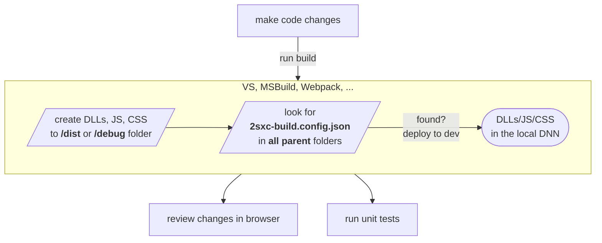

```mermaid
flowchart TB
 subgraph s1["VS, MSBuild, Webpack, ..."]
    direction LR
        B["create DLLs, JS, CSS<br>to <b>/dist</b> or <b>/debug</b> folder"]
        n2["look for<br><b>2sxc-build.config.json</b><br>in <b>all parent</b> folders"]
        n1(["DLLs/JS/CSS<br>in the local DNN"])
  end
    B --> n2
    A["make code changes"] -- run build --> s1
    n2 -- found?<br>deploy to dev<br> --> n1
    s1 --> n3["review changes in browser"] & n4["run unit tests"]

    B@{ shape: lean-r}
    n2@{ shape: lean-r}
    n3@{ shape: rect}
    n4@{ shape: rect}
```
