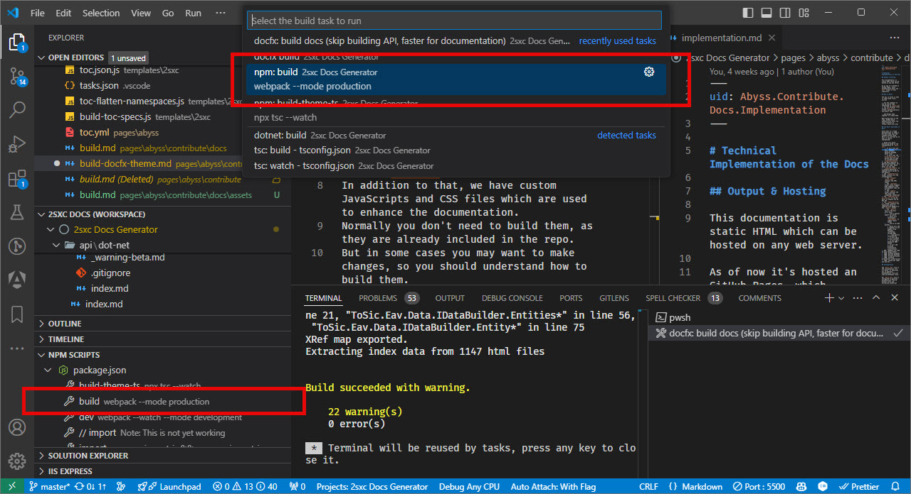

[!include["many-projects"](../_docs-for-many-projects.md)]

# Docs: TypeScript, CSS, WebPack Customizations

> [!WARNING]
> This is a technical documentation about how the documentation system works.
> It helps the core team understand how to maintain and enhance the documentation system.
>
> It's not meant for most contributors, as it's too technical.

To make the docs more interactive and user-friendly, we use TypeScript and SASS which is compiled with WebPack.
We provide additional features such as:

1. **Lightbox** feature for images - with Fancybox
1. **Image Galleries** - with Fancybox
1. **Razor / Blazor Code Highlighting** - with highlightjs
1. **Version switcher** - to access older archives of the docs
1. **Permalink system** - to easily share links to specific sections
1. **Blinking architecture illustrations** - to explain context of specific sections

Normally you don't need to build them, as they are already included in the repo.
But in some cases you may want to make changes, so you should understand how to build them.

## Parts that Make it Work

The parts that make it work are

* **NPM** manages the packages and scripts
* **WebPack** compiles the TypeScript and SCSS
* **TypeScript** is used to write the JavaScript
* **SCSS** is used to write the CSS
* **Fancybox** is used for the lightbox
* **HighlightJS** is used for syntax highlighting
* `/templates/[project]/src/` contains the TypeScript and SCSS files
  * `/src/styles/` contains the SCSS files which are project specific
  * `/src/styles/shared/` contains files which are shared across all docs-projects
  * `/src/scripts/*` are project specific TypeScript files
  * `/src/scripts/utils/*` are shared TypeScript files
  * `/src/scripts/versions/*` are shared TypeScript files for the version switcher
  * `/src/scripts/xref/*` are shared TypeScript files for the Permalink system
  * `/src/scripts/@types/*` are shared TypeScript files for the HighlightJS configuration

TODO: @tvatavuk probably best put everything shared in `/src/scripts/shared/...` so it's easier to copy 1:1 into other projects

## How it Works

TODO: @tvatavuk PLS EXPLAIN how it works etc.

* package.json
* init / build
* what actually happens, where it's compiled to etc.


## Setup

Make sure you have node/npm installed.
Then let NPM install all dependencies using continuous-integration.
Run this in the docs folder (ideally just from the VS-Code terminal):

```cmd
npm ci
```

## Build TODO: @tvatavuk

To build the assets, run this in the docs folder (ideally just from the VS-Code terminal):

```cmd
npm run build
```

...or use `ctrl+shift+b` and select `build`
...or right-click on the `build` task in the VS-Code task-runner.

<div gallery="vs-code">
  
</div>

---

## History

* Updated 2024-12-04 v18.04

