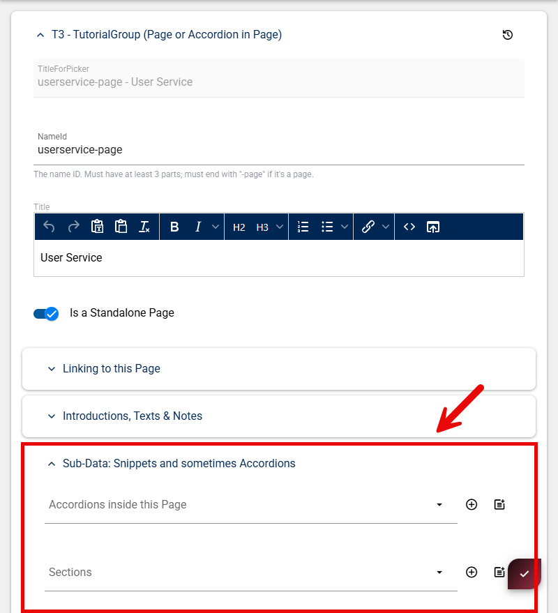
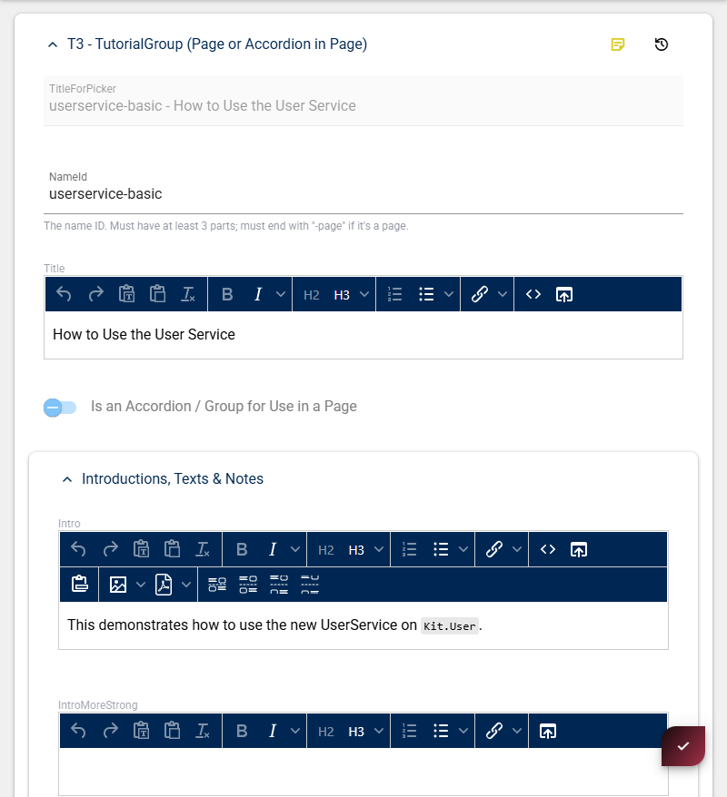
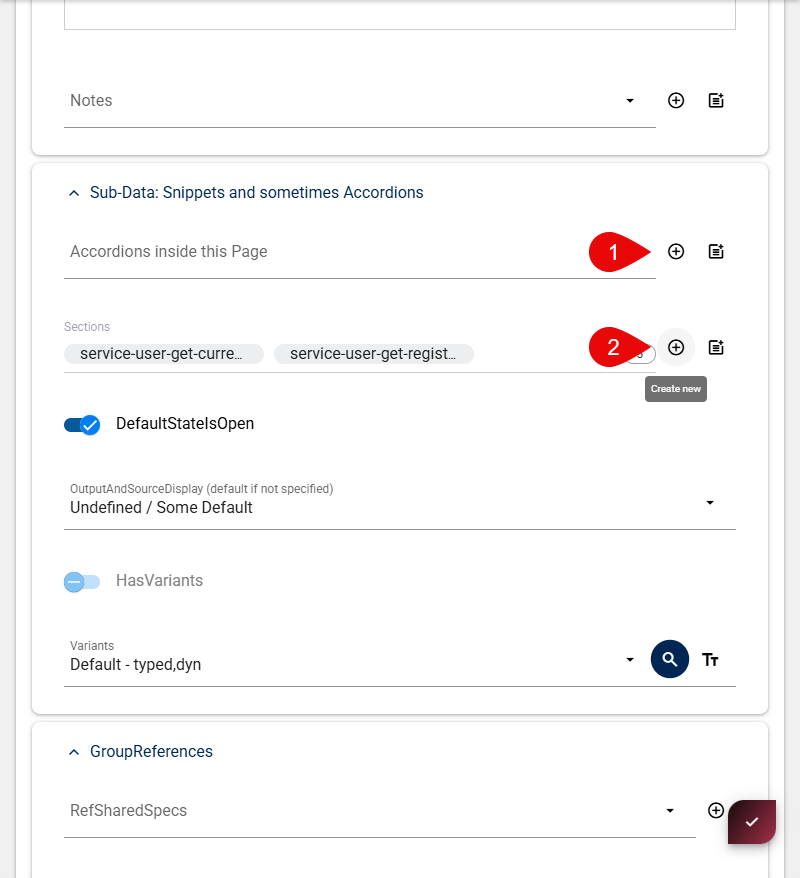
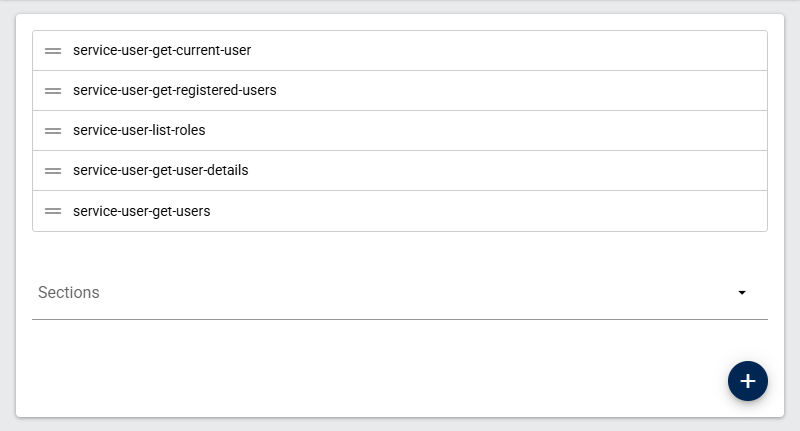
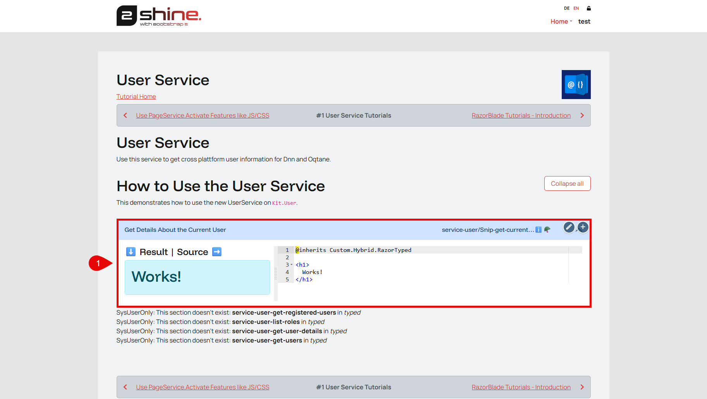

## Create Snippets (Page Content)

With the new page in place you can start adding page content by creating new Snippets

Either add Sections or Accordions inside the Page, based on your conent. If your content is nested better structured then go for accordions - if your content is straight forword and lean go with single sections.

_note: if you have accorionds the sections will be added automatically inside the accordion sections_

### Creating an Accordion

Fill in the following information:

|Field|Description|Example|
|-----|-----------|-------|
|NameId|Identifier. The NameId must end with **-basic** as it is a convention|_userservice-basic_|
|Title|Visible title on page|_How to Use the User Service_|
|Intro|Visible Description on page|_This demonstrates how to..._|

_Scrolling to the bottom, you will again find the `Sub-Data: Snippets and sometimes Accordions` Group._

Here you can add a newsted Accordion or start with adding actual sections (snippets).

Create as many `Snippet Sections` as you need:

A `Snippet Section` should contain the following information:

|Field|Description|Example|
|-----|-----------|-------|
|TutorialID|Identifier. such as `type` + `name` + `functionality`.|_service-user-get-current-user_|
|Title|Visible title on page|_How to Use the User Service_|
|Tutorial Type|||

The actual `Snippet` will be a **Razor** _(.cshtml)_ or a **Formula**, depending on your **Tutorial Type choice**.

Your new `Tutorial Snippets files` should be placed at: _D:\2sxc Apps Dev\Web\Portals\tutorial-razor\2sxc\Tutorial-Razor\tutorials_

Or seee them here: [Tutorial-Razor tutorials folder](https://github.com/2sic/app-tutorial-razor/tree/master/tutorials)

Here you will need to create a new folder. The nameing for **both** **file** and **folder** need to match the **TutorialID** you specified earlier.

So for `service-user-get-current-user`:
- the **folder** would be: `service-user`
- the **file** would be: `Snip-Get-Current-User.cshtml`

Repeat this for all remaining **files**.
