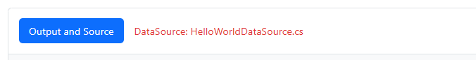

## Add an extra “Source” tab using hidden comments

Each snippet automatically renders with an **Output and Source** tab.

In addition, you can add **extra Source tabs** by placing a special **hidden Razor comment** anywhere in your snippet file. This comment is not rendered in the HTML output, but it is parsed by the tutorial system to show an additional tab containing the referenced `.cs` file.



### Syntax

Use this exact pattern:

```razor
@*!
Tut.Tabs=<tabId>:<fileNameWithoutExtension>
!*@
```

- `Tut.Tabs=` is the instruction for the renderer
- `<tabId>` is the tab (category) that is displayed before the file name
- `<fileNameWithoutExtension>` the filename without, in this case, `.cs`
