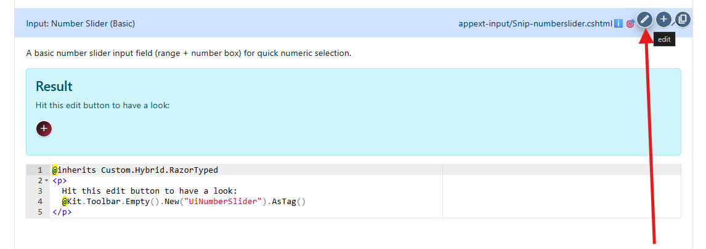
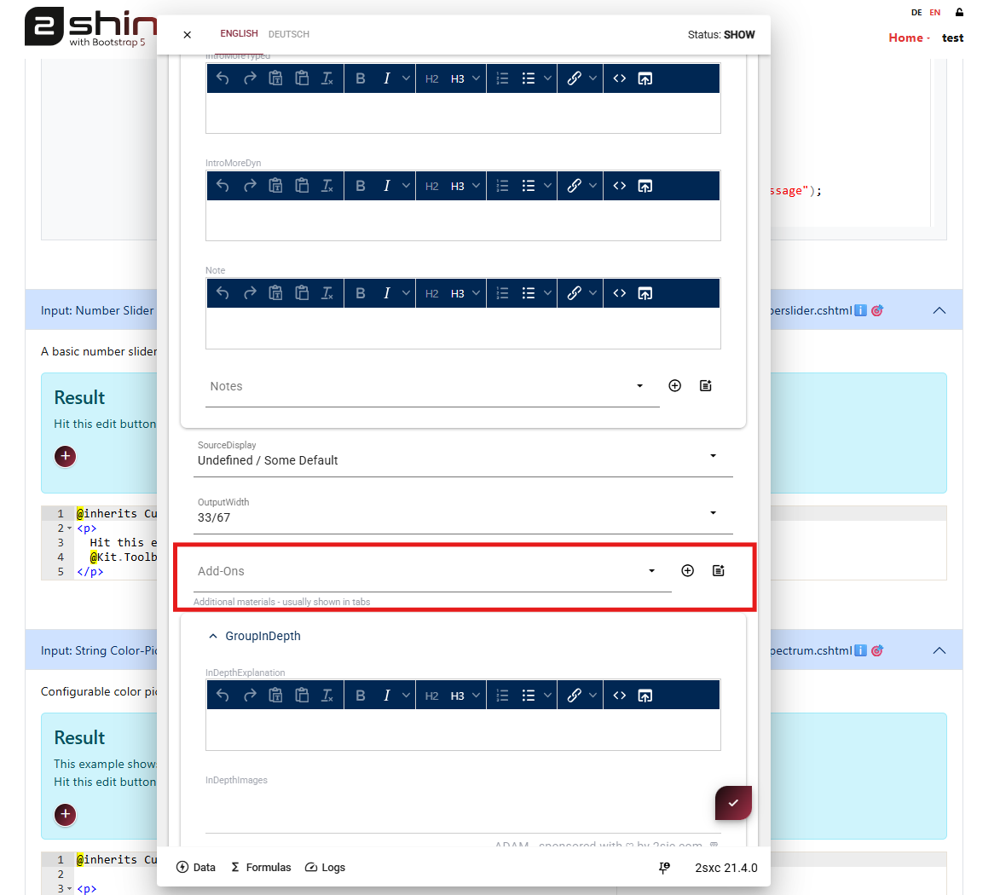
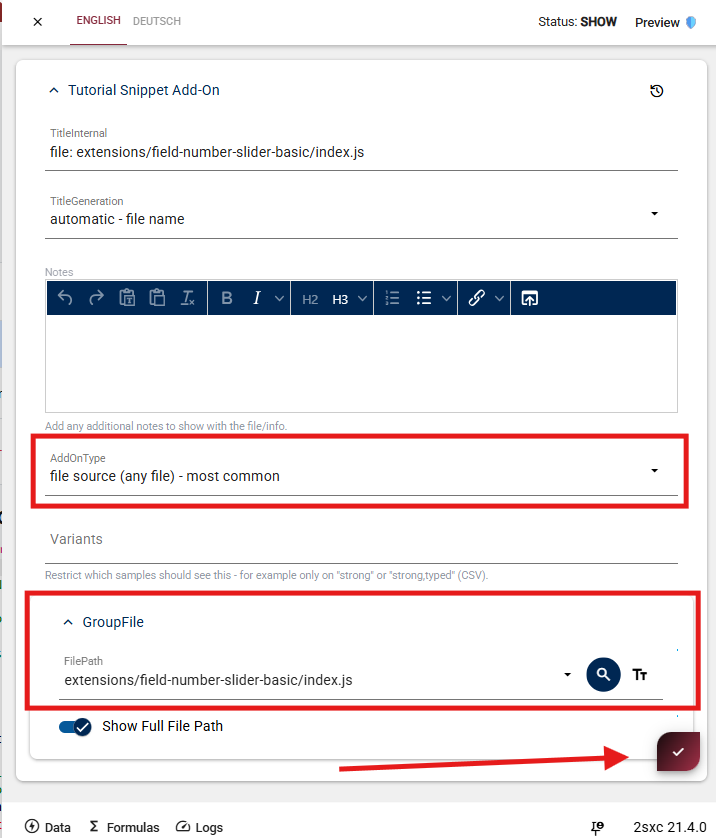
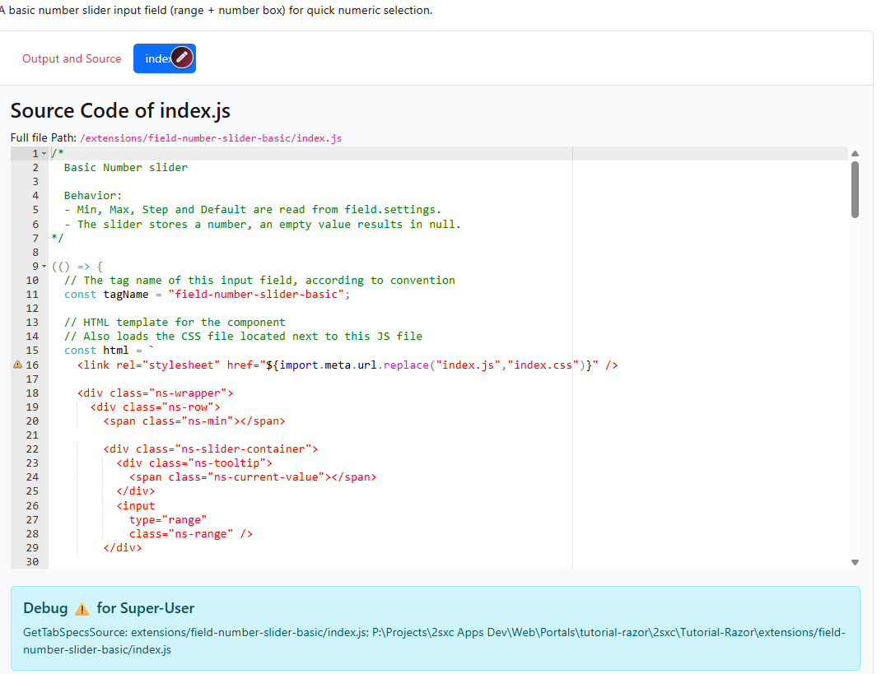

## Add an extra “Source” tab using hidden comments

Each tutorial snippet automatically renders with two default tabs:

- **Output:** shows the rendered result
- **Source:** shows the code from the snippet file

Sometimes you want to show **additional files** such as:

- JavaScript files
- CSS files
- C# helper classes
- configuration files
- additional Razor views

These files can be added as **extra tabs** in the snippet output.

---

## Edit the Snippet Section

To add a new tab, edit the snippet section in the tutorial page.

    

Click the **edit button** in the snippet area.  
This opens the snippet configuration dialog.

---

## Open the Add-Ons Section

Inside the editor dialog you will find the **Add-Ons** section.

This section allows you to attach additional files which will appear as tabs in the snippet output.

    

---

## Add a new File Tab

Inside **Add-Ons** you have two options:

### Select an existing file

If a file was already added before, you can simply select it from the list.

### Create a new Add-On

If the file does not exist yet:

1. Click the **+ button**
2. A new Add-On configuration dialog will open

    

Fill in the following fields.

## Add-On Configuration

### TitleInternal

Usually the **file path** to the file you want to show.

**Example:**

`extensions/field-number-slider-basic/index.js`

### AddOnType

Choose the type of add-on.

The most common option is:

`file source (any file)`

This tells the tutorial system to load and display the file source code.

### GroupFile -> FilePath

This is the **path to the file** inside the tutorial project.

Example:

`extensions/field-number-slider-basic/index.js`

use the **search button** to select it

### Show Full File Path

Optional but recommended.

When enabled, the full file path will be displayed above the code block so users know exactly where the file lives.

---

## Save the Add-On

After saving the configuration:

1. Save the Add-On dialog
2. Save the snippet editor

The new tab will now appear in the snippet output.

    

---

## Result

Your snippet will now contain an additional tab showing the file source code.

Opening the tab will show the file contents directly in the documentation.

---

## Summary

To add a new **Source tab**:

1. Edit the snippet
2. Open **Add-Ons**
3. Add a new entry
4. Select **AddOnType → file source**
5. Provide the **file path**
6. Save

The tutorial system will automatically generate a new tab displaying the file.
