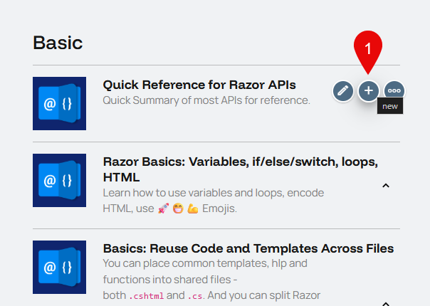

# Get Started

A quick pathway to get you started in minutes. For detailed information visit the [verbose information](xref:Abyss.Contribute.Tutorials.Verbose) docs page.

## Preparations

On [app-dev.2sxc.org/tutorial-razor/](https://app-dev.2sxc.org/tutorial-razor/) login to be able to edit the apps content.

_you should end up on this page (see screenshot):_

## Create a new Section

When you want to create a completely new tutorial you first need to create one using the toolbar on any existing sextino. Just press **new**.

### Filling out basic infos

Greeted with this the create-dialog...

... you will need to fill out the following basic infos:

|Field|Description|Example|
|-----|-----------|-------|
|NameId|Identifier for this set|_services-userservice_|
|Title|Title for the Overview|_User Service_|
|Category|Where this tutorial belongs|_Data and DataSources_|
|Introduction|Basic description|_Use the Kit.User service.._|

Then you will need to add one or multiple new pages for the tutorials. Start with only one default page.

Here you will also need fill in some basic infos so the app knows how to handle the page.

|Field|Description|Example|
|-----|-----------|-------|
|NameId|Url path (everything before **-page** will be in the url). The NameId must end with **-page** as it is a convention|_userservice-page_|
|Is an Accordion|Set this option to **Is a Standalone Page**|_True_|

Leave the rest as is for now.

Back on the [home](https://app-dev.2sxc.org/tutorial-razor/) page the new set should have been created with the selected Icon, Title etc. and contain the Link to the new Tutorial page.

The new tutoral page should look like this:

### Metadata

Diffentet kinds of metadata can be set in the **Linking to this Page** group.

### Creating Snippets

Continue with creating Snippets for the new tutorial
[See](xref:Abyss.Contribute.Tutorials.CreateSnippet)
