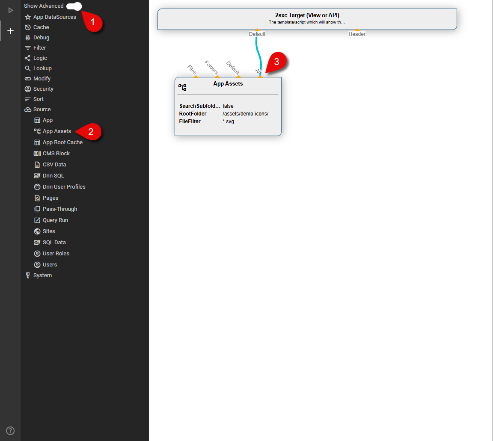
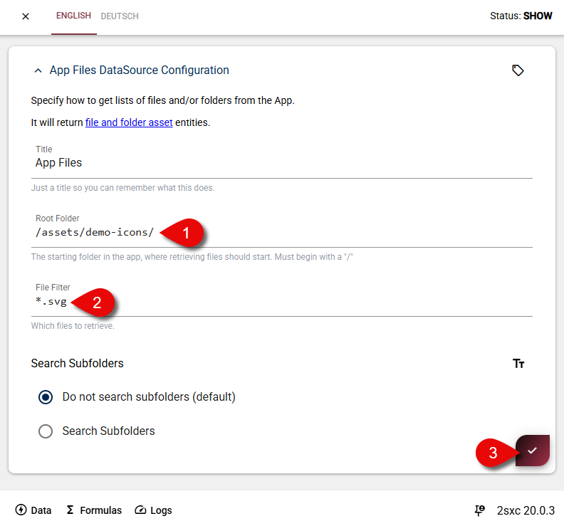
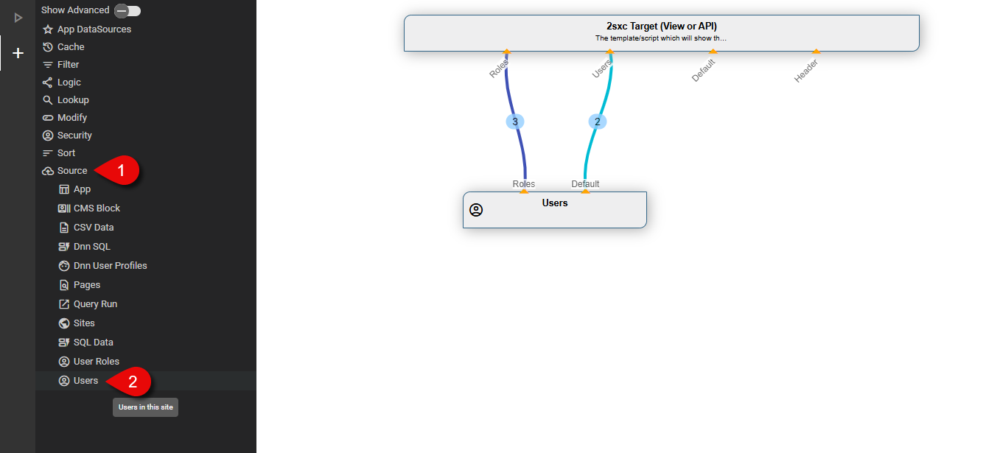

# Setup New Environment

When you copy the tutorial app to a new environment there are some steps you need to follow, in order to have all tutorials running.

For instance the _IUserService_ tutorial registerd a new **user** and **user role** for instance. These need to be duplicated as they are not part of the app export.

---

## 2025-07-14 - App Assets

For the _Data App Assets_ tutorial you need to:

1. Create a new query: `AppAssets`
1. Add the `App Assets` DataSource.
1. Add a stream: `All` or only `Files`
1. Update the **RootFolder** in the settings to `/assets/demo-icons/`

Then you will need to create a folder in the root of the tutorial app at the path specified in **RootFolder**: `/assets/demo-icons/`

Download and place [these icons](https://github.com/2sic/app-tutorial-razor/tree/master/assets/demo-icons) in your directory.

## 2025-07-14 - Use Data Sources

For the _Get Users with App Query_ tutorial you need to:

1. Create a new query: `AllUsers`
1. Add the `Users` DataSource.
1. Add two streams: `Roles` as `Roles` and `Default` as `Users`.

---

## 2025-07-10 - IUserService

For the _IUserService_ tutorial you need to:

1. Create a new User: `UserServiceDemoUser`
1. Create a new User Role: `UserServiceDemoRole`
1. Add the `UserServiceDemoRole` Role to the `UserServiceDemoUser`
