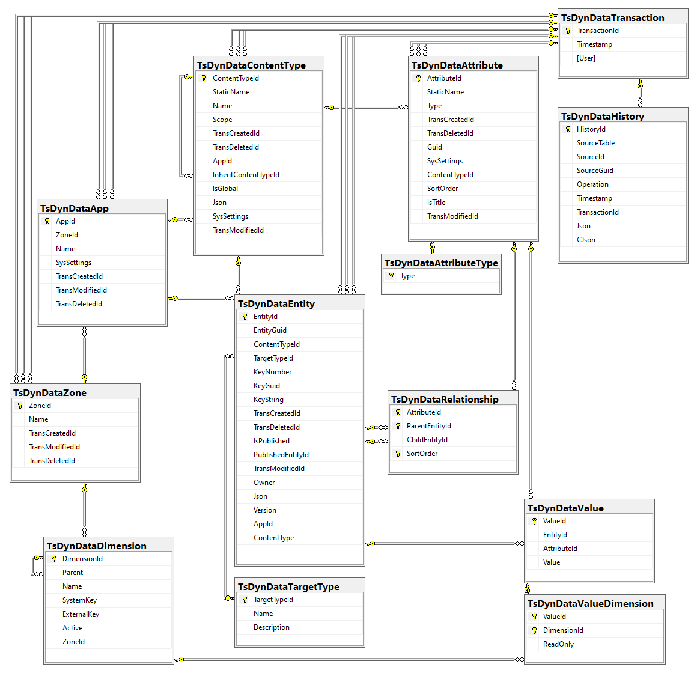
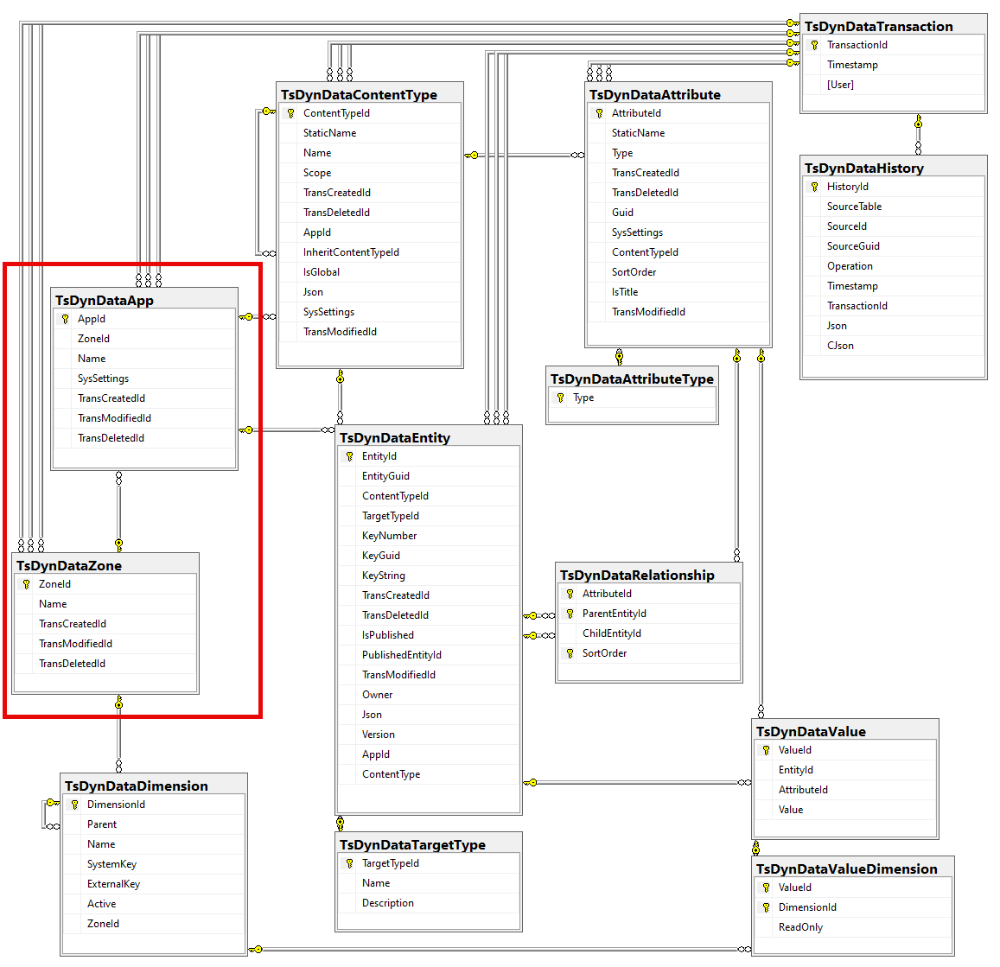
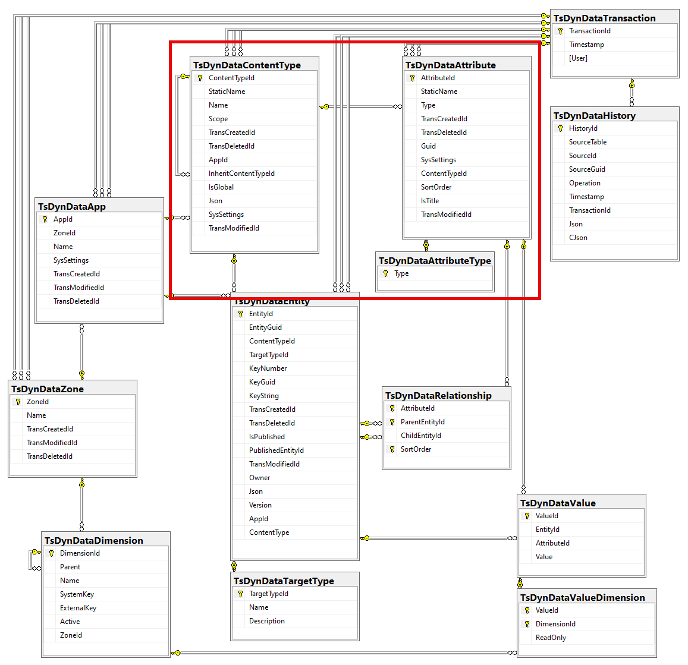
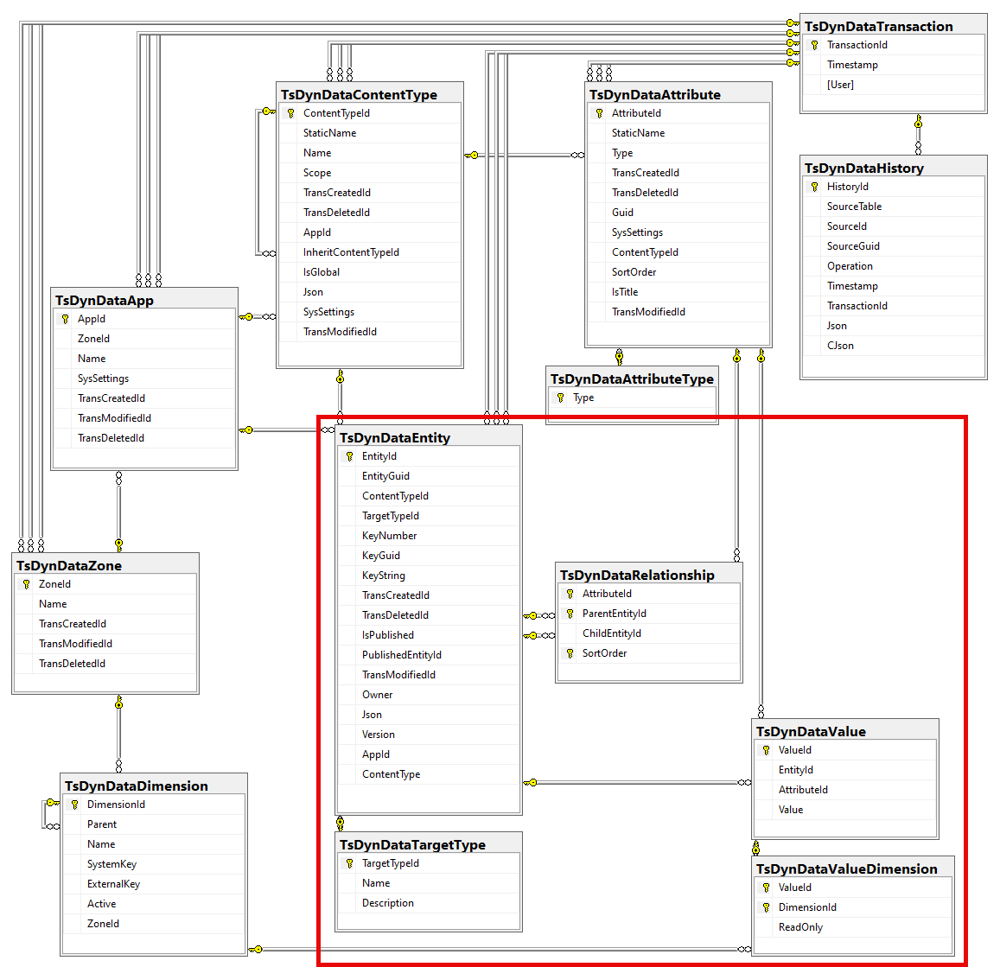
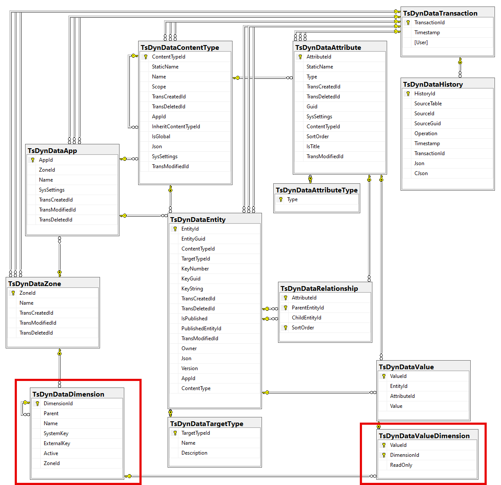
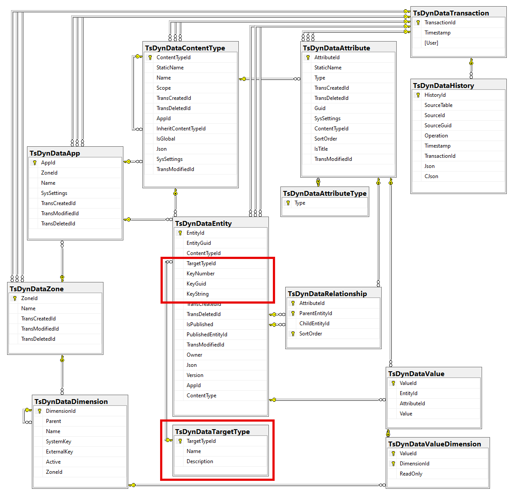
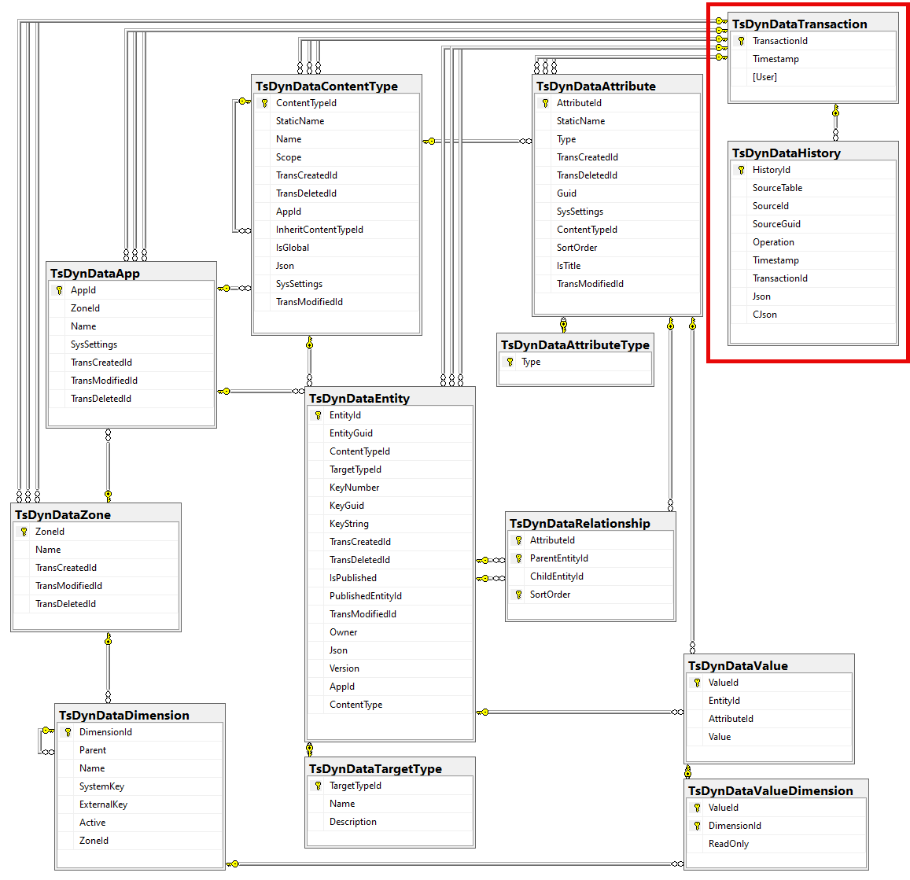

d---
uid: Abyss.Db.Index
---

# 2sxc & EAV Database

2sxc build on top of the EAV (Entity-Attribute-Value) data model.
This is a very flexible data model, but it can be complex to understand.

This section should help you understand how data is stored in the SQL database.

> [!NOTE]
> This is the new v20 schema.
> You can see the changes in the [changes v20](./changes-v20.md) section.

> [!IMPORTANT]
> This is documented so you can better understand the database.
> However, you should not use this to write SQL queries or manipulate data directly.
>
> The database almost never changes (since it's a lot of effort to change it),
> but it can change at any time.

---

## Overall Structure

This diagram shows the current structure of the database, with all tables and their relationships.
It has various aspects such as:

1. **Containers** grouping data into Apps and Zones
1. **Schema** like ContentTypes and Attributes
1. **Data** like Entities, Values and Relationships
1. **Languages** called Dimensions in the SQL
1. **Metadata** which connects data to something else it describes
1. **History** to track changes over time

_Click on the image to see it larger._

## Aspects of the Database

### Containers - The App and Zone

The app is a isolated container, similar to a small database.

These are what the App is responsible for:

* Has an own name and GUID
* It belongs to a Zone (like a web site)
* It has some SysSettings (JSON) which are used for advanced configuration such as data sharing with other apps
* It's the main anchor for ContentTypes and Entities, which belong to this app

The Zone is a larger container, which can contain multiple Apps.
It typically matches a single web site/portal on a system, but in special cases multiple sites can share a Zone.

### Schema - ContentTypes and Attributes

The schema is the structure of the data.
Since this is a dynamic data model using the EAV (Entity-Attribute-Value) model, the schema is very flexible.
It consists of the following parts:

* **ContentTypes** - these are the main types of data, like "Person", "Product", etc.
* **Attributes** - these are the properties of the ContentTypes, like "Name", "Country", etc.
* **AttributeTypes** - these are the data types of the attributes, like "Text", "Number", etc.

### Data - Entities, Values and Relationships

The data is the actual information stored in the database.
It consists of the following parts:

* **Entities** - these are the individual items of data, like a specific person or product.
* **Values** - these are the actual data points for the attributes, like "John Doe" for the Name attribute.
* **Relationships** - these define how entities are related to each other, like a person having multiple addresses.

### Language (Dimensions)

The dimensions are the languages and other dimensions of the data.
In 2sxc, we typically only use the language dimension, but you can also use other dimensions if needed.

* **Dimensions** - these are the different dimensions of the data, usually languages.
* **ValueDimensions** - this maps a specific value to that language

### Metadata - Connecting Data to Targets

The metadata is an _optional_ layer which allows data to reference something else which it describes.

* **DataTargetType** - this describes what kinds of targets there are, so that referencing a target with id `3` can be the person with id `3`, or the product with id `3`, etc.
* **Entity.TargetTypeId** - this - if set - defines what target type its addressing
* **Entity.Key...** - this is the specific key of the target, which is being referenced

_Note: this structure will probably change in the near future._

### History - Tracking Changes Over Time

The history is a way to track changes to the data over time.

It consists of the following parts:

* **DataTransaction** - this is a timestamped log entry to track changes to the data. All tables reference these timestamps to know when the data was changed and by whom.
* **DataHistory** - this table stores all changes to the data, including the old and new values.

---

## History

* changes from v0.x to v12.0 are not documented here
* v08 (ca.) - removed old table `ToSIC_EAV_Attachments`
* v13.01 - added `SysSettings` (JSON) columns to Apps table
* v15.00 - removed triggers for data versioning, since it's now handled by the C# code
* v15.00 - added `CJson` column to the History table, for compressed JSON data
* v15.00 - removed some unused columns for sort-order which were never used
* v16.07 - added SysSettings (JSON) columns to ContentTypes and Attributes
* v18.03 - removed old table `ToSIC_EAV_AttributeGroups`
* v19.00 - added cascade delete on attributes with relationships, so if the attribute is deleted, all relationships are also deleted
* v20 - major changes to the database structure, see [changes v20](./changes-v20.md)
