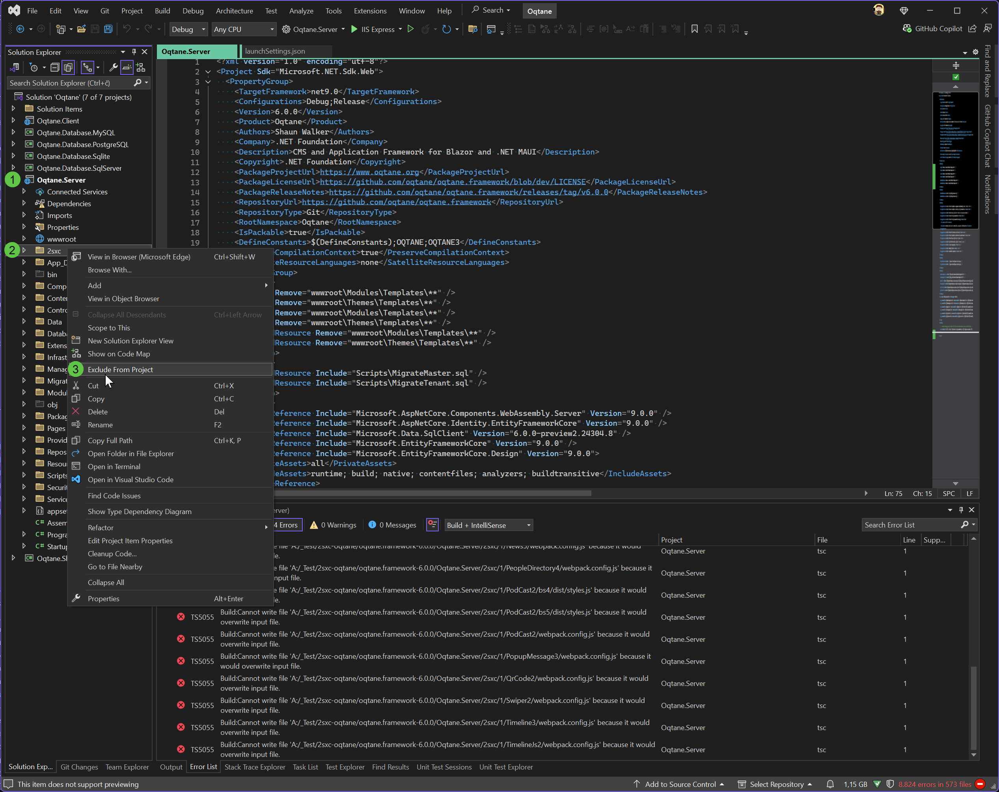

# Issues Building `Oqtane.Server.csproj` After Installing 2sxc Templates

When developing with Oqtane in **developer mode**, you typically run `Oqtane.Server.csproj` by pressing `F5` in Visual Studio. This action builds the project and its dependencies before launching it on IIS Express (`localhost`). However, after installing 2sxc Content and App templates, you might encounter build failures when compiling `Oqtane.Server.csproj`.

The same issue can also happen when creating an Oqtane dev app from the `oqtane-app` template:

```cmd
dotnet new install Oqtane.Application.Template

mkdir C:\oqtanedemo
cd C:\oqtanedemo

dotnet new oqtane-app -o OqtaneDemoApp
cd OqtaneDemoApp

dotnet build

cd Server
dotnet run
```

## Problem Overview

After adding 2sxc templates to your Oqtane project, the Visual Studio build process may fail with numerous errors—sometimes over 1,000—rendering Oqtane unusable in the development environment.



### Affected Folders

The build can pick up runtime files from two folders:

* `2sxc` - site apps and templates
* `Content` - persisted content, including 2sxc system and app files

These folders must remain on disk, but they should not be included in the `Oqtane.Server` project.

## Solution: Exclude the Runtime Folders from the Build

Add one exclusion block to the server project so build ignores both folders.

### Steps to Exclude Folders

1. **Open `Oqtane.Server.csproj`:**

   Locate the server project file (eg `Oqtane.Server.csproj`) in your project directory and open it with a text editor or within Visual Studio.
   For template-created apps this is usually `Server\YourAppName.Server.csproj`.

1. **Add Exclusion Rules:**

   Insert the following `<ItemGroup>` inside the `<Project>` element. If you already have an exclusion block for `2sxc`, replace it with this block:

   ```xml
   <ItemGroup>
     <!-- Exclude these directories from compilation -->
     <Compile Remove="2sxc\**;Content\**" />
     <!-- Exclude content files from the build output -->
     <Content Remove="2sxc\**;Content\**" />
     <!-- Exclude files from being embedded as resources -->
     <EmbeddedResource Remove="2sxc\**;Content\**" />
     <!-- Exclude miscellaneous files not included elsewhere -->
     <None Remove="2sxc\**;Content\**" />
     <!-- Exclude files from the dotnet watch tool -->
     <Watch Remove="2sxc\**;Content\**" />
   </ItemGroup>
   ```

   This only changes how the project handles the files. It does not delete them or prevent 2sxc from using them at runtime.

1. **Save and Rebuild:**

   Save the changes to `Oqtane.Server.csproj` and rebuild the project by pressing `F5` or selecting **Build** > **Rebuild Solution** in Visual Studio.

## Why This Happens

The .NET SDK automatically includes matching files below the project folder. The `2sxc` and `Content` folders can contain `.cs`, `.cshtml`, and other runtime files that belong to 2sxc apps, not to `Oqtane.Server`. Without the exclusions, build may compile or process these files as part of the server project.

## Summary

By excluding both runtime folders, you keep their files available to 2sxc without treating them as part of the server project.

## Related

* [](xref:Abyss.Platforms.Oqtane.Install.IssueHotReload)

---

