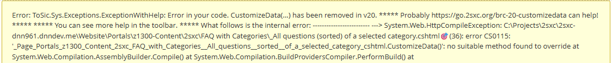
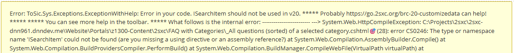
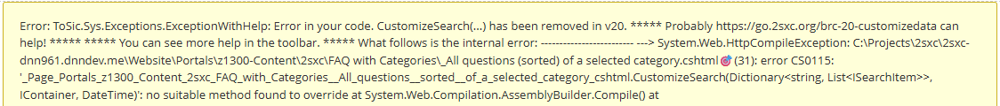

# Fix Breaking Change drop old CustomizeData and CustomizeSearch API in v20

**Keywords:** #Deprecated

2sxc v20 cleans up some historic, deprecated functionality.
They were not used much, but if you have old code which used this, here's how to fix any code in production.

## What changed

The `CustomizeData(...)` API was removed, together with `CustomizeSearch(...)` and `Purpose`, so you may see a message like this:

```text
Error: ToSic.Sys.Exceptions.ExceptionWithHelp: Error in your code. Check for custom AppCode.Razor.SomeRazor that forgets to inherit 'Custom.Hybrid.RazorTyped' or similar. ***** You can see more help in the toolbar. ***** What follows is the internal error: ------------------------- ---> System.Web.HttpCompileException: XXX.cshtml🎯(5): error CS0115: 'XXX_cshtml.CustomizeData()': no suitable method found to override ...
```



or

```text
error CS0246: The type or namespace name 'ISearchItem' could not be found (are you missing a using directive or an assembly reference?)
```



or

```text
error CS0115: 'XXX_cshtml.CustomizeSearch(Dictionary<string, List<ISearchItem>>, IContainer, DateTime)': no suitable method found to override 
```



## Background

When 2sxc was first created, the original idea was that Razor templates could receive data from various sources, such as:

1. the modules "own" data, which was added/edited by the editor (this was and is automatic)
1. data which the developer prepared in some initialization code, on a method called `CustomizeData(...)` (this was manual)
1. in addition, the developer could also prepare data for search, on a method called `CustomizeSearch(...)` (this was manual)

The underlying idea was that this way, the Razor template could be used flexibly in different ways, such as:

1. Html output: showing data directly
1. WebApi: publish the same data through WebApi
1. JS serialization: convert the data to JSON and use it in JavaScript
1. Search: use the data to search for content
1. ...and this with various combinations of where data comes from

Most of these features were superseded by other functionality many years ago, such as:

1. Visual Query
1. WebApi
1. Search API

The internal flow of data was:

1. prepare data using all the default mechanisms, providing the data on `Data`
1. Optionally call `CustomizeData(...)` to add or change data.
    Note that `CustomizeData(...)` could also query the `Purpose` to determine if it was being called for search or WebApi publishing, etc.
1. Finally: Either
    1. run the Razor template, which could then use the data on the `Data` object or the `Content` object, etc.
    1. or call `CustomizeSearch(...)` to retrieve the data for search and pass it on to the Dnn search indexer.

This old code continued to work, but was not used much in production, yet still added a lot of maintenance overhead for the 2sxc developers.

## Reason for Removal

For the Moment-of-Truth (MoT) release v20, we decided to finally remove this API, since it was not used much, and it was a source of confusion for many developers.

There are two key risk of leaving very old APIs alive:

1. maintenance and testing for the developers of 2sxc - who work for free - goes up and up and up.
1. people tend to discover old code and reuse it, spreading bad code practices.

Another problem was that these methods used an old programming style (non-functional)
which relied on side-effects (bad) to achieve their goals, which is not how modern 2sxc works.

So it was time to clean up in this MoT release.

## Example of old Code

This is from an ancient FAQ Module v1.00.03 which was available for 2sxc v8, ca. 2017:

```c#
@using ToSic.Eav.DataSources
@using ToSic.SexyContent
@functions{
  // Prepare the data - get all categories through the pipeline
  public override void CustomizeData()
  {
    // new features in 6.1 - the App DataSource CreateSource<App> and also the RelationshipFilter
    var qsOfCat = CreateSource<RelationshipFilter>(App.Data["QandA"]);
    qsOfCat.Relationship = "Categories";
    qsOfCat.Filter = Content.Category.Count > 0 ? Content.Category[0].Name : "";
    var sorted = CreateSource<ValueSort>(qsOfCat);
    sorted.Attributes = "EntityTitle";
    Data.In.Add("QandA", sorted["Default"]);
  }
}
```

## Recommended fix: Depends on the Scenario

### Recommended Fix for Data-Source Scenarios

In most cases, `CustomizeData(...)` was used to process data through DataSources, such as `CreateSource<...>`.
This was because in the early days, it was really difficult to write code which would select data from the App or other sources,
so almost every manipulation incl. sorting, filtering, etc. was done through DataSources.

The above example from the FAQ Module would be such a case.

You have at least two options to fix this:

1. Use [Visual Query](xref:Basics.Query.VisualQuery.Index) (recommended)
1. Continue to use DataSources, but without modifying the `Data` object (which is officially immutable)

> [!TIP]
> For such simple it's best to just use Visual Query.
>
> If you do not have experience with this, we recommend the [docs](xref:Basics.Query.VisualQuery.Index)
> and trying newer version of the same App, to see how it's implemented there.
> For example, try the latest [FAQ App v4](https://2sxc.org/en/apps/details/app/faq4-hybrid-for-dnn-and-oqtane) which uses Visual Query.

If you just want a quick-fix and, you can change the code as follows (based on the previous example):

TODO: 

```razor
@using ToSic.Eav.DataSources
@* old - this namespace is not supported any more *@
@* @using ToSic.SexyContent *@
@using ToSic.Sxc.Data

@functions{
    // Prepare the data - get all categories through the pipeline
    // old: public override void CustomizeData()
    // new - returns an IDataSource and renamed to GetData()
    public ToSic.Eav.DataSource.IDataSource GetData()
    {
        // new features in 6.1 - the App DataSource CreateSource<App> and also the RelationshipFilter
        var qsOfCat = CreateSource<RelationshipFilter>(App.Data["QandA"]);
        qsOfCat.Relationship = "Categories";
        qsOfCat.Filter = Content.Category.Count > 0 ? Content.Category[0].Name : "";
        var sorted = CreateSource<ValueSort>(qsOfCat);
        sorted.Attributes = "EntityTitle";
        // old: Data.In.Add("QandA", sorted["Default"]);
        // new
        return sorted;
    }
}
```

In most cases you can simply replace the `GetBestValue(...)` with `Get(...)`, which will return the same value.

```c#
// old:
var x = someObject.GetBestValue("DetailsPage"); // stops working in v20

// new:
var x = someObject.Get("DetailsPage"); // works in v12 - v20 and beyond
```

---

## History

* Introduced for DNN ca. 2sxc 2
* Deprecated in 2sxc 12 ca. 2018
* Planned for full removal in 2sxc 15 ca. middle of 2022
* Finally removed in 2sxc 20 ca. 2025-06

---

Shortlink to here: <https://go.2sxc.org/brc-20-customizedata>
