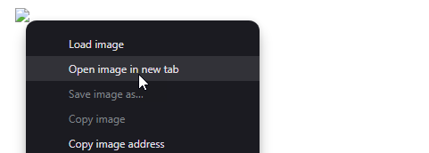
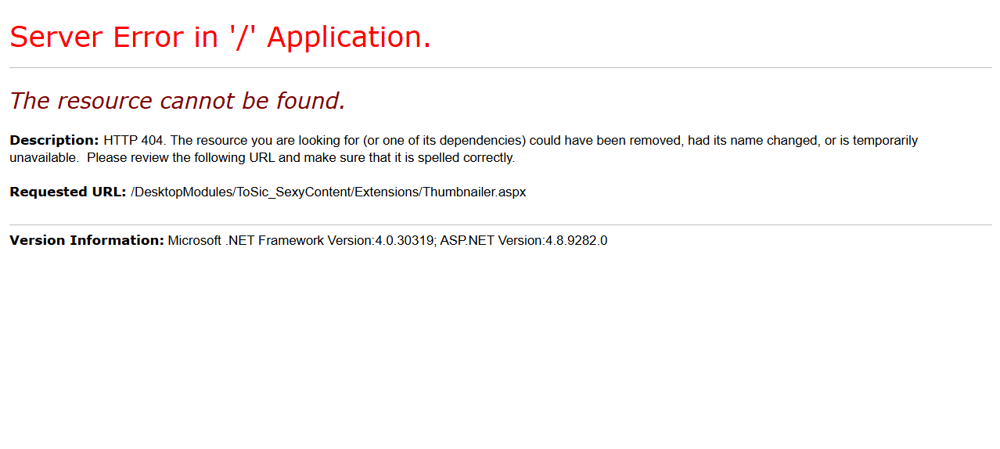

# Fix Breaking Change Thumbnailer.aspx in v20

**Keywords:** #Deprecated #Thumbnailer

2sxc v20 cleans up some historic, deprecated functionality.
They were not used much, but if you have code which used this, here's how to fix any code in production.

When we renamed the main folder from `/DesktopModules/ToSic_SexyContent/` to `DesktopModules/ToSic.Sxc/`,
we also removed the old `Thumbnailer.aspx` file which was used to resize images.

This is a very old thumbnailer which was not very good, but some old samples referenced it.

## Effect

If you are actually using it, you will get broken images in your apps like this:


If you then right-click the image and select "Open Image in New Tab", you will see an error like this:




The url would look like this:

```text
https://2sxc-dnn961.dnndev.me/DesktopModules/ToSic_SexyContent/Extensions/Thumbnailer.aspx?Image=/some-path.jpg&Width=454&Height=5000
```

The screen you would see would look like this:



```text
The resource cannot be found.

Description: HTTP 404. The resource you are looking for (or one of its dependencies) could have been removed, had its name changed, or is temporarily unavailable.  Please review the following URL and make sure that it is spelled correctly.

Requested URL: /DesktopModules/ToSic_SexyContent/Extensions/Thumbnailer.aspx

```

## Reason for Removal

This was a very old thumbnailer which was replaced more than 10 years ago.
Since the path-change also breaks all previous URLs, it's time to move on.

## Upgrade to Newer functionality

In general all you need to do is change the link to the new thumbnailer, which is now part of the 2sxc module.

Just adjust your code - for example this:

```html
   
```

to this:

```html

```

As you can see, the important things are:

1. The base path is now not necessary
1. The query parameters are now `?w=454&h=5000` instead of `?Width=454&Height=5000`

---

## History

* original `thumbnailer.aspx` introduced with 2sxc 2 ca. 2012
* replaced with ImageResizer.net ca. 2sxc 5 in ca. 2014
* replaced with ImageFlow in ca. v12 with same URL schema ca. 2018
* replaced the `thumbnailer.aspx` in 2019-05 to redirect to new schema, but links still worked
* Removed thumbnailer.aspx in 2sxc 20 with the path change to `/DesktopModules/ToSic.Sxc/`

---

<!-- Shortlink to here: <https://go.2sxc.org/brc-20-thumbnailer> -->
