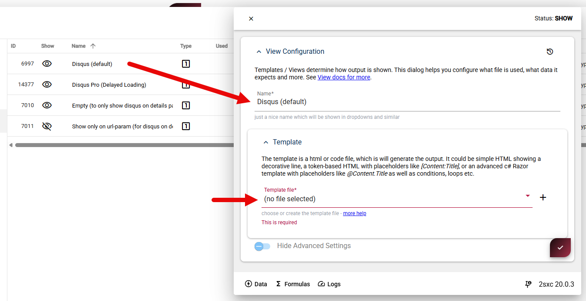
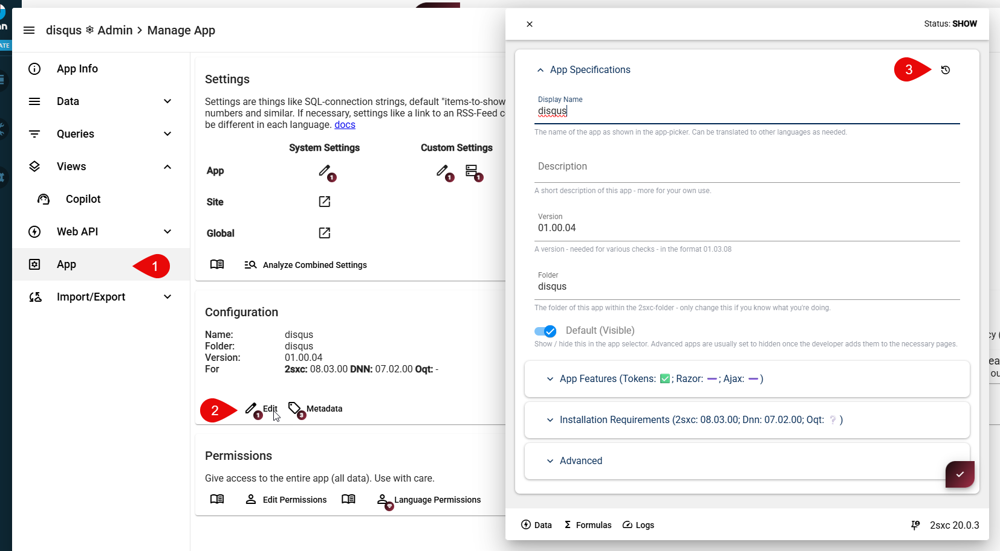
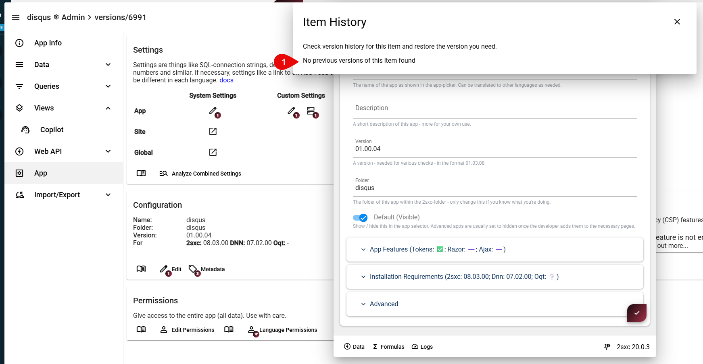
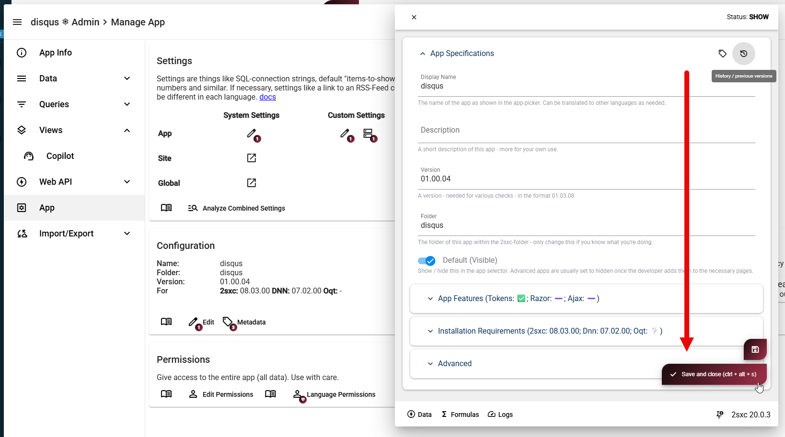

# Fix Issue Selecting Templates in Old Apps

During extensive testing we noticed that in some very old apps, the template selection was not working correctly.

This is how it looks like:

The reason is quite complex, but it has to do with internal data changes about 8 years ago, how the data was stored in the database.
Today data describing the app (including it's main folder), is stored in a JSON format, but in the past it was stored in a different way.
This was not a problem until we updated the DB Schema in v20.

> [!TIP]
> You only have this problem if you never saved the App Configuration for the last 8 years or so.
> So we believe it's quite rare.

## Verify and Fix this Issue

If you have this issue, you will see that the template selection is not working correctly.

You would also go to the app configuration, and see that the data has no prior history.

To fix the issue, simply save the App Configuration once.

  

  

  

> [!TIP]
> After fixing this, make sure to either flush the App Cache, or briefly restart the system.

---

## History

* published this for v20 2025-07-10
