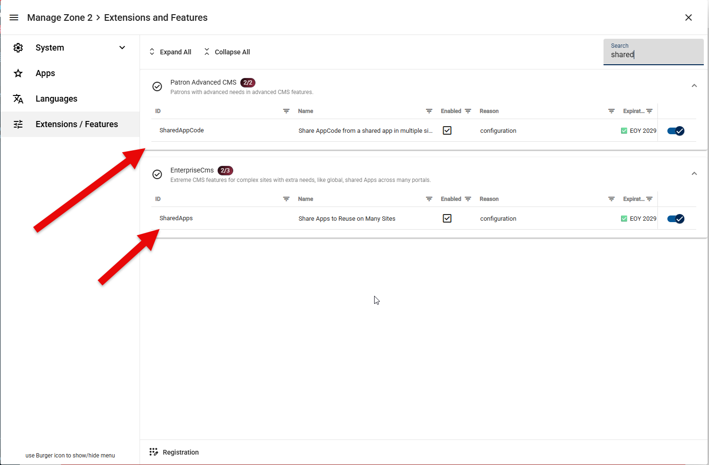
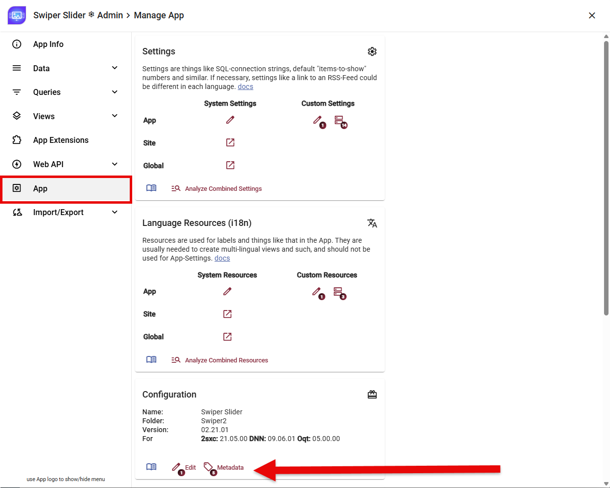
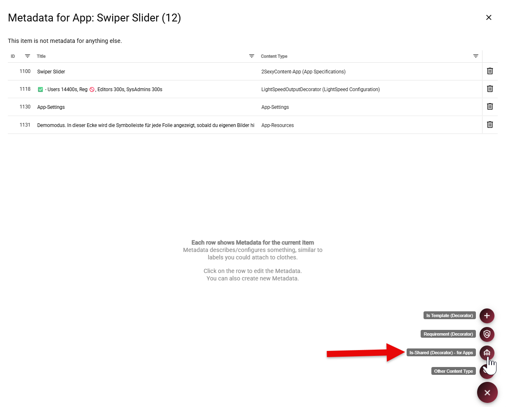
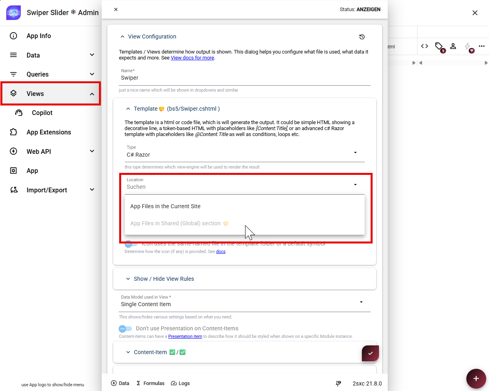
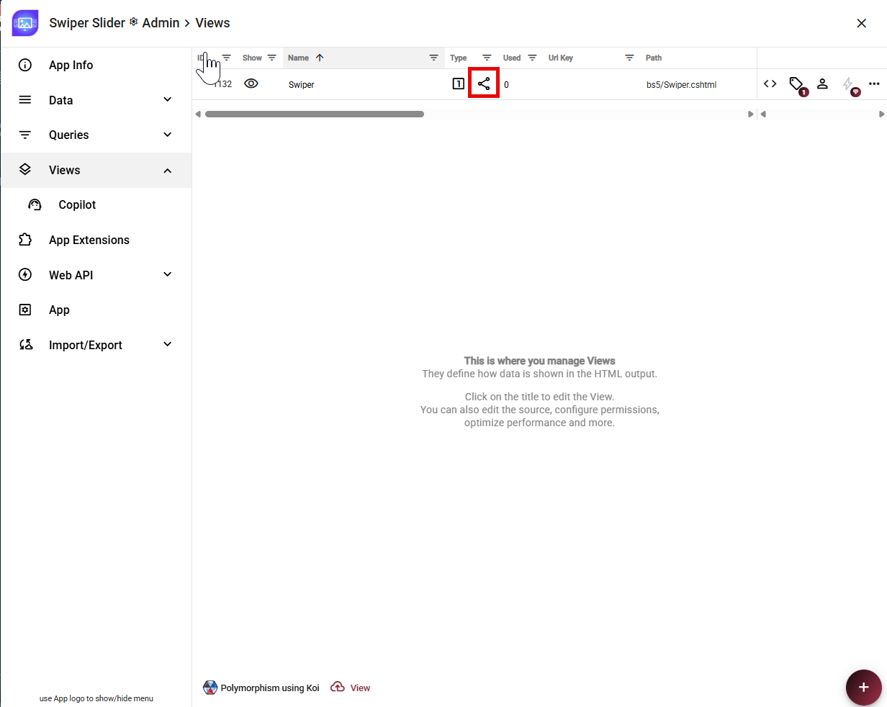
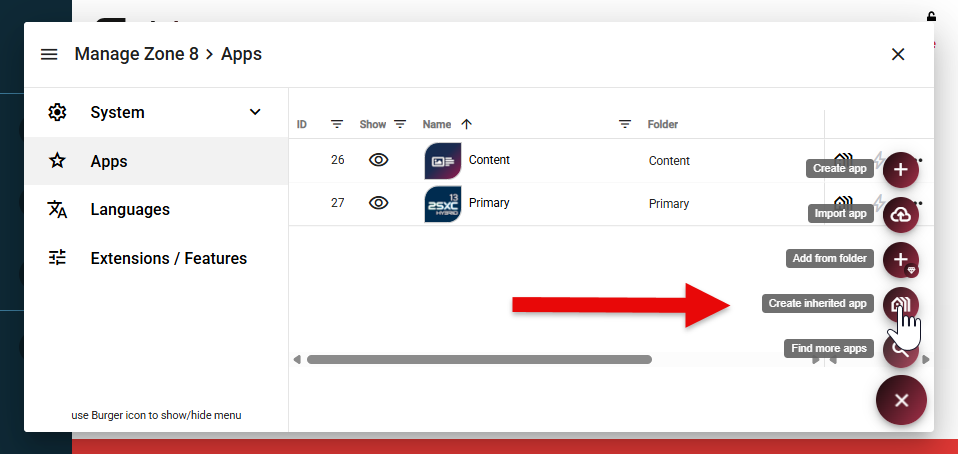
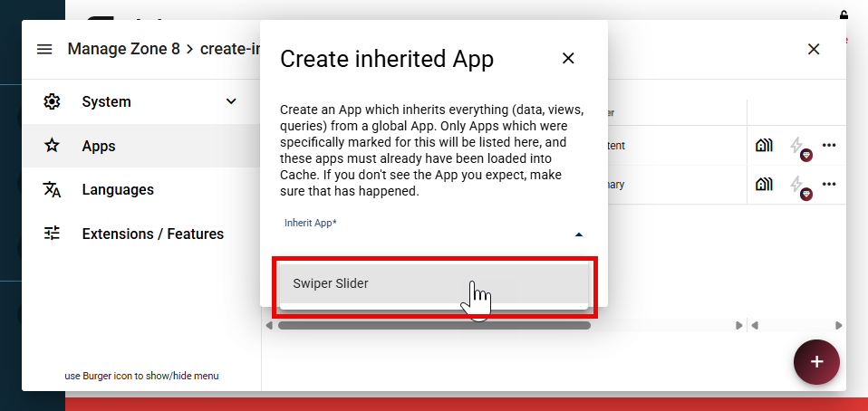
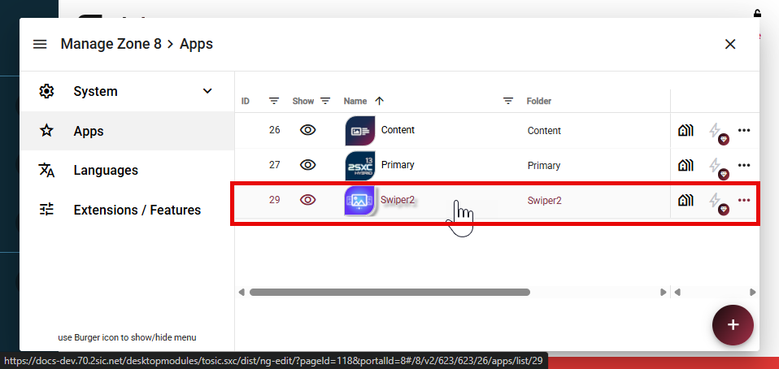
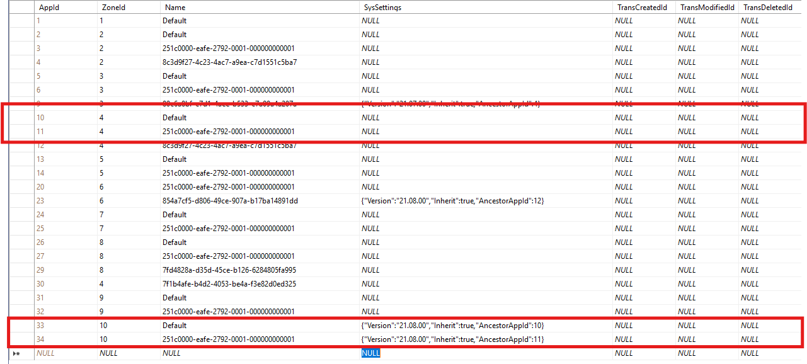

# Inherit Apps (v13+)

Inherited Apps let you maintain data, content types, queries, views, and shared
files in one App and reuse them on multiple sites.

This is useful when several sites need the same App and should receive updates
from one central source.

> [!IMPORTANT]
> App inheritance uses features from **Patron Advanced CMS** and **Enterprise CMS**.
> The corresponding features must be included in your license and enabled for the zone.

## How App Inheritance Works

An inherited App has two layers:

1. The **Ancestor App** is the shared base. Changes to it affect every App that inherits from it.
1. A **Descendant App** is created on a specific site. It can add local items, but it cannot
   modify items inherited from the Ancestor App.

### What a Descendant App Inherits

1. The App folder name
1. Content types
1. Data and entities
1. Queries
1. View definitions
1. Template files and JS/CSS resources stored in the shared (global) App folder
1. App settings from the Ancestor App

Ancestor settings act as fallbacks. Settings configured directly on the Descendant App
have higher priority. For details, see [Settings Stack](xref:Basics.Configuration.SettingsStack).

### What a Descendant App Does Not Inherit

1. Templates and resources stored in the Ancestor App's site-local folder
1. ADAM files belonging to the Ancestor App's site

## Best Practices

Everything in the Ancestor App is available to all its Descendant Apps, so even a small
change can affect many sites. Keep Ancestor Apps on a dedicated, non-public management
site instead of using an App from a production site.

Test changes on the management site before relying on them in Descendant Apps.

## Enable the Required Features

Before creating an Ancestor App, enable the two features used by App inheritance:

1. In **Manage Zone**, open **Extensions / Features**.
1. Search for `shared`.
1. Enable **SharedAppCode** to share AppCode from a shared App across multiple sites.
1. Enable **SharedApps** to reuse shared Apps on multiple sites.



Both entries must show as enabled before you continue.

## Create the Ancestor App

An existing App can be converted into an Ancestor App in four steps.

### 1. Mark the App as Shared

Open **App Settings**, select **App**, and click **Metadata** in the **Configuration** section.



Add the **Is-Shared (Decorator) - for Apps** metadata decorator.
This marks the App as available for inheritance by Apps on other sites.



### 2. Copy the App Files to the Shared Folder

Copy the complete App folder from the current site's Apps folder:

```text
/Portals/<site-id>/2sxc/<app-folder>/
```

to the shared Apps folder:

```text
/Portals/_default/2sxc/<app-folder>/
```

Keep the folder name unchanged. Do not delete the original folder yet.

### 3. Change Every View to Shared Storage

Open **Views** and edit each view. In **Template**, change **Location** from
**App Files in the Current Site** to **App Files in Shared (Global) section**.



Repeat this for every view in the App. The shared icon in the Views list confirms
that a view now uses the global App folder.



### 4. Remove the Local App Folder and Test

After all views use shared storage, make a backup and remove the old App folder from
`/Portals/<site-id>/2sxc/`. Test the App again. It should work exactly as before,
but its files should now come from the shared folder.

> [!TIP]
> For developers, a filesystem link from the old portal App path to the shared App
> folder can make the new location easier to discover. This link is optional and
> is not required by 2sxc.

The App is now ready to be used as an Ancestor App.

### Limitations of the Ancestor App

1. Descendant Apps can only use views whose templates are stored in the shared (global) location.
1. If you have data (entities) with images or files, they cannot use a `file:72` reference.
   Use the full path because file-ID lookup does not work across sites.

## Create the Descendant App

On the site which should use the inherited App, open **Apps**.
Expand the **+** menu and select **Create inherited app**.



In **Inherit App**, select the Ancestor App and click **Create**.
Only Apps marked with the **Is-Shared** decorator appear in this list.



> [!TIP]
> The Ancestor App must already be loaded into the cache. If it is missing from the
> list, open the Ancestor App on its management site, then reopen this dialog. Also
> verify that the **Is-Shared** decorator is present.

2sxc creates the Descendant App automatically. It now appears in the Apps list
and inherits the data, content types, queries, views, and shared files of the Ancestor App.



Open the new App and verify that its inherited views and data are available. Changes made
later in the Ancestor App will become available to this Descendant App and all other
Descendant Apps that use the same ancestor.

## Advanced: Inherit the Content or Primary App

The **Content App** and **Primary App** already exist for every site, so they cannot be
created as Descendant Apps through **Create inherited app**.

In the `TsDynDataApp` table, locate the target row by its `ZoneId` and `Name`:

1. The Content App has the name `Default`.
1. The Primary App uses the name `251c0000-eafe-2792-0001-000000000001`.



The highlighted rows show a Content App and Primary App configured with different
Ancestor App IDs in the same zone.

The row's `SysSettings` JSON must enable inheritance and contain the numeric `AppId` of
the Ancestor App, for example:

```json
{ "Inherit": true, "AncestorAppId": 123 }
```

Replace `123` with the actual Ancestor App ID.

> [!CAUTION]
> Restart the application or clear the 2sxc App/zone cache so the new settings are loaded.

---

## History

1. 2026-09-01: Documented manual inheritance for Content and Primary Apps.
1. 2026-09-01: Documented the required features and clarified inheritance behavior.
1. 2026-08-28: Documented how to create a Descendant App from an Ancestor App.
1. 2026-08-27: Documented how to convert an existing App into an Ancestor App.
1. Introduced in v13.01
