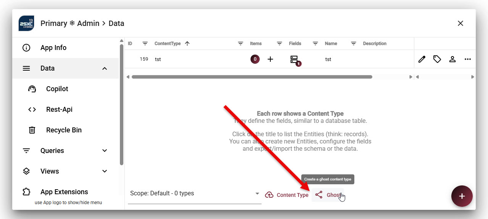
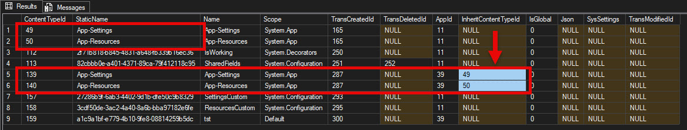

# App Shared "Ghost" Content-Types (⚠)

[!include["Data"](~/pages/basics/data/_shared-content-types-app.md)]

This explains **App Shared Content-Types** which used to be called **Ghost Content-Type**.
For an overview check out .

> [!TIP]
> If you are looking into this, you probably want
> to use [Inherited Apps](xref:Basics.App.InheritApps.Index) instead,
> which is a more modern approach to the same problem.

---

> [!WARNING]
> This is a very advanced topic which less than 0.1% of all developers use.
>
> You almost certainly will _not_ need this. So if you start playing around with this,
> make sure that you really need this.

## What is an App Shared Content-Type?

**App Shared Content Types** are a [Content Types](xref:Basics.Data.ContentTypes.Index) which are...

1. ...**defined** in one App
2. ...and **inherited** (re-used) in one or more other Apps.

Good to know:

* They can only be used inside the App which are configured to _inherit_ the definition
* The data will be in the export/import, but the **Content-Type Definition** will be missing.
* If you import an App with such data, the App holding the definition must be imported first.
* The defining Content-Types are stored in the [SQL database](xref:Basics.Data.ContentTypes.SqlStorage) on the main App.

You rarely want to use this.

## How it works

* Shared Content-Types are defined in a **Master** App which manages this type.
* Other **Slave** Apps are configured to also use this Content-Type. They automatically inherit every configuration of the **Master** App even when the schema changes.

## Why does this Feature exist?

The feature was originally introduced in 2sxc 1.0 because at that time we didn't have [Global Shared Content-Types](xref:Basics.Data.ContentTypes.Global)

It has since been used in various complex sites. An example is a installation which has many Sites, each having the same **News App**. In such scenarios it's hard to keep changes synchronized, so it's usually implemented as follows:

1. A **Master** App is on a hidden Site which just manages the Content-Types
1. A **Slave** App is configured to use the Content-Types. It often also uses shared Templates etc.
1. The **Slave** App is then exported and imported in each site where needed.

## Why would you want to use this?

1. If you are creating a complex system with many portals and apps which should share the schema.
1. If you want to share the schema of the AppSettings and AppResources from somewhere.  
    Reason is that inheriting the entire app would also inherit the data (the settings) which results in unexpected behavior.

## Why would you _not_ want to do this?

Using Shared Content-Types is fairly technical, so the developer must understand what this is.

## How to Set it Up

There are two ways to do this: in the UI, or directly in the DB (advanced).

In the UI, there is a hidden button to do this, which only appears in developer mode (since it's such a rare/advanced feature).

## How it Works

This is just internal information, so that the few people who actually need this understand it.

The configuration is stored in the database, in a special field in the `TsDynDataContentType` table.

## History

1. Introduced in 2sxc 1.0
