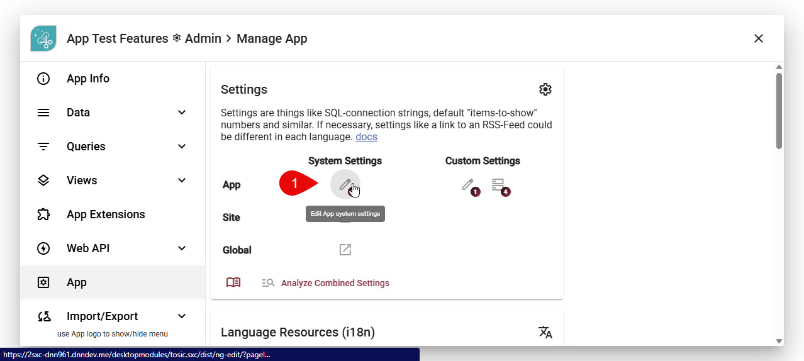
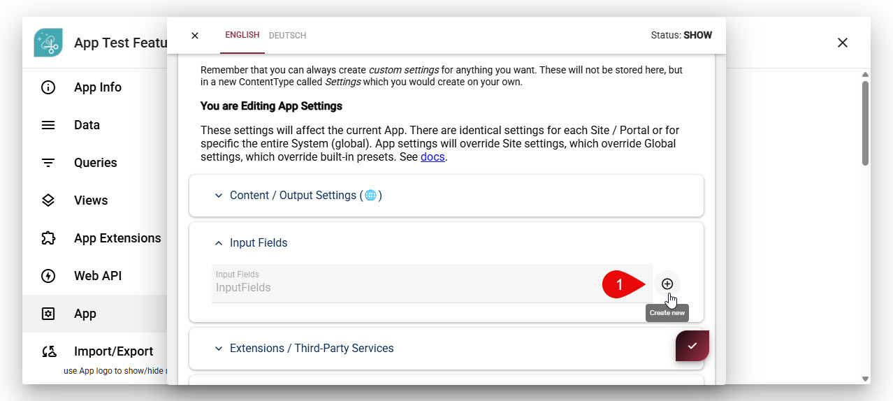
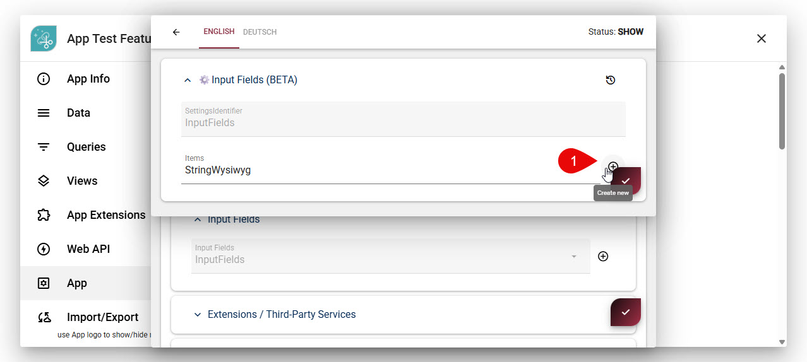
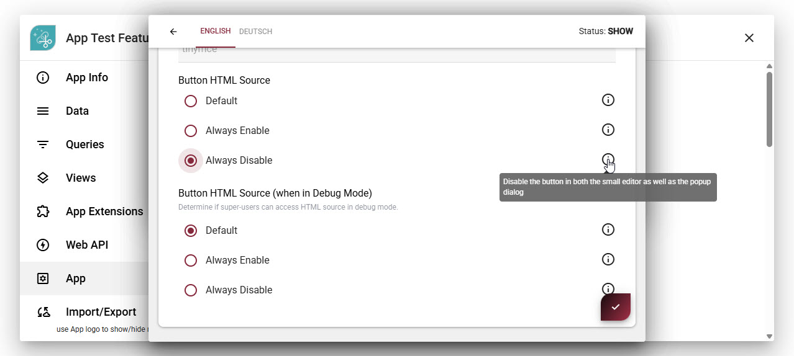

# Field Input-Type string-wysiwyg

Use this field type for configuring simple text UI elements, storing [string/text data](xref:Basics.Data.Fields.String). It's an extension of the basic [string field type](xref:Basics.Data.Fields.String).

## Features

1. provide a wysiwyg text box
1. rich WYSIWYG experience using TinyMCE
1. ADAM support to drop images and documents

## Modes (new v15.04)

The string-wysiwyg field type has these modes.

### [`default`](#tab/default)

This is the standard mode, which is used if you don't specify a mode.
It has various buttons to edit text and more.

### [`text`](#tab/text)

This is the basic text mode.
It doesn't show as many buttons and disables features such as adding images to the content.
The text-mode is meant for WYSIWYG where the user shouldn't add images.

### [`text-basic`](#tab/text-basic)

This is a reduced text mode and doesn't provide the editor with headings.
It's meant for simpler text where the editor should really not add headings to the content,
but can still do basic formatting and add lists etc.

### [`text-minimal`](#tab/text-minimal)

This is a very reduced text mode which only provides basic formatting such as bold/italic.
It's meant for inputs where the user should not be able to add headings or lists.

### [`text-plain`](#tab/text-plain)

This is the most reduced wysiwyg mode, almost not a WYSIWYG at all.
It's meant for teasers and other short texts, where the user can basically not paste formatted text
or make anything bold/italic.

In addition to the toolbar, the plain text mode also has the following configuration:

1. Disable dialog mode. Since the plain text mode is meant for short texts, it's not really useful to have a dialog mode.

### [`rich`](#tab/rich)

This is a new mode which is still in development.
It provides special features to make content which is rich and responsive at the same time.

Features include:

1. Automatic image resizing of wysiwyg-images using the `<picture>` tag
1. Image arrangements which work on all screens (eg. 4-in-a-row on desktop, but under-each-other on mobile)
1. Optimized CSS to make this possible
1. Special spacers to create proper gaps where necessary
1. Image text wrapping so that multiple side-images are under each other and not staggered

👉🏽 See 

---

## Configure a String-Wysiwyg

The mode is configured in the normal field settings.

### Special Configuration of the HTML Button

In the normal field settings, you can also configure whether the HTML button should be shown or not.
This is useful if you want to allow users to add images and other media, but not allow them to edit the HTML directly.

The system defaults are as follows:

1. The HTML button is shown for all users by default - but only in the full-screen dialog mode, not in the inline mode.
1. The HTML button is hidden for all users by default in the inline mode.

You change the default behavior for all fields in the system by going to the System Settings (new in v21.04):

* "Button HTML Source" modifies the default - leaving it on `default` will keep the existing behavior.
* "Button HTML Source (when in Debug mode)" setting - leaving it on `default` will allow super-users to see the HTML button in Debug mode, even if it's hidden for normal users.

  
  
  
  

> [!TIP]
> You can specify this at the app-level, site-level or system-level, and the more specific setting will override the more general one.

---

## History

1. Introduced in EAV 1.0 2sxc 1.0, originally as part of the [string field type](xref:Basics.Data.Fields.String)
1. Changed in 2sxc 6.0 - Moved to it's own sub-type
1. Changed to be full-screen dialog editing only in 10.00
1. Added option to switch between full-screen or directly in the form in 10.09
1. Added options to enable / disable HTML and Advanced buttons in 10.09
1. Added modes in 15.04, released in 16.00
1. Added ability to hide HTML button for normal users, but show it for super-users in Debug mode in 21.04
