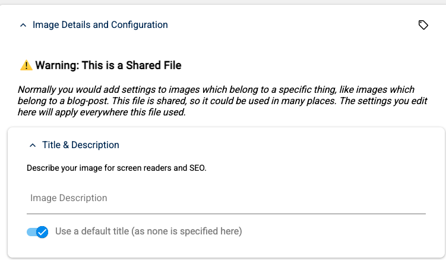

# Warning about Shared Images in 2sxc

Sometimes you'll see a warning that an image is shared:

## Background

In 2sxc, when you add an image to any item, it is stored in a folder which "belongs" to this item and this explicit field.
So it's usually in a folder like `/Portals/0/adam/[App-name]/[short-guid]/[field-name]/image.jpg`.

The main idea is that this file really belongs to this item,
and as long as you use it this way, anything you do will not impact any other item, app, or page on your site.
So if you rename it, delete it, change how it should be cropped - all this will only impact this one item and this one field.

## Access from Another Context could lead to Surprising Results

Now the image itself could also be used in another item - nothing prevents you from copying `file:72` to another item.
But if you are now accessing the image from this other item and modify it's title,
you may not be aware that this will have a broader impact - since you'll usually only look at the image
right where you changed it.

So the above warning tries to make you aware of this - if you are accessing the image from a different context,
it will warn you that you are changing something that is shared and may impact other items, apps, or pages on your site.
You are free to still make your changes, but you should be aware of the potential impact.

---

## History

1. Added ca. v15 (but could have been anytime else)
1. Added docs in v21

Shortlink: <https://go.2sxc.org/image-share-warning>
