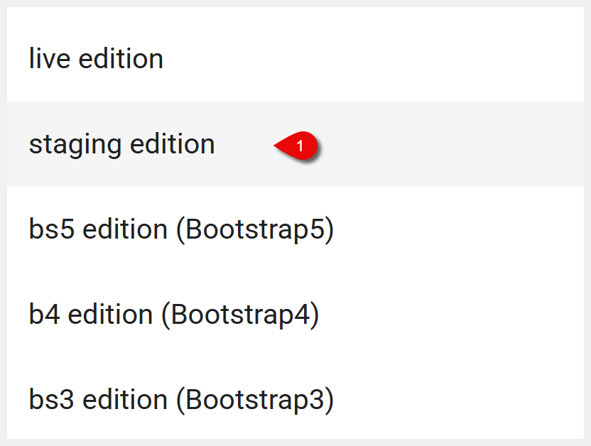
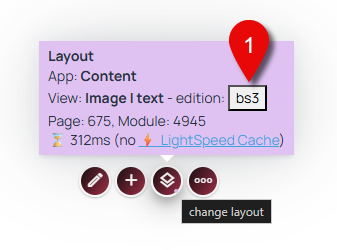
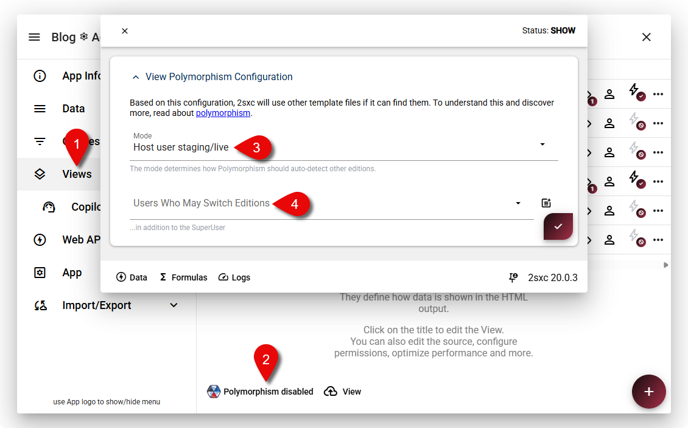

# Edition Switching in 2sxc 20.00.03

2sxc 20.00.03 introduces a highly requested feature: **edition switching**. This allows developers, designers, and content managers to toggle between different editions of content or layouts directly from the toolbar — instantly and securely.

## What Are Editions?



Editions in 2sxc let you serve different content or layouts depending on the context. Common use cases include:

- **Live vs Staging**: Show published content to users while keeping drafts or upcoming changes separate.
- **Multiple Visual Themes**: For example, switching between Bootstrap 3 and Bootstrap 5 styles.
- **Regional Variants**: Different content or layout depending on location or audience.

With the edition switching feature, you can preview and test these variations easily from the toolbar.

## How Edition Switching Works

When you add the `.Edition()` tweak to your toolbar, a dialog appears allowing users to switch between configured editions (e.g., staging, live).

```csharp
Kit.Toolbar.Empty().Edition()
```



Alternatively, edition switching can be accessed by hovering over the layout change toolbar and clicking the edition button.

Switching editions changes the displayed content or layout — for example, toggling between Bootstrap 3 and Bootstrap 5 styles, or switching from draft to published content.

## Permissions



- By default, only developers or host users can switch editions.
- To allow editors or admins to switch editions, adjust the polymorphism permissions accordingly.
- If users lack permission, the edition switcher will not be visible unless explicitly added with .Edition() in the toolbar configuration.
