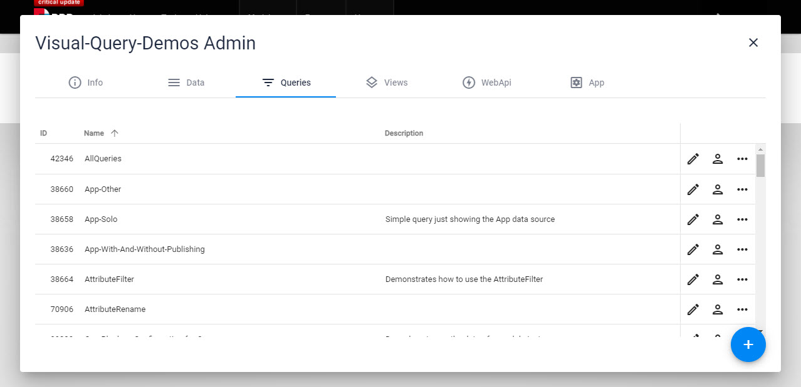
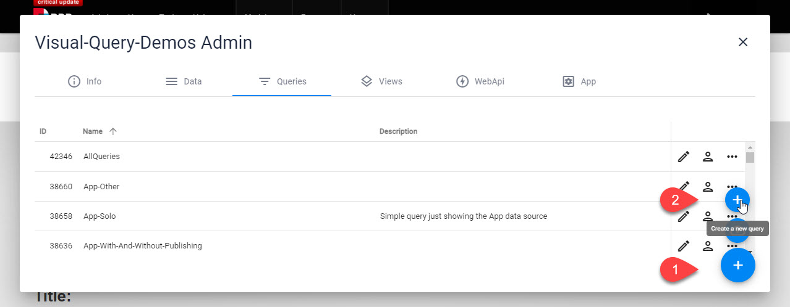

# Query and VisualQuery

[!include]

2sxc Templates and Headless APIs can use **Queries** to access data. This is pretty amazing:

* [VisualQuery Designer](xref:Basics.Query.VisualQuery.Index){title="icon:diagram-3"}
  create queries using the VisualQuery designer
* [Assign Queries to a View](xref:Basics.Query.QueryInView){title="icon:layout-text-window"}
  use queries as the data source for a view template
* [Use Queries in the Headless API](xref:WebApi.Headless.Index){title="icon:cloud"}
  configure permissions to use queries through the Headless API
* [Use Queries in Dropdown Fields](xref:Basics.Query.EditForm){title="icon:chevron-down"}
  use queries in edit forms such as dropdown fields
* [Access Queries in Code](xref:NetCode.DynamicCode.Objects.App.Query){title="icon:code-slash"}
  access queries using App.Query["QueryName"]

In addition, there are also some built-in [System Queries](xref:Basics.Query.SystemQueries) which will get system data for you like a list of Content-Types or Apps in the System.

> [!TIP]
> Note that Queries can created in code and using VisualQuery.
> The code method is very advanced. You can read more about [using DataSources in C# / Razor code](xref:NetCode.DataSources.Use.Guide).
> The rest of this page is about VisualQuery.

## Queries in an App

All Queries (except for the System-Queries) are stored in the App - this is what it looks like:

## Create Queries

To create a new Query hit the + and continue from there:

## Edit Queries

Use the [VisualQuery Designer](xref:Basics.Query.VisualQuery.Index)

## Export / Import

👉 

## Technical Implementation

When queries run they behave like [Data-Sources](xref:NetCode.DataSources.Index) while internally chaining various other Data-Sources to query the underlying data.

---

## History

* introduced in 2sxc 6
* continuously enhanced
