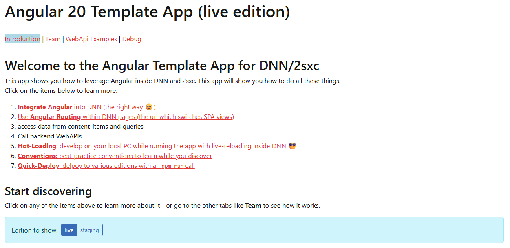

# App Extension: Angular Loader

Whit this Extension, you can easily load Angular apps into your DNN environment. It handles loading the Angular framework and your app code.

Optionally, it can also handle loading different editions of your app (e.g. dev vs. prod) using the JS App Editions extension.

## Installation and Use

➡️ See [](xref:Extensions.AppExtensions.Install.Index)

### [Basic example](#tab/use-in-razor-minimal)

1. First, build your Angular app and place the output files into the appropriate folder in your app.
2. Insert this code into your Razor view where you want to load the Angular app:

```cshtml
@inherits Custom.Hybrid.RazorTyped

@Html.Partial("./extensions/angular-loader/Angular Main.cshtml", data: new {
  AngularAppPath = "/angular-demo/angular/browser",
  AngularAppTag = "app-root"
})
```


This will load the Angular app from the specified path (e.g. `/angular-demo/angular/browser`)
regardless of the current edition. For example the hello world app of the Angular Quickstart Guide.

### [With Editions](#tab/with-editions)

1. To use the Angular Loader with Editions, build your Angular app and place the output files into the appropriate folders in your app (e.g. `/live/dist/ng-app`, `/staging/dist/ng-app`).

2. Insert this code into your Razor view where you want to load the Angular app:

```cshtml
@inherits Custom.Hybrid.RazorTyped

@Html.Partial("./extensions/angular-loader/Angular Main.cshtml", data: new {
  AngularAppPath = "/dist/ng-app",
  AngularAppTag = "app-root",
  Editions = "live,staging"
})
```

This will load the Angular app based on the current edition.
For example, if the current edition is "live", it will load the Angular app from "/live/dist/ng-app".



### [With Local Editions](#tab/local-editions)


The Angular Loader includes the [JS App Editions](xref:Extensions.AppExtensions.By2sxc.JsAppEditions.Index) extension to develop the app locally with a hot-build, while loading the production build from DNN for normal users.

The local edition is useful for development, as it allows you to load the Angular app directly from your local development environment without having to build and deploy it to the server.
When the local edition is active, the Angular Loader will load the app from the specified LocalDevServerPath (e.g. `"//localhost:4200"`) and include the specified LocalDevFiles (e.g. `"runtime.js,polyfills.js,styles.js,vendor.js,main.js"`).
This allows you to see your changes in real-time as you develop your Angular app.

```cshtml
@inherits Custom.Hybrid.RazorTyped

@Html.Partial("./extensions/angular-loader/Angular Main.cshtml", data: new {
  AngularAppPath = "/dist/ng-app",
  AngularAppTag = "app-root",
  Editions = "live,staging,local",
  LocalDevServerPath = "//localhost:4200",
  LocalDevFiles = "runtime.js,polyfills.js,styles.js,vendor.js,main.js"
})
```


***

## History

1. v01.00 - Initial release for 2sxc

Shortlink: <https://go.2sxc.org/ext-ngloader>
