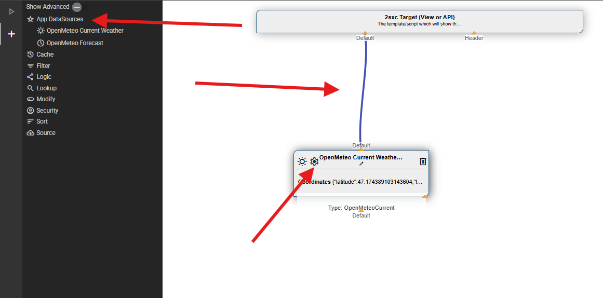

# Open-Meteo DataSource

This App Extension adds ready-to-use **2sxc DataSources** for the public **Open-Meteo** weather API.
It lets you pull **Current weather** and/or **Forecast data** into 2sxc streams, so you can use it like any other DataSource in Visual Query / code.

---

## Installation

See [Extension installation](xref:Extensions.AppExtensions.Install.Index)

After installation, you should have the extension files in your app

## Usage

The extension contains **two DataSources**:

- `OpenMeteoCurrent` → current weather
- `OpenMeteoForecast` → forecast data

Both DataSources read configuration (lat/lon and other supported parameters) and return one stream (usually `Default`) with a model matching the Open-Meteo response.

### Configure

In Visual Query (or in code), set at least:

- `Latitude`
- `Longitude`


Optional (recommended):

- `Timezone` (e.g. `Europe/Amsterdam`)
- `TemperatureUnit` (`celsius`/`fahrenheit`)

Only parameters shown in the DataSource configuration UI are supported. Configure them either through Visual Query or via code when creating the DataSource.

---

### Use in Visual Query

1. Add the DataSource `Open-Meteo Current` or `Open-Meteo Forecast`
2. Set the configuration values (Latitude/Longitude/…)
3. Connect it to your output
4. Inspect the `Default` stream to see the returned fields

<div gallery="new-inherit">
  
  
</div>

> Tip: In the configuration UI, click the small map icon next to the coordinate fields to pick latitude/longitude from a map.

---

### Use in RazorTyped (minimal examples)

Below are intentionally short examples. Your actual namespace/class names may differ depending on where you placed the files.

#### Current weather

1. Creates an instance of the `OpenMeteoCurrent` DataSource
2. Passes location and configuration values
3. Reads the first item from the `Default` stream
4. Access fields by name (as shown in the Visual Query inspector)


```cshtml
@inherits Custom.Hybrid.RazorTyped
@using AppCode.Extensions.OpenMeteo
@using AppCode.Extensions.OpenMeteo.Data

<h3>Current Weather</h3>
@{
  // Create a data source for current weather data from OpenMeteo API
  // Parameters specify the location and timezone settings
  var currentDs = Kit.Data.GetSource<OpenMeteoCurrent>(parameters: new OpenMeteoParameters() {
    Latitude = 47.1674,   // Latitude of the location
    Longitude = 9.4779,   // Longitude of the location
    Timezone = "auto"     // Use timezone of coordinates
  });

  // Use the strongly-typed model
  var current = As<OpenMeteoResult>(currentDs);
}

@* Display message if the API didn't return any weather data, then exit *@
@if (current == null)
{
  <div class="alert alert-warning">
    No data available
  </div>
  return;
}

@* Display the current weather information retrieved from the API *@
<ol>
  <li>
    <strong>When:</strong> @current.When
  </li>
  <li>
    <strong>Temperature:</strong> @current.Temperature °C
  </li>
  <li>
    <strong>Weather:</strong> @current.Weather
  </li>
</ol>
```

### Forecast

1. Creates an instance of the `OpenMeteoForecast` DataSource
2. Reads the forecast data from the Default stream
3. Iterates over the items and accesses fields by name

> Tip: You can cast the stream to the  `OpenMeteoResult` model using `AsList<OpenMeteoResult>(forecastDs)`.

```cshtml
@inherits Custom.Hybrid.RazorTyped
@using System.Linq
@using AppCode.Extensions.OpenMeteo
@using AppCode.Extensions.OpenMeteo.Data


<h3>Weather Forecast</h3>
@{
  // Create a data source for hourly weather forecast from OpenMeteo API
  // Returns one record per hour for the specified number of forecast days
  var forecastDs = Kit.Data.GetSource<OpenMeteoForecast>(parameters: new {
    Latitude = 47.1674,      // Latitude coordinate for the location (Vaduz, Liechtenstein)
    Longitude = 9.4779,      // Longitude coordinate for the location
    Timezone = "auto",       // Automatically detect timezone based on coordinates
    ForecastDays = 2         // Number of days to forecast (default is 2)
  });

  // Convert the data source results to a strongly-typed list
  // Take only the first 24 hours (1 day) for display
  var items = AsList<OpenMeteoResult>(forecastDs).Take(24).ToList();
}

@if (!items.Any()) {
  // Display message if the API didn't return any forecast data
  <p>No forecast data available</p>
}
else {
  <p>Showing hourly forecast for the next @items.Count hours</p>
  
  <table class="table table-striped">
    <thead>
      <tr>
        <th>Time</th>
        <th>Temperature (°C)</th>
        <th>Weather</th>
      </tr>
    </thead>
    <tbody>
    @foreach (var item in items)
    {
      @* Each row displays one hour of forecast data *@
      <tr>
        <td>@item.When</td>            @* Timestamp for this forecast entry *@
        <td>@item.Temperature</td>     @* Forecasted temperature in Celsius *@
        <td>@item.Weather</td>         @* Human-readable weather condition *@
      </tr>
    }
    </tbody>
  </table>
}
```

> Tip: You can cast the stream to the  `OpenMeteoResult` model using `AsList<OpenMeteoResult>(forecastDs)`.

## History

1. Initial release

Shortlink: <https://go.2sxc.org/ext-openmeteo>
