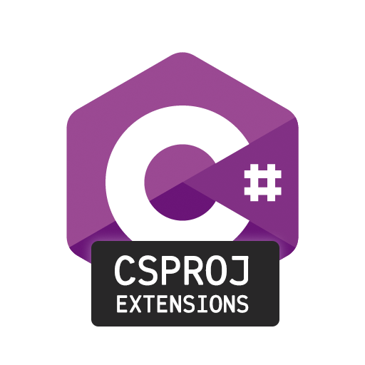
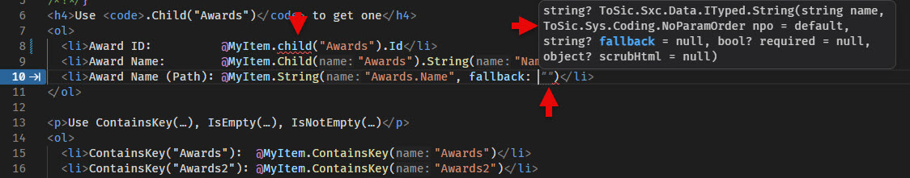
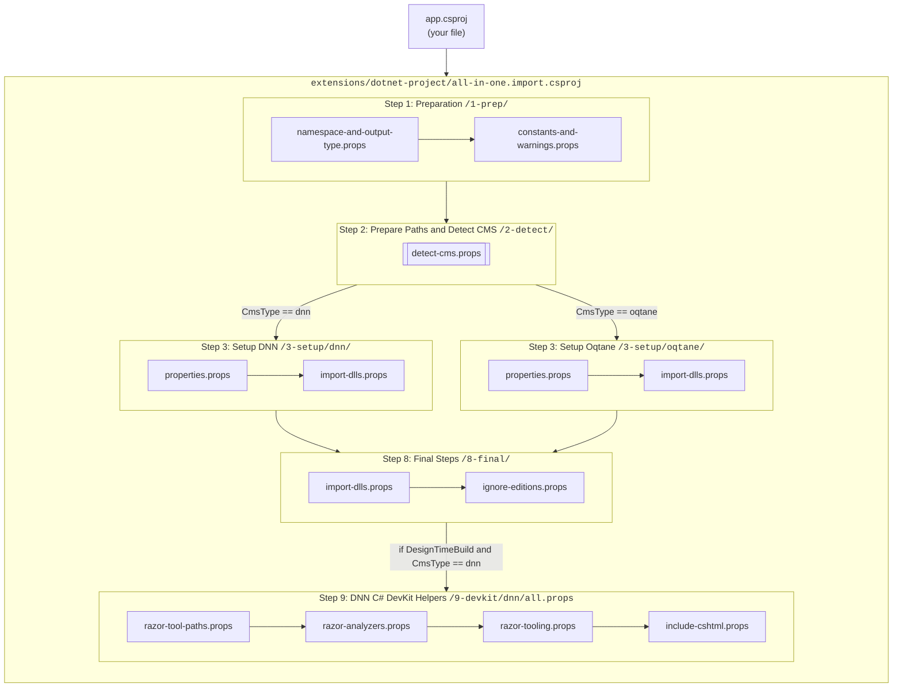
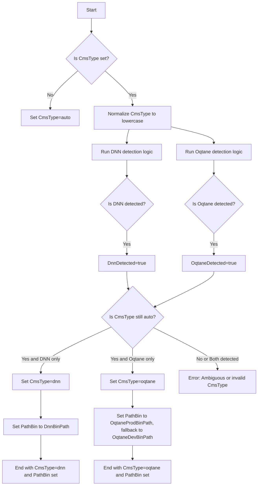

# DotNet Project (VS Code Helper)

_This is an extension for 2sxc Apps and can be installed into each App individually._

This extension provides tools and helpers for .NET projects in VS Code.



## Installation and Upgrades

### [Installation](#tab/installation)

[!include[install](_installation.md)]

### [Upgrades](#tab/upgrades)

To upgrade the extension:

1. Install the latest version from the marketplace, replacing the previous version.
1. Then restart VS Code.

---

> [!TIP]
> Anything that follows is just a deep-dive, you usually do not need to understand it.
>
> For most users, you can stop reading here.

## How it works

The extension uses the OmniSharp extension to provide IntelliSense and other C# features in VS Code.
By including a .sln and .csproj file in the app folder, OmniSharp can recognize the project structure and provide the necessary tooling support.

Basically this is what happens:

1. The `app.sln` file defines a solution that includes the `app.csproj` project.
1. The `app.csproj` imports the `/extensions/dotnet-project/all-in-one.import.csproj` which contains everything needed for the project
1. The `all-in-one.import.csproj` file imports the necessary SDKs and packages to enable C# development in the app folder.

These would be your files:

### [The `app.sln` file](#tab/app-sln)

The `app.sln` file is a standard Visual Studio solution file that defines the structure of the project.
It includes the `app.csproj` project and any other projects that may be needed in the future.
This is what's probably in the file:

```text
Microsoft Visual Studio Solution File, Format Version 12.00
# Visual Studio Version 18
#
# Visual Studio .sln File for 2sxc App
# This is necessary so that VS Code can perform intellisense in Razor
# It also requires a csproj file to exist as well
# 
# Read more and get help for issues on https://go.2sxc.org/vscode
#

VisualStudioVersion = 18.3.11520.95
MinimumVisualStudioVersion = 10.0.40219.1
Project("{9A19103F-16F7-4668-BE54-9A1E7A4F7556}") = "app", "app.csproj", "{9F7A078F-99D5-4EF4-8EC0-C6B920FE679C}"
EndProject
Global
	GlobalSection(SolutionConfigurationPlatforms) = preSolution
		Debug|Any CPU = Debug|Any CPU
		Release|Any CPU = Release|Any CPU
	EndGlobalSection
	GlobalSection(ProjectConfigurationPlatforms) = postSolution
		{9F7A078F-99D5-4EF4-8EC0-C6B920FE679C}.Debug|Any CPU.ActiveCfg = Debug|Any CPU
		{9F7A078F-99D5-4EF4-8EC0-C6B920FE679C}.Debug|Any CPU.Build.0 = Debug|Any CPU
		{9F7A078F-99D5-4EF4-8EC0-C6B920FE679C}.Release|Any CPU.ActiveCfg = Release|Any CPU
		{9F7A078F-99D5-4EF4-8EC0-C6B920FE679C}.Release|Any CPU.Build.0 = Release|Any CPU
	EndGlobalSection
	GlobalSection(SolutionProperties) = preSolution
		HideSolutionNode = FALSE
	EndGlobalSection
EndGlobal
```

There's not much to add here, just leave it as is and it will work.

### [The `app.csproj` file](#tab/app-csproj)

The `app.csproj` file is a standard C# project file that defines the project structure and dependencies.
It imports the `all-in-one.import.csproj` file which contains all the necessary SDKs and packages to enable C# development in the app folder.

Here's what's probably in the file:

```xml
<Project Sdk="Microsoft.NET.Sdk.Web">
  <!-- This file helps VS Code provide IntelliSense - see https://go.2sxc.org/vscode -->

  <!-- Keep this file intentionally small and use the imports from extensions/dotnet-project to add the necessary logic. -->

  <!-- Import everything so it just magically works. For fine-grained control, import the individual files instead of the all-in-one. -->
  <Import Project="extensions\dotnet-project\all-in-one.import.csproj" />
</Project>
```

There is not much to add here either, just make sure to keep the import path correct and it will work.

---

## Internal Complexity

### [The Challenges](#tab/challenges)

Internally it's a bit more complex, because it has to work with all kinds of different scenarios such as:

1. It could be running in DNN or Oqtane.
1. It needs to work with both .NET Framework (`net48`) and .NET Core (`net10`) projects.
1. It's always in an App, but some Apps have it in their root folder, while others have it in an edition-subfolder.
1. In Oqtane, the path will vary if you're running a production or development version of Oqtane.
1. When using editions and opening VS Code on the root folder, it may have identical files in each edition, confusing the analyzers, so we have to remove editions such as `live` or `bs4` from the project when running in design-time in DNN.
1. In DNN we had to do some trickery to make older Razor code work with the newer .net Core Razor Code Analyzers.

This is the inner logic which is implemented in the `all-in-one.import.csproj` file, which imports the necessary SDKs and packages based on the environment and project type.

### [The `all-in-one.import.csproj` file](#tab/all-in-one-import-csproj)

The `all-in-one.import.csproj` file is a C# project file that imports the necessary SDKs and packages to enable C# development in the app folder.
It contains logic to determine the environment and project type, and imports the appropriate SDKs and packages based on that.

Here's what actually happens in the file:

<!-- Note: this is copied from the readme.md 2026-03-21 at 12:23 - keep in sync -->



### [PathBin and CMS Detection](#tab/pathbin-and-cms-detection)

This is the flow of code:

1. Set `CmsType=auto` if not previously set.
1. Normalize to lowercase - so it should only be `auto`, `dnn`, or `oqtane` at this point.
1. Run the platform-specific detection logic, which looks for the marker DLL in the expected paths for each platform, and sets `DnnDetected` or `OqtaneDetected` accordingly.
1. If `CmsType` is still `auto`, switch it to `dnn` or `oqtane` if only one of them was detected.
1. If `CmsType` is not `dnn` or `oqtane`, throw an error because the host cannot be resolved.

As an output, it will have a final:

1. `CmsType` value of either `dnn` or `oqtane` that can be used for conditional imports and properties later on.
1. `PathBin` value pointing to the correct `bin` folder of the host, which is needed for reference imports later on.



### [More Details](#tab/more-details)

For more details, best consult the `readme.md` in the [](xref:Repo.Ext.Project-DotNet).

---

## Customizing the Configuration

### [Introduction to Customization](#tab/customization)

When you need to do some customizations, you can always

1. Pre-set some of the variables such as `CmsType` in your `app.csproj` before the import.
1. Customize your own `app.csproj` file to import specific files instead of the `all-in-one.import.csproj`.

### [Example Customization](#tab/example-customization)

Here's an example where we needed another DLL.


```xml
<Project Sdk="Microsoft.NET.Sdk.Web">
  <!-- This file helps VS Code provide IntelliSense - see https://go.2sxc.org/vscode -->

  <!-- Best keep this file small and use imports from extensions/dotnet-project. -->

  <!-- Import everything so it just magically works. -->
  <Import Project="extensions\dotnet-project\all-in-one.import.csproj" />
  <!-- Note: For fine-grained control, import the individual files instead of the all-in-one. -->

  <!-- Load other important DLLs which are not in the main bundle -->
  <ItemGroup>
    <Reference Include="$(PathBin)\System.Collections.Immutable.dll" />
  </ItemGroup>
</Project>
```

### [PathBin Variable](#tab/pathbin-variable)

The `PathBin` variable is used to specify the path where the DLLs are.
This allows us to use the same rules for Dnn and Oqtane, just with a different path to start from.
Here's what you should know:

* Dnn usually has the App files in `/Portals/[portal]/2sxc/[app]/` so the DLLs relatively in `..\..\..\..\bin`
* Oqtane has the App files in `/2sxc/[site-id]/app/` but the DLLs are in different locations depending on Dev vs. Production builds
  * in development built it places the DLLs in `\bin\Debug\net8.0` so the relative path is usually `..\..\..\bin\Debug\net8.0`
  * in production builds it places the DLLs in the root folder, so the relative path is usually `..\..\..`

### [Ignoring Files for Polymorphism](#tab/ignoring-files-for-polymorphism)

If you're working with Polymorphism then you have many of the same files, which confuses IntelliSense.
For example, `/live` and `/staging` have the same files, and `/bs3`, `/bs4` and `/bs5` have the same files.
So intellisense might find the same class in multiple places, and show warnings.

To handle this, you should decide which is your **primary** folder, and then exclude the others.
This is just an example to exclude `/live` as we're always working on `/staging`:

```xml
  <!-- Example: exclude /live as we're always working on /staging -->
  <ItemGroup>
    <None Remove="live\**" />
    <Content Remove="live\**" />
    <Compile Remove="live\**" />
    <EmbeddedResource Remove="live\**" />
  </ItemGroup>
```

---

## Understanding csproj files

In case you're not familiar with `.csproj` files, here's a quick overview:

### [About PropertyGroup and ItemGroup](#tab/about-propertygroup-and-itemgroup)

* `PropertyGroup` is used to define variables which are used later in the file
* `ItemGroup` is used to define lists of items, like files, references, etc.

Both of these can have conditions, so you can define different settings for different situations.

### [Target Framework and C# Version](#tab/target-framework-and-csharp-version)

The `TargetFramework` is the .net Framework you are targeting.
The value like `net472` or `net48` are called _target framework moniker_ or _TFM_.
You can find a list of them on the [Microsoft Docs](https://learn.microsoft.com/en-us/dotnet/standard/frameworks).
Recommended values:

* Dnn: `net472` or `net48` (officially, Dnn requires 4.7.2, but 4.8 is what is normally installed because of security)
* Oqtane: `net10` (Oqtane 10+)

The `LangVersion` is the C# version you are using.
You can find a list of them on the [Microsoft Docs](https://learn.microsoft.com/en-us/dotnet/csharp/whats-new/csharp-version-history).
Recommended values:

* Dnn: `8.0` (Dnn 9.11.02+ using 2sxc 17 and Roslyn Compiler)
* Oqtane: `latest` or `12.0` (Oqtane 10+)

---


## History

1. v01.00 - Initial release for 2sxc v21 2026-03-21

Shortlink: <https://go.2sxc.org/ext-csproj>
