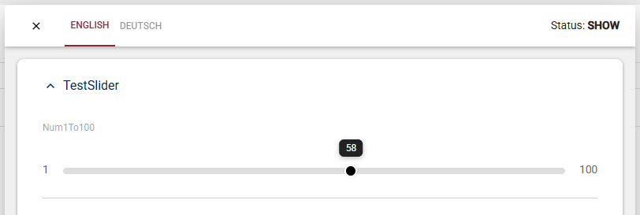

# App Extension: Number Slider Basic (Input Field)

This adds a nice number slider as an input type for number fields.

## Installation and Use

➡️ See 

Once installed, you can simply pick the "Number Slider Basic" input type
when configuring a number field in your content type.

You can also configure the slider to set:

1. Minimum value
1. Maximum value
1. Step value

---

## History

1. v01.00 - Initial release for 2sxc v21 2025-12

Shortlink: <https://go.2sxc.org/ext-numslide>
