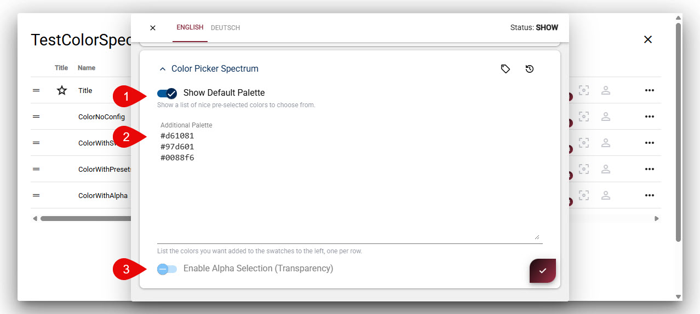

# App Extension: Color Picker Spectrum (Input Field)

This adds a powerful color picker input type for selecting colors with a spectrum-vanilla interface.

## Installation

See 

## Usage

Once installed, you can simply pick the "Color Picker Spectrum" input type
when configuring a string field in your content type.

You can also configure the picker to

1. show palette of nice standard colors
1. show palette of pre-defined colors
1. show alpha (transparency) selection

---

## History

1. v01.00 - Initial release for 2sxc v21 2025-12

Shortlink: <https://go.2sxc.org/ext-color>
