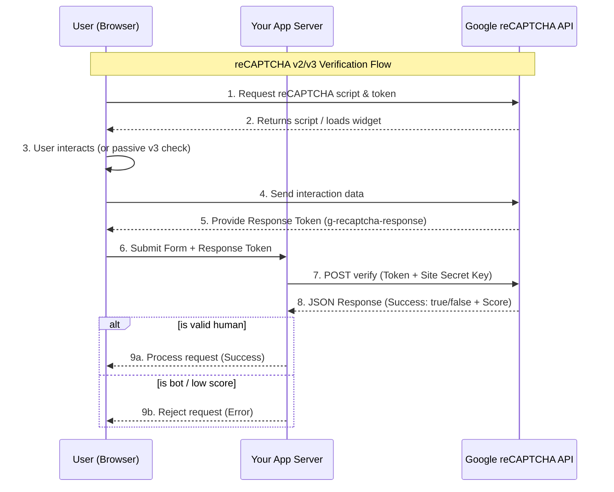

# Google reCAPTCHA v3 (App Extension)

This **App Extension** helps you add **Google reCAPTCHA v3** to custom forms in your 2sxc app,
so you can reduce spam and automated submissions.

Unlike reCAPTCHA v2, **v3 runs in the background** and returns a **score** (0.0-1.0).

> [!Tip]
> reCAPTCHA v3 is **not "a secure checkbox"**. You must always verify the token **server-side**,
and you should tune your score threshold over time.

## How reCaptcha Works

### [Description](#tab/how-it-works-description)

reCAPTCHA v3 works by analyzing user interactions on your website to determine whether the user is a human or a bot.
Here's how the process works:

1. Your app's server needs to know if a user is likely a bot and decide whether to accept the request.
1. To provide an answer, the server requests a score from Google's reCAPTCHA API.
1. For this to work, reCAPTCHA must have watched the user behavior in the browser.
    This requires the browser to load the reCAPTCHA JavaScript library.

### [Diagram](#tab/how-it-works-diagram)

This is what happens in detail:



Breakdown of the Process

1. **Front-end Integration**: Your website loads the reCAPTCHA JavaScript. This script monitors user behavior (like mouse movements or typing patterns) to generate a unique **Response Token**.
1. **The Handshake**: When the user submits a form, that token is sent to _your server_.
1. **Backend Verification**: For security, your server must talk to Google's servers directly. You send the user's token along with your private _Secret Key_.
1. **The Verdict**: Google returns a JSON object. In v3, this includes a score (typically $0.0$ to $1.0$), where $1.0$ is very likely a human and $0.0$ is definitely a bot.

---

## Installation

See [Installing App Extensions](xref:Extensions.AppExtensions.Install.Index)

## Preparation

### Prep 1: Get your Google keys (Site Key + Secret)

Create a reCAPTCHA v3 site in the [Google reCAPTCHA admin console](https://azing.org/2sxc/r/dll--jV8) and copy:

* **Site key** (public, used in the browser)
* **Secret key** (private, used on the server)


### Prep 2: Configure the extension in 2sxc App Settings

You can configure everything directly in **2sxc App Settings** for this extension:

* **Site Key**
* **Secret Key**
* **Score Threshold** (minimum score required to accept requests)

<div gallery="new-inherit">
  
  
  
</div>


## Code Example

### Razor Code containing the HTML Form + reCAPTCHA v3 JS

Before a form can be verified, the browser must:

1. Load the reCAPTCHA v3 JavaScript
2. Execute an action to generate a token
3. Send that token together with the form data to the server

The following Razor view demonstrates the minimal required setup.

```cshtml
@inherits Custom.Hybrid.RazorTyped

@{
  // Read site key
  var siteKey = Kit.SecureData.Parse(AllSettings.String("GoogleRecaptcha.SiteKey")).Value;

  // WebApi Endpoint for DocsFormController, supporting Polymorph editions
  var submitUrl = Link.To(api: $"{MyView.Edition}/api/DocsForm/SubmitAsync");
}

@* Load reCAPTCHA script *@
<script src="https://www.google.com/recaptcha/api.js?render=@siteKey"></script>

@* Minimal visible demo with button to submit *@
<button id="send-demo" class="btn btn-primary" type="button">
  Test ReCaptcha v3
</button>

@* Script to handle button click, get token, and send to API *@
<script>
  (() => {
    // On click, execute reCAPTCHA and send token to API
    document.getElementById("send-demo")?.addEventListener("click", () => {
      grecaptcha.execute("@siteKey", { action: "submit" })
        .then(token =>
          fetch("@submitUrl", {
            method: "POST",
            headers: { "Content-Type": "application/json" },
            body: JSON.stringify({ message: "hello", token })
          })
        )
        .then(async r => {
          if (!r.ok) throw new Error( await r.text() || "captcha-failed");
        })
        .then(() => alert("reCAPTCHA accepted"))
        .catch(err => alert("reCAPTCHA failed: " + (err?.message || err)));
    });
  })();
</script>
```

What happens here:

1. The site key is read from App Settings
2. reCAPTCHA v3 runs silently in the background
3. A token is generated for the action "submit"
4. The token is sent to the server together with the form data

### WebApi Sample Validating the Token

This code will receive the request,
validate the token using the app extension `RecaptchaValidator` service,
and decide if the request should be accepted or rejected.


```csharp
using AppCode.Extensions.GoogleRecaptchaV3;
using System.Threading.Tasks;
using ToSic.Sxc.WebApi;

#if NETCOREAPP
using Microsoft.AspNetCore.Mvc;
#else
using System.Web.Http;
using IActionResult = System.Web.Http.IHttpActionResult;
#endif

/// <summary>
/// Demo API controller to test reCAPTCHA v3 form submissions
/// Used by the frontend test form to verify token + message
/// </summary>
[AllowAnonymous]
public class DocsFormController : Custom.Hybrid.ApiTyped
{
  [HttpPost]
  [SecureEndpoint]
  public async Task<IActionResult> SubmitAsync([FromBody] DemoFormRequest request)
  {
    // Basic input validation
    if (string.IsNullOrWhiteSpace(request?.Message))
      return BadRequest("Message-missing");

    // Validate reCAPTCHA token - include Client IP as it improves validation accuracy
    var result = await GetService<RecaptchaValidator>()
      .ValidateAsync(request.Token, remoteIp: Request.GetClientIp());

    if (!result.Success)
      return BadRequest(result.Error);

    // Continue if reCAPTCHA validation succeeded
    // YOUR CUSTOM LOGIC goes here (e.g., save the form, send email, etc.)

    // Demo success response
    return Ok();
  }
}
```

What happens here:

1. The token is validated server-side using the `RecaptchaValidator` service provided by the app extension.
1. The validator automatically:
    1. Calls Google's reCAPTCHA verification API using the secret key configured in the app settings.
    2. Checks if the token is valid and not expired.
    3. Compares the returned score against the configured score threshold.
    4. Requests with scores below the threshold are rejected with an error message.
1. If validation succeeds, the form data can be processed further (e.g., saving the message).
1. If validation fails, a `BadRequest` response is returned with the error details.

---

## Hiding the reCAPTCHA Badge

By default, reCAPTCHA v3 displays a badge in the bottom-right corner of your page.
You can hide it with simple CSS:

```css
.grecaptcha-badge {
  visibility: hidden;
}
```

> [!WARNING]
> **Google's Terms of Service Requirement**
>
> If you hide the reCAPTCHA badge, you **must** include the following text visibly in your user flow (e.g., near your form):
>
> _This site is protected by reCAPTCHA and the Google [Privacy Policy](https://policies.google.com/privacy) and [Terms of Service](https://policies.google.com/terms) apply._
>
> See the [official Google reCAPTCHA FAQ](https://developers.google.com/recaptcha/docs/faq#id-like-to-hide-the-recaptcha-badge.-what-is-allowed) for more details.

---

## History

1. Creating v1 ca. 2026-01

Shortlink: <https://go.2sxc.org/ext-grecapt3>
