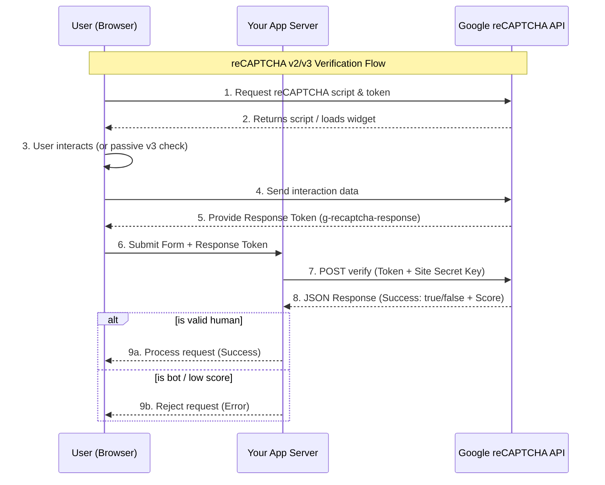
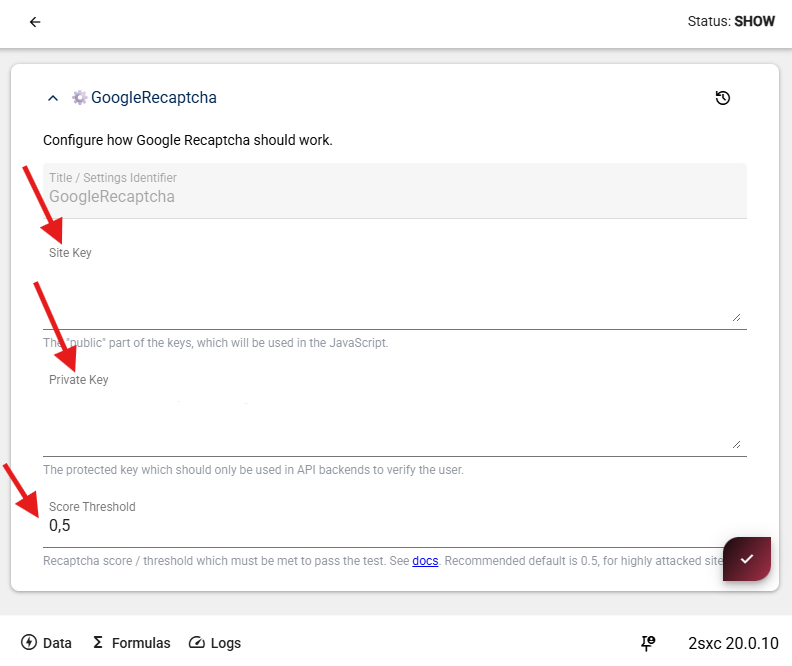
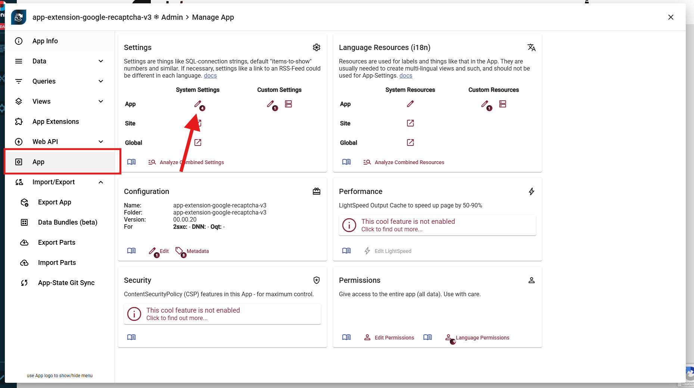
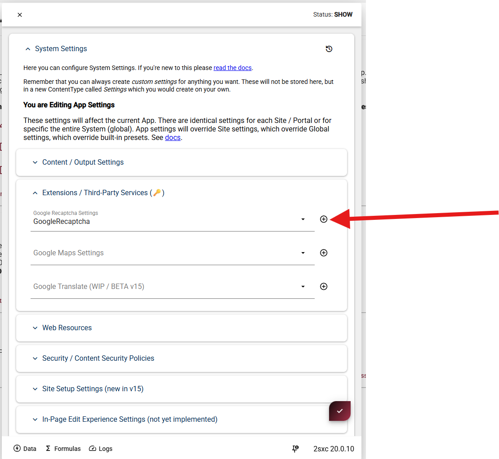

# Google reCAPTCHA v3 (App Extension)

This **App Extension** helps you add **Google reCAPTCHA v3** to custom forms in your 2sxc app,
so you can reduce spam and automated submissions.

Unlike reCAPTCHA v2, **v3 runs in the background** and returns a **score** (0.0-1.0).

> [!Tip]
> reCAPTCHA v3 is **not "a secure checkbox"**. You must always verify the token **server-side**,
and you should tune your score threshold over time.

## How reCaptcha Works

1. A App WebAPIs on server which process user forms/inputs must know if the user is likely a bot and decide if we want to accept the request or not.
1. For this the WebAPI asks Recaptcha Web API to score the user.
1. To provide an answer, Recaptcha must first have watched the user behavior in the browser, which requires the browser to load a JS.
  Recaptcha v3 works by analyzing user interactions on your website to determine whether the user is a human or a bot.

This is what happens in detail:



Breakdown of the Process

1. **Front-end Integration**: Your website loads the reCAPTCHA JavaScript. This script monitors user behavior (like mouse movements or typing patterns) to generate a unique **Response Token**.
1. **The Handshake**: When the user submits a form, that token is sent to _your server_.
1. **Backend Verification**: For security, your server must talk to Google's servers directly. You send the user's token along with your private _Secret Key_.
1. **The Verdict**: Google returns a JSON object. In v3, this includes a score (typically $0.0$ to $1.0$), where $1.0$ is very likely a human and $0.0$ is definitely a bot.

## Installation

See [](xref:Extensions.AppExtensions.Install.Index)

## Preparation

### Prep 1: Get your Google keys (Site Key + Secret)

Create a reCAPTCHA v3 site in the [Google reCAPTCHA admin console](https://azing.org/2sxc/r/dll--jV8) and copy:

* **Site key** (public, used in the browser)
* **Secret key** (private, used on the server)


### Prep 2: Configure the extension in 2sxc App Settings

You can configure everything directly in **2sxc App Settings** for this extension:

* **Site Key**
* **Secret Key**
* **Score Threshold** (minimum score required to accept requests)

<div gallery="new-inherit">
  
  
  
</div>


## Code Example

### Razor Code containing the HTML Form + reCAPTCHA v3 JS

Before a form can be verified, the browser must:

- Load the reCAPTCHA v3 JavaScript
- Execute an action to generate a token
- Send that token together with the form data to the server
- The following Razor view demonstrates the minimal required setup.

```cshtml
@inherits Custom.Hybrid.RazorTyped

@{
  // Read the public site key from 2sxc App Settings
  var siteKey = AllSettings.String("GoogleRecaptcha.SiteKey");

  // Build the URL to the WebAPI endpoint which will receive the form data
  var submitUrl = Link.To(api: $"{MyView.Edition}/api/TestForm/SubmitAsync");

  // Generate a unique DOM id
  // Important if the same view is rendered multiple times on one page
  var id = "recaptcha-" + UniqueKey;
}

<div id="@id">
  <input type="text" data-msg placeholder="Message" />
  <button type="button" data-send>Send</button>
</div>

<!-- Load Google reCAPTCHA v3 JavaScript using the site key -->
<script src="https://www.google.com/recaptcha/api.js?render=@siteKey"></script>

<script>
  (() => {
    // Get references to DOM elements inside this component
    const root = document.getElementById("@id");
    const input = root.querySelector("[data-msg]");
    const button = root.querySelector("[data-send]");

    // Handle button click manually (no normal form submit)
    // Request a reCAPTCHA token for the action "submit"
    // Send the message and reCAPTCHA token to the server
    button.onclick = async () => {

      const token = await grecaptcha.execute("@siteKey", { action: "submit" });

      await fetch("@submitUrl", {
        method: "POST",
        headers: { "Content-Type": "application/json" },

        // Payload contains both the user input and the token
        body: JSON.stringify({
          message: input.value,
          token
        })
      });
    };
  })();
</script>

```

What happens here:

* The site key is read from App Settings

* reCAPTCHA v3 runs silently in the background

* A token is generated for the action "submit"

* The token is sent to the server together with the form data

### WebApi Sample Validating the Token

This code will receive the request,
validate the token using the app extension `RecaptchaValidator` service,
and decide if the request should be accepted or rejected.


```csharp
#if NETCOREAPP
using Microsoft.AspNetCore.Mvc;
#else
using System.Web.Http;
using IActionResult = System.Web.Http.IHttpActionResult;
#endif

using AppCode.Extensions.GoogleRecaptchaV3;
using System.Threading.Tasks;

[AllowAnonymous]
public class TestFormController : Custom.Hybrid.ApiTyped
{
  [HttpPost]
  public async Task<IActionResult> SubmitAsync([FromBody] Request data)
  {
    // Use the extension service to validate the token
    var validator = GetService<RecaptchaValidator>();
    var result = await validator.ValidateAsync(data.Token);

    // Validation failed (invalid token or score below threshold)
    if (!result.IsValid)
      return BadRequest(result.Error);

    // Token is valid and score is above the configured threshold
    return Ok();
  }
}

public record Request(string Token, string Message);

```

### What happens here

* The token is validated server-side using the `RecaptchaValidator` service provided by the app extension.

* The validator automatically:
  * Calls Google's reCAPTCHA verification API using the secret key configured in the app settings.
  * Checks if the token is valid and not expired.
  * Compares the returned score against the configured score threshold.
  * Requests with scores below the threshold are rejected with an error message.

* If validation succeeds, the form data can be processed further (e.g., saving the message).
* If validation fails, a `BadRequest` response is returned with the error details.

---

## History

1. Creating v1 ca. 2026-01

Shortlink: <https://go.2sxc.org/ext-grecapt3>
