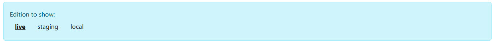

# App Extension: JS App Editions

While developing JS apps, it's often useful to have different editions of the app.
This is a form of Polymorphism - but it goes a lot further.
What you usually need is:

1. The ability to see a "dev" version of the app, with extra logging, debug features, etc. while the end-user only sees the "prod" version.
1. The ability to serve a local hot-build edition of the app while developing, which comes from your own PC instead of DNN.

This is what JS App Editions allow.

## Installation

See [](xref:Extensions.AppExtensions.Install.Index)

## Usage

Insert this code into your Razor view where you want to show the editions bar:
```
@Html.Partial("../js-app-editions/Editions Bar.cshtml", new { Editions = "live,staging,local" })
```

Show the toolbar to select an edition - usually only for the superuser / developer


With this toolbar, you can select the edition you want to use for the current app. This will set an cookie so that the app knows which edition to load. In code you can then check which edition is active and adjust behavior accordingly.

```
@inherits Custom.Hybrid.RazorTyped
@using AppCode.Extensions.JsEditions
@using ToSic.Sxc.Services;
@using ToSic.Razor.Blade;

@{
  // Create helper to manage the editions (live, staging etc.)
  var editionsHelper = GetService<Editions>();

  if (editionsHelper.CurrentEdition == "local")
  {
    // Local edition logic here
    // Some code for local edition
  }
  else
  {
    // Non-local edition logic here
    // Some other code
  }
}
```

---

## History

1. v01.00 - Initial release for 2sxc 

Shortlink: <https://go.2sxc.org/ext-jsappeds>
