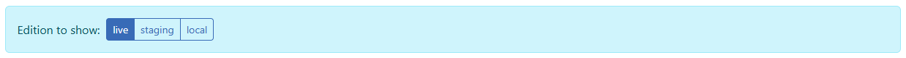
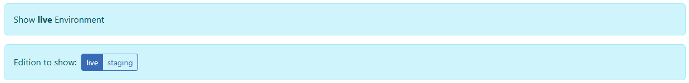

# JS App Editions (JS-Helper)

_This is an extension for 2sxc Apps and can be installed into each App individually._


While developing JS apps, it's often useful to have different editions of the app.
This is a form of Polymorphism - but it goes a lot further.
What you usually need is:

1. The ability to see a "dev" version of the app, with extra logging, debug features, etc. while the end-user only sees the "prod" version.
1. The ability to serve a **local** **hot-build** edition of the app while developing, which comes from your own PC instead of DNN.

This is what **JS App Editions** is for.
It consists of 2 parts:

1. A UI-Box to select the edition you want to use - which will set a magic cookie for the current user
1. A helper service which will tell your code which edition is currently set.

You can then use this information to adjust the behavior of your app - for example to load a different JS file, or to show extra logging information.

> [!TIP]
> **JS App Editions** is also used by the [Angular Loader](xref:Extensions.AppExtensions.By2sxc.AngularLoader.Index)
> to load the Angular app from a local hot-build during development, while loading the production build from DNN for normal users.

## Installation

* [](xref:Extensions.AppExtensions.Install.Index){title="icon:journal-arrow-down"} instructions for your first time

## Usage

Insert this code into your Razor view where you want to show the editions bar:

```cshtml
@Html.Partial("./extensions/js-app-editions/Editions Bar.cshtml", new {
  Editions = "live,staging,local"
})
```

Show the toolbar to select an edition - usually only for the superuser / developer



With this toolbar, you can select the edition you want to use for the current app.
This will set an cookie so that the app knows which edition to load.
In code you can then check which edition is active and adjust behavior accordingly.

```cshtml
@inherits Custom.Hybrid.RazorTyped
@using AppCode.Extensions.JsAppEditions

@{
  var editionsHelper = GetService<JsAppEditionService>();

  <div class="alert alert-info">
    Show <strong>@editionsHelper.CurrentEdition</strong> Environment
  </div>

  if (MyUser.IsContentAdmin)
  {
    @Html.Partial("extensions/js-app-editions/Editions Bar.cshtml", new {
      Editions = "live,staging"
    })
  }
}
```



> [!TIP]
> Your Razor Code would usually now do something
> (just like the [Angular Loader](xref:Extensions.AppExtensions.By2sxc.AngularLoader.Index) does)
> to load a different JS file based on the edition.
> For example loading a local hot-build version of the app during development,
> and the production build from DNN for normal users.

---

## Use in JavaScript

In some scenarios the JavaScript should also know the edition.
Either because you maybe want to use a different endpoint in staging vs production, or you want to show extra logging in the dev edition.

You have two options

1. Pass in the edition to the JavaScript code from Razor - for example using turnOn
2. Retrieve the edition from the cookie in JavaScript

As of now there is no sample code to do this,
but you can check out the [Angular Loader](xref:Extensions.AppExtensions.By2sxc.AngularLoader.Index)
for inspiration.

## History

1. v01.00 - Initial release for 2sxc ca. 2026-03

Shortlink: <https://go.2sxc.org/ext-jsappeds>
