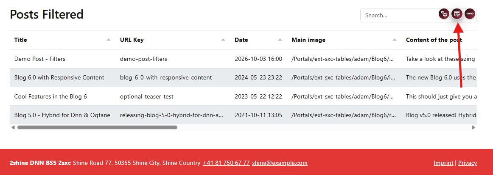
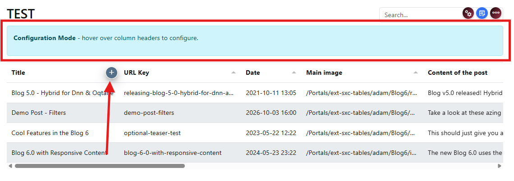
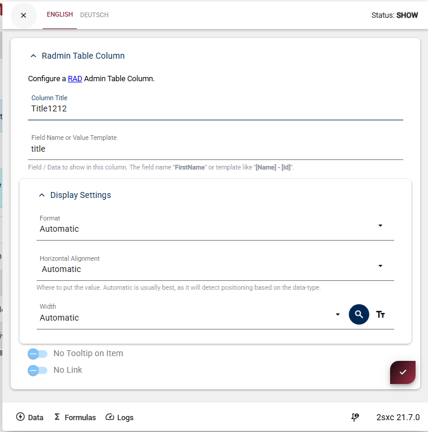

# Configure Columns

Use column configuration to control what users see and click in the table.

## Enable Configuration Mode

First enable **Configuration Mode** in the toolbar.

  

Once enabled, you can now edit columns.

### Add and Configure Columns

When configuration mode is active, hover a column header and use the plus icon to initialize that column.

  
  

In the column settings dialog, configure:

**Displayed Title**  
The heading shown in the table for this column.

**Field Name**  
The data field this column displays.

**Position and Options**  
Control where the column appears and set any special behaviors.

### Arrange and Verify

After configuring columns, arrange them by dragging.

  

Save and verify the table now shows your preferred columns in the correct order.

Next step:

Continue with {title="Link and Query Configuration"} to set up linking between views.
