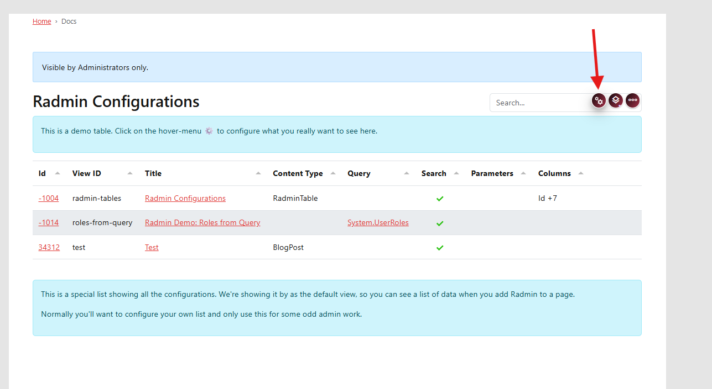

# Configure View

The view configuration defines what the Radmin table is and what data it should load.

## General Settings

Open the view settings dialog.

  
  

**Title**  
The heading shown above your table.

**View ID**  
A unique identifier for this Radmin setup. You will use this when linking to this view later.

### Data to Manage

Configure your data source by selecting one of these patterns:

**Content Type only**  
Manage all items of one content type.

**Query only**  
Show data from a query result.

**Content Type and Query**  
Read data from query, create new items with a selected content type.

After configuring, save the dialog and check the table result on the page.

Next step:

Continue with {title="Configure Table"}.
