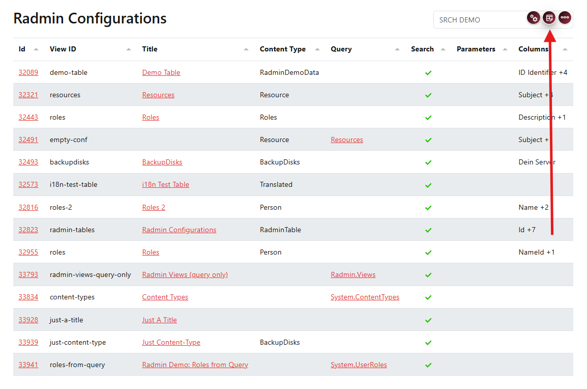
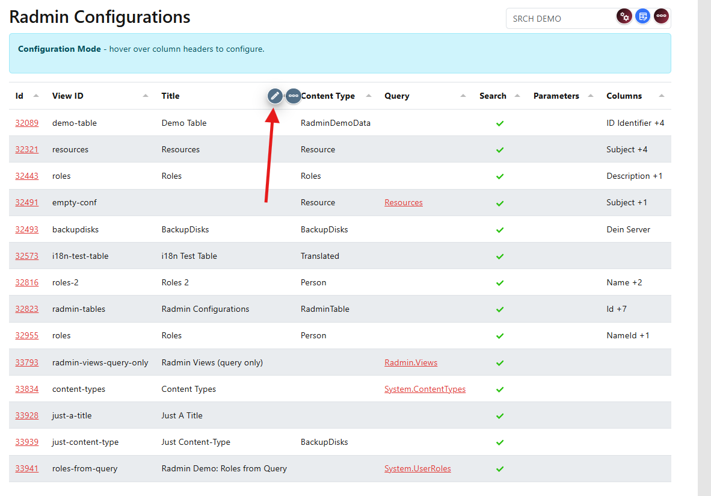

# Detail View

Radmin can automatically open an item's detail view when you click a configured column.

  
  
  

Enable configuration mode and edit the column you want to make clickable.

Enable **Link to View / Details**.

If you do not select a specific target view, Radmin uses the detail view of the current item.

This is a good default for beginner setups, because users can open a record quickly without additional view wiring.

The **Link Target** is usually left empty. Only set it when you need special behavior like opening in a new tab.

## Next Step

Continue with {title="Link Parameters"} to pass filters to target views.
