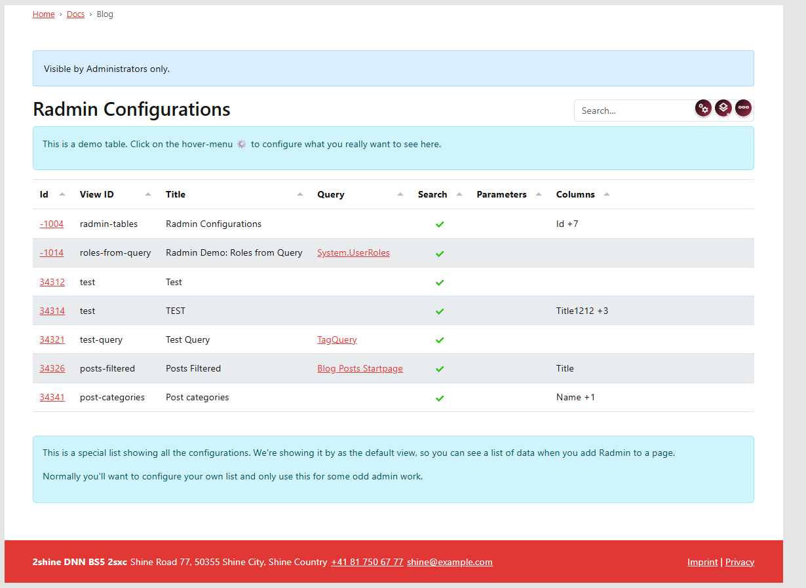
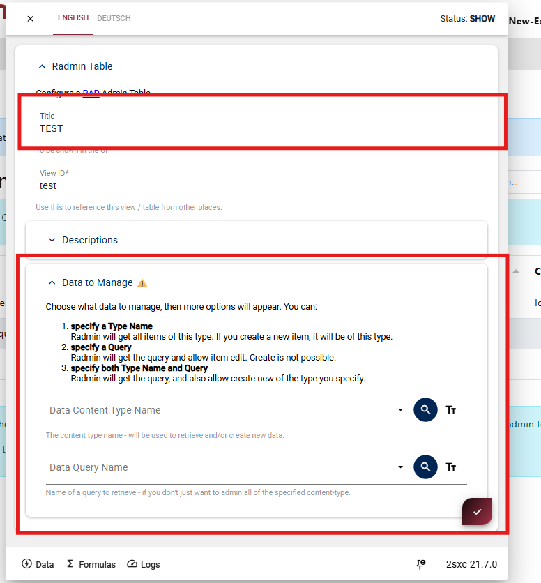
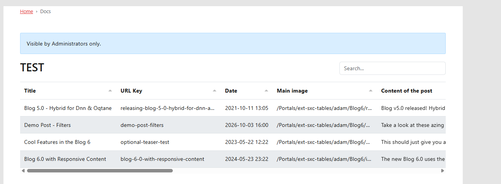

# Radmin Getting Started

These docs use examples made in a Blog App. This guide shows the fastest way to get your first Radmin table running.

> [!TIP]
> Since Radmin is meant to admin data,
> it's best to add it to a page which is not visible to the public, and only accessible to admins.
>
> If you add it to a page which is visible to the public,
> the table will not show any data to external users,
> because the backend will refuse to deliver data unless specifically allowed to do so.

## Add Radmin to a Page

Add a Radmin view to your page. For this example, we'll create it in a Blog App.

  
  
  

### Configure Basic Values

Open the view settings and configure the basic values:

  
  

**Title**  
The heading shown above your table.

**View ID**  
A unique identifier for this Radmin setup.

**Data to Manage**  
The initial data source for your table.

After setting these values, save the dialog.

### View Your First Table

When done, you should see your first working table.

Next step:

Continue with {title="Configure View"} to understand each setup option.
