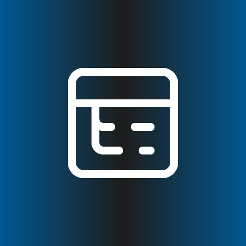
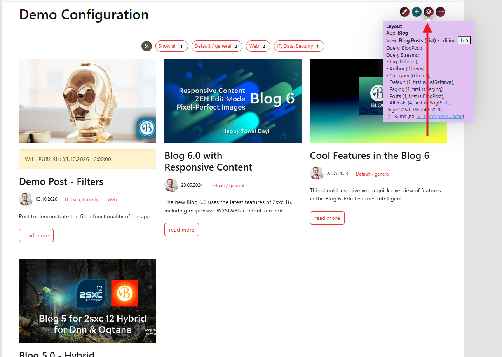
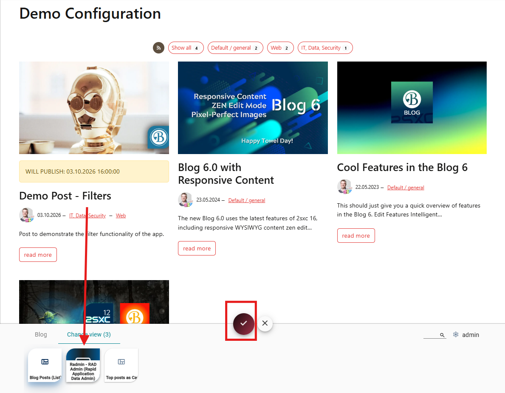
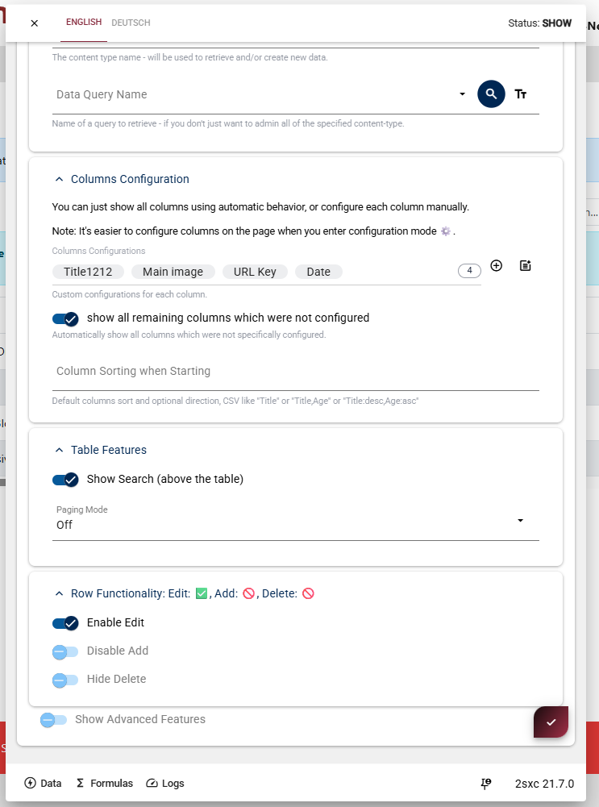
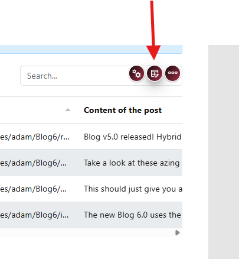
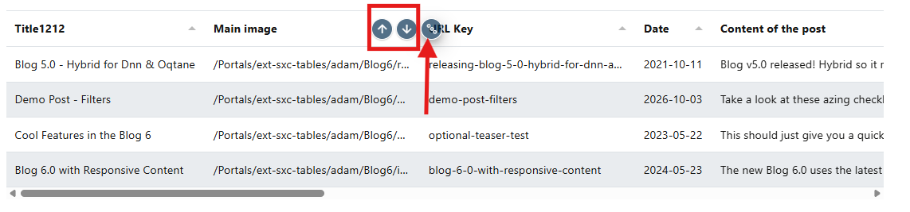
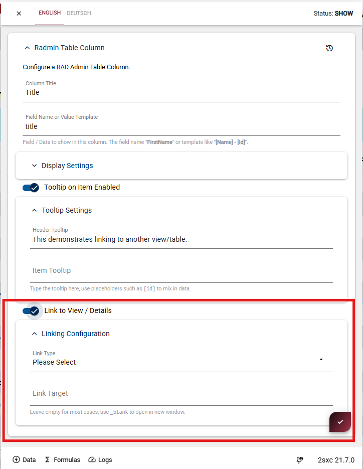
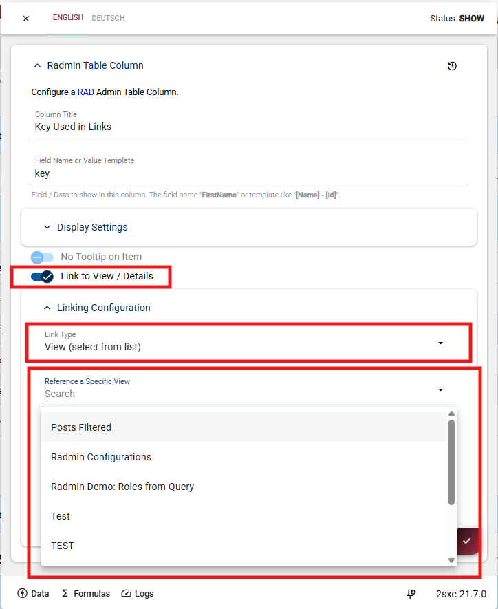

# Radmin Admin Tools Extension TODO / WIP

_This is an extension for 2sxc Apps and can be installed into each App individually._

TODO: description, what it is

## Installation and Basic Usage

* {title="icon:journal-arrow-down"} instructions for your first time

Once installed, you will want to

1. Add Radmin to a page.
2. Configure a title and a view-ID to show the data you want to manage.
3. Specify the data to show in the table.
4. Configure which features you want to use, such as edit, delete, add, etc.
5. Maybe do some custom configuration for the columns.

> [!TIP]
> Since radmin is meant to admin data,
> it's best to add it to a page which is not visible to the public, and only accessible to admins.
>
> If you add it to a page which is visible to the public,
> the table will not show any data to external users,
> because the backend will refuse to deliver data unless specifically allowed to do so.

## Add a Radmin View to a Page

### Adding Radmin and Configure the View

To use Radmin on a page, install the Radmin Extension

  
  

After the view has been added, open the view configuration. This is where you define what the table should show and manage.

  
  

First, configure the general settings:

**Title**  
  The title shown above the table.

**View ID**  
  A unique identifier for this Radmin configuration.  
  This ID is used to reference the view from other places.

Next, configure the **Data to Manage** section.

Radmin can be configured in three ways:

1. **Content Type only**  
   Select a content type if Radmin should manage all items of that type.  
   New items created in the table will also use this content type.

2. **Query only**  
   Select a query if Radmin should display data returned by that query.

3. **Content Type and Query**  
   Select both if Radmin should load its data from a query, but still create new items using the selected content type.

Save the configuration when you are done.

The Radmin table will now render on the page and show the configured data.

### First Result

You now have a a table

1. showing the data you want to manage
1. it can sort and search the data

## Configure the Table

### Configuring the Radmin Table

To configure the table, open the Radmin settings dialog and go to the table configuration section.

  
  

Here you configure the table.

This section is for things like initial sorting, search UI, paging mode, and row actions.

In **Table Features**, you can enable features such as the search box above the table and configure paging.

In **Row Functionality**, you can control whether users are allowed to edit items, add new items, or delete existing items.

If needed, you can also enable **Advanced Features** for additional table options.

After configuring the table settings, save the dialog to apply the changes.

## Configure the Columns

Use this section for column-level setup such as title, visible order, and field-specific behavior.

To configure columns in a Radmin table, first enable **Configuration Mode** using the configuration button in the top-right toolbar.

  
  
  
  

When Configuration Mode is active, a blue info box appears above the table.  
You can now hover over the table headers to configure each column.

Use the **plus button** beside a column header to initialize that table column.

In the column settings dialog, configure settings such as:

1. Column title shown in the table
2. Field name (data source)
3. Column order and other column-specific options

After configuring the column, save the dialog to apply the changes.

## Implement a Query

  
  

To manage data from a Query, open the table configuration and go to **Data to Manage**.

In the **Data Query Name** field, select the name of the Query you want to use.

Radmin will then use the data returned by this Query to show the table entries.

If the Query returns its data on the default stream, no additional configuration is needed.

If the Query uses another stream, or if you want to pass parameters to the Query, enable **Show Advanced Query Options**.

In the advanced options you can configure:

1. **Data Query - Stream Name**  
   Use this if the data should be loaded from a specific stream instead of the default stream.

2. **Data Query - Parameters**  
   Use this if the Query needs parameters, for example to filter the results or load only specific items.

This is optional. Only use the advanced options when the Query does not return the expected data by default or when the Query needs additional parameters.

## Link a Column to a View

  
  
  

To link a column to another view, first enable the configuration mode in the toolbar.

When configuration mode is active, hover over the column header you want to configure.  
Click the edit icon on the column to open the column settings.

In the column configuration, enable **Link to View / Details**.

After enabling it, open **Linking Configuration** and configure where the link should go.

Set **Link Type** to **View (select from list)**.

Then choose the target view in **Reference a Specific View**.

For example, you can link a category column to a filtered posts view, so clicking a category opens another view that shows the related posts.

After saving, the selected column will link to the configured view.

### Implement Detail View

  
  
  

First enable the configuration mode in the toolbar.

When configuration mode is active, hover over the column header you want to configure and click the edit icon.

In the column configuration, enable **Link to View / Details**.

If you do not select a specific link type or target view, Radmin will automatically link the column to the detail view of the current item.

This means the value in this column becomes clickable.  
When the user clicks it, Radmin opens the details of the selected item.

The **Link Target** field can usually stay empty.  
Only set it if you want the link to open in a specific target, for example a new window.

### Add Link Parameters to filter the target view

  
  

You can also pass parameters to the linked view.

This is useful if the target view should open already filtered, based on the value of the clicked column.

After enabling **Link to View / Details** and selecting the target view, use the **Link Parameters** field to define the parameters that should be added to the URL.

For example:

`category=[key]`

This means:

* **category** is the URL parameter name
* **[key]** is the value taken from the current row

When a user clicks the link, Radmin replaces `[key]` with the actual value of that item and appends it to the URL.

The linked view can then use this parameter to filter its data.

**Result**

---

## History

1. todo

<!-- fyi: shortlink here does not start with ext-, because I think we'll use radmin a lot, so it's a first-class citizen -->
Shortlink: <https://go.2sxc.org/radmin>
