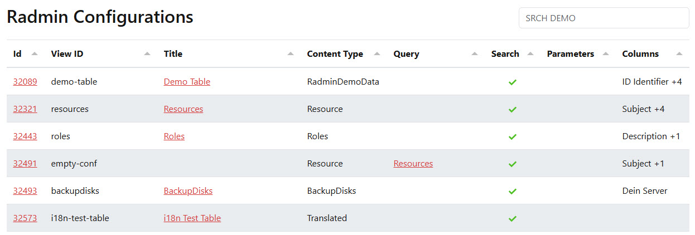

# Radmin Admin Tools Extension

_This is an extension for 2sxc Apps and can be installed into each App individually._

2sxc Radmin is a powerful extension that allows you to create admin interfaces for your data.
Use it to create tables, link between them, show details, and much more, all without writing any code.

Here's a quick release video for an overview:

<iframe width="100%" height="400px" src="https://www.youtube.com/embed/HQphIKDSKW0" frameborder="0" allow="accelerometer; autoplay; clipboard-write; encrypted-media; gyroscope; picture-in-picture" allowfullscreen></iframe>

## Start Here

* {title="icon:journal-arrow-down"} instructions for your first time

* [Getting Started](xref:Extensions.AppExtensions.By2sxc.Radmin.GettingStarted){title="icon:play-circle"}
* [Configure View](xref:Extensions.AppExtensions.By2sxc.Radmin.ConfigureView){title="icon:gear"}
* [Configure Table](xref:Extensions.AppExtensions.By2sxc.Radmin.ConfigureTable){title="icon:table"}
* [Configure Columns](xref:Extensions.AppExtensions.By2sxc.Radmin.ConfigureColumns){title="icon:layout-three-columns"}
* [Link and Query Configuration](xref:Extensions.AppExtensions.By2sxc.Radmin.LinkAndQuery){title="icon:link-45deg"}
* [Detail View](xref:Extensions.AppExtensions.By2sxc.Radmin.DetailView){title="icon:file-earmark-text"}

---

## History

1. 2026-05-04: Initial release for May the 4th 2026.

<!-- fyi: shortlink here does not start with ext-, because I think we'll use radmin a lot, so it's a first-class citizen -->
Shortlink: <https://go.2sxc.org/radmin>
